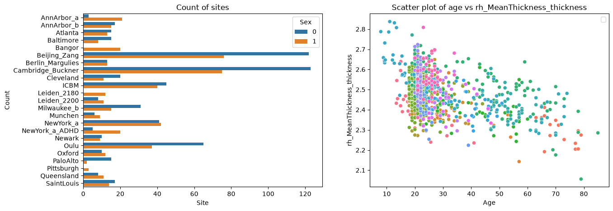

Command line interface
======================

.. container:: notebook-download

   :download:`Download Jupyter notebook <notebooks/09_command_line_interface.ipynb>`

The PCNtoolkit is a python package, but it can also be used from the
command line.

Here we show how to use the PCNtoolkit from the command line.

Furthermore, you can use this script to generate commands for the
command line interface. (Although if you are able to run this notebook,
why not just use it as a python package?)

.. code:: ipython3

    import pandas as pd
    import numpy as np
    from sklearn.model_selection import train_test_split
    import seaborn as sns
    import matplotlib.pyplot as plt
    import os
    import sys
    import pickle

BLR Example
-----------

Data preparation
~~~~~~~~~~~~~~~~

.. code:: ipython3

    # Download and split data first
    # If you are running this notebook for the first time, you need to download the dataset from github.
    # If you have already downloaded the dataset, you can comment out the following line
    os.makedirs("resources/data", exist_ok=True)
    pd.read_csv(
        "https://raw.githubusercontent.com/predictive-clinical-neuroscience/PCNtoolkit-demo/refs/heads/main/data/fcon1000.csv"
    ).to_csv("resources/data/fcon1000.csv", index=False)

.. code:: ipython3

    data = pd.read_csv("resources/data/fcon1000.csv")

.. code:: ipython3

    # Inspect the data
    fig, ax = plt.subplots(1, 2, figsize=(15, 5))
    sns.scatterplot(data=data, x=("age"), y=("rh_MeanThickness_thickness"), hue=("site"), ax=ax[1])
    ax[1].legend([], [])
    ax[1].set_title("Scatter plot of age vs rh_MeanThickness_thickness")
    ax[1].set_xlabel("Age")
    ax[1].set_ylabel("rh_MeanThickness_thickness")
    sns.countplot(data=data, y="site", hue="sex", ax=ax[0], orient="h")
    ax[0].legend(title="Sex")
    ax[0].set_title("Count of sites")
    ax[0].set_xlabel("Site")
    ax[0].set_ylabel("Count")
    plt.show()

.. code:: ipython3

    # Split into X, y, and batch effects
    covariate_columns = ["age"]
    batch_effect_columns = ["sex", "site"]
    response_columns = ["rh_MeanThickness_thickness", "WM-hypointensities"]
    
    X = data[covariate_columns]
    Y = data[response_columns]
    batch_effects = data[batch_effect_columns]
    
    batch_effects_strings = [str(b[0]) + " " + str(b[1]) for b in batch_effects.values]
    
    # Split into train and test set
    trainidx, testidx = train_test_split(data.index, test_size=0.2, random_state=42, stratify=batch_effects_strings)
    train_X = X.loc[trainidx]
    train_Y = Y.loc[trainidx]
    train_batch_effects = batch_effects.loc[trainidx]
    
    test_X = X.loc[testidx]
    test_Y = Y.loc[testidx]
    test_batch_effects = batch_effects.loc[testidx]

.. code:: ipython3

    # Save stuff
    root_dir = os.path.join("resources", "cli_example")
    data_dir = os.path.join(root_dir, "data")
    os.makedirs(data_dir, exist_ok=True)
    
    resp = os.path.abspath(os.path.join(data_dir, "responses.csv"))
    cov = os.path.abspath(os.path.join(data_dir, "covariates.csv"))
    be = os.path.abspath(os.path.join(data_dir, "batch_effects.csv"))
    
    t_resp = os.path.abspath(os.path.join(data_dir, "test_responses.csv"))
    t_cov = os.path.abspath(os.path.join(data_dir, "test_covariates.csv"))
    t_be = os.path.abspath(os.path.join(data_dir, "test_batch_effects.csv"))
    
    
    with open(cov, "wb") as f:
        pickle.dump(train_X, f)
    with open(resp, "wb") as f:
        pickle.dump(train_Y, f)
    with open(be, "wb") as f:
        pickle.dump(train_batch_effects, f)
    with open(t_cov, "wb") as f:
        pickle.dump(test_X, f)
    with open(t_resp, "wb") as f:
        pickle.dump(test_Y, f)
    with open(t_be, "wb") as f:
        pickle.dump(test_batch_effects, f)

BLR configuration
~~~~~~~~~~~~~~~~~

.. code:: ipython3

    alg = "blr"
    func = "fit_predict"
    
    # normative model configuration
    save_dir = os.path.join(root_dir, "blr_cli", "save_dir")
    savemodel = True
    saveresults = True
    basis_function = "linear"
    inscaler = "standardize"
    outscaler = "standardize"
    
    # Regression model configuration
    optimizer = "l-bfgs-b"
    n_iter = 200
    heteroskedastic = True
    fixed_effect = True
    warp = "WarpSinhArcsinh"
    warp_reparam = True
    
    # runner configuration
    cross_validate = True
    cv_folds = 5
    parallelize = False
    job_type = "local"
    n_jobs = 2
    temp_dir = os.path.join(root_dir, "temp")
    log_dir = os.path.join(root_dir, "log")
    python_env = os.path.join(os.path.dirname(os.path.dirname(sys.executable)))

Constructing command
~~~~~~~~~~~~~~~~~~~~

.. code:: ipython3

    command = "normative"
    args = f"-a {alg} -f {func} -c {cov} -r {resp} -t {t_resp} -e {t_cov} -k {cv_folds}"
    kwargs = f"be={be} t_be={t_be}"
    normative_model_kwargs = f"save_dir={save_dir} savemodel={savemodel} saveresults={saveresults} basis_function={basis_function} inscaler={inscaler} outscaler={outscaler}"
    runner_kwargs = f"cross_validate={cross_validate} parallelize={parallelize} job_type={job_type} n_jobs={n_jobs} temp_dir={temp_dir} log_dir={log_dir} environment={python_env}"
    blr_kwargs = f"optimizer={optimizer} n_iter={n_iter} heteroskedastic={heteroskedastic} fixed_effect={fixed_effect} warp={warp} warp_reparam={warp_reparam}"
    full_command = f"{command} {args} {kwargs} {runner_kwargs} {normative_model_kwargs} {blr_kwargs}"

.. code:: ipython3

    print(full_command)

.. code:: text

    normative -a blr -f fit_predict -c /home/runner/work/PCNtoolkit/PCNtoolkit/resources/cli_example/data/covariates.csv -r /home/runner/work/PCNtoolkit/PCNtoolkit/resources/cli_example/data/responses.csv -t /home/runner/work/PCNtoolkit/PCNtoolkit/resources/cli_example/data/test_responses.csv -e /home/runner/work/PCNtoolkit/PCNtoolkit/resources/cli_example/data/test_covariates.csv -k 5 be=/home/runner/work/PCNtoolkit/PCNtoolkit/resources/cli_example/data/batch_effects.csv t_be=/home/runner/work/PCNtoolkit/PCNtoolkit/resources/cli_example/data/test_batch_effects.csv cross_validate=True parallelize=False job_type=local n_jobs=2 temp_dir=resources/cli_example/temp log_dir=resources/cli_example/log environment=/opt/hostedtoolcache/Python/3.13.15/x64 save_dir=resources/cli_example/blr_cli/save_dir savemodel=True saveresults=True basis_function=linear inscaler=standardize outscaler=standardize optimizer=l-bfgs-b n_iter=200 heteroskedastic=True fixed_effect=True warp=WarpSinhArcsinh warp_reparam=True

Running command
~~~~~~~~~~~~~~~

.. code:: ipython3

    !{full_command}

.. code:: text

    Process: 2973 - 2026-09-25 17:56:46 - Dataset "fit_data" created.
        - 862 observations
        - 862 unique subjects
        - 1 covariates
        - 2 response variables
        - 2 batch effects:
        	batch_effect_0 (2)
    	batch_effect_1 (23)
        
    Process: 2973 - 2026-09-25 17:56:46 - Dataset "predict_data" created.
        - 216 observations
        - 216 unique subjects
        - 1 covariates
        - 2 response variables
        - 2 batch effects:
        	batch_effect_0 (2)
    	batch_effect_1 (23)
        
    Process: 2973 - 2026-09-25 17:56:46 - Task ID created: fit_predict_fit_data__2026-09-25_17:56:46_419.935547
    Process: 2973 - 2026-09-25 17:56:46 - Temporary directory created:
    	/home/runner/work/PCNtoolkit/PCNtoolkit/resources/cli_example/temp/fit_predict_fit_data__2026-09-25_17:56:46_419.935547
    Process: 2973 - 2026-09-25 17:56:46 - Log directory created:
    	/home/runner/work/PCNtoolkit/PCNtoolkit/resources/cli_example/log/fit_predict_fit_data__2026-09-25_17:56:46_419.935547
    /home/runner/work/PCNtoolkit/PCNtoolkit/pcntoolkit/util/output.py:309: UserWarning: Process: 2973 - 2026-09-25 17:56:46 - Predict data not used in k-fold cross-validation
      warnings.warn(message, category)
    /opt/hostedtoolcache/Python/3.13.15/x64/lib/python3.13/site-packages/sklearn/model_selection/_split.py:812: UserWarning: The least populated class in y has only 2 members, which is less than n_splits=5.
      warnings.warn(
    Process: 2973 - 2026-09-25 17:56:46 - Fitting models on 2 response variables.
    Process: 2973 - 2026-09-25 17:56:46 - Fitting model for response_var_0.
    Process: 2973 - 2026-09-25 17:56:46 - Fitting model for response_var_1.
    /home/runner/work/PCNtoolkit/PCNtoolkit/pcntoolkit/regression_model/blr.py:640: LinAlgWarning: An ill-conditioned matrix detected: slice 0 has rcond = 5.523723946631791e-27.
      invAXt: np.ndarray = linalg.solve(self.A, X.T, check_finite=False)
    /home/runner/work/PCNtoolkit/PCNtoolkit/pcntoolkit/util/output.py:309: UserWarning: Process: 2973 - 2026-09-25 17:56:46 - Posterior estimation failed: 
    Matrix is not positive definite. 
    The optimizer could not find a stable solution. Retrying optimization.
      warnings.warn(message, category)
    /home/runner/work/PCNtoolkit/PCNtoolkit/pcntoolkit/regression_model/blr.py:640: LinAlgWarning: An ill-conditioned matrix detected: slice 0 has rcond = 6.375496563279125e-27.
      invAXt: np.ndarray = linalg.solve(self.A, X.T, check_finite=False)
    /home/runner/work/PCNtoolkit/PCNtoolkit/pcntoolkit/regression_model/blr.py:640: LinAlgWarning: An ill-conditioned matrix detected: slice 0 has rcond = 4.9980721138137064e-27.
      invAXt: np.ndarray = linalg.solve(self.A, X.T, check_finite=False)
    /home/runner/work/PCNtoolkit/PCNtoolkit/pcntoolkit/regression_model/blr.py:640: LinAlgWarning: An ill-conditioned matrix detected: slice 0 has rcond = 6.746691663731469e-27.
      invAXt: np.ndarray = linalg.solve(self.A, X.T, check_finite=False)
    /home/runner/work/PCNtoolkit/PCNtoolkit/pcntoolkit/regression_model/blr.py:640: LinAlgWarning: An ill-conditioned matrix detected: slice 0 has rcond = 6.104659065295494e-27.
      invAXt: np.ndarray = linalg.solve(self.A, X.T, check_finite=False)
    Process: 2973 - 2026-09-25 17:56:47 - Saving model to:
    	resources/cli_example/blr_cli/save_dir/folds/fold_0.
    Process: 2973 - 2026-09-25 17:56:47 - Making predictions on 2 response variables.
    Process: 2973 - 2026-09-25 17:56:47 - Computing z-scores for 2 response variables.
    Process: 2973 - 2026-09-25 17:56:47 - Computing z-scores for response_var_1.
    Process: 2973 - 2026-09-25 17:56:47 - Computing z-scores for response_var_0.
    Process: 2973 - 2026-09-25 17:56:47 - Computing centiles for 2 response variables.
    Process: 2973 - 2026-09-25 17:56:47 - Computing centiles for response_var_1.
    Process: 2973 - 2026-09-25 17:56:47 - Computing centiles for response_var_0.
    Process: 2973 - 2026-09-25 17:56:47 - Computing log-probabilities for 2 response variables.
    Process: 2973 - 2026-09-25 17:56:47 - Computing log-probabilities for 2 response variables.
    Process: 2973 - 2026-09-25 17:56:47 - Computing log-probabilities for response_var_1.
    Process: 2973 - 2026-09-25 17:56:47 - Computing log-probabilities for response_var_0.
    Process: 2973 - 2026-09-25 17:56:47 - Computing yhat for 2 response variables.
    Process: 2973 - 2026-09-25 17:56:47 - Computing yhat for response_var_1.
    Process: 2973 - 2026-09-25 17:56:47 - Computing yhat for response_var_0.
    Process: 2973 - 2026-09-25 17:56:47 - Dataset "centile" created.
        - 150 observations
        - 150 unique subjects
        - 1 covariates
        - 2 response variables
        - 2 batch effects:
        	batch_effect_0 (1)
    	batch_effect_1 (1)
        
    Process: 2973 - 2026-09-25 17:56:47 - Computing centiles for 2 response variables.
    Process: 2973 - 2026-09-25 17:56:47 - Computing centiles for response_var_1.
    Process: 2973 - 2026-09-25 17:56:47 - Computing centiles for response_var_0.
    Process: 2973 - 2026-09-25 17:56:47 - Harmonizing data on 2 response variables.
    Process: 2973 - 2026-09-25 17:56:47 - Harmonizing data for response_var_1.
    Process: 2973 - 2026-09-25 17:56:47 - Harmonizing data for response_var_0.
    Process: 2973 - 2026-09-25 17:56:48 - Making predictions on 2 response variables.
    Process: 2973 - 2026-09-25 17:56:48 - Computing z-scores for 2 response variables.
    Process: 2973 - 2026-09-25 17:56:48 - Computing z-scores for response_var_1.
    Process: 2973 - 2026-09-25 17:56:48 - Computing z-scores for response_var_0.
    Process: 2973 - 2026-09-25 17:56:48 - Computing centiles for 2 response variables.
    Process: 2973 - 2026-09-25 17:56:48 - Computing centiles for response_var_1.
    Process: 2973 - 2026-09-25 17:56:48 - Computing centiles for response_var_0.
    Process: 2973 - 2026-09-25 17:56:48 - Computing log-probabilities for 2 response variables.
    Process: 2973 - 2026-09-25 17:56:48 - Computing log-probabilities for 2 response variables.
    Process: 2973 - 2026-09-25 17:56:48 - Computing log-probabilities for response_var_1.
    Process: 2973 - 2026-09-25 17:56:48 - Computing log-probabilities for response_var_0.
    Process: 2973 - 2026-09-25 17:56:48 - Computing yhat for 2 response variables.
    Process: 2973 - 2026-09-25 17:56:48 - Computing yhat for response_var_1.
    Process: 2973 - 2026-09-25 17:56:48 - Computing yhat for response_var_0.
    Process: 2973 - 2026-09-25 17:56:49 - Dataset "centile" created.
        - 150 observations
        - 150 unique subjects
        - 1 covariates
        - 2 response variables
        - 2 batch effects:
        	batch_effect_0 (1)
    	batch_effect_1 (1)
        
    Process: 2973 - 2026-09-25 17:56:49 - Computing centiles for 2 response variables.
    Process: 2973 - 2026-09-25 17:56:49 - Computing centiles for response_var_1.
    Process: 2973 - 2026-09-25 17:56:49 - Computing centiles for response_var_0.
    Process: 2973 - 2026-09-25 17:56:49 - Harmonizing data on 2 response variables.
    Process: 2973 - 2026-09-25 17:56:49 - Harmonizing data for response_var_1.
    Process: 2973 - 2026-09-25 17:56:49 - Harmonizing data for response_var_0.
    Process: 2973 - 2026-09-25 17:56:50 - Fitting models on 2 response variables.
    Process: 2973 - 2026-09-25 17:56:50 - Fitting model for response_var_0.
    Process: 2973 - 2026-09-25 17:56:50 - Fitting model for response_var_1.
    /home/runner/work/PCNtoolkit/PCNtoolkit/pcntoolkit/regression_model/blr.py:640: LinAlgWarning: An ill-conditioned matrix detected: slice 0 has rcond = 4.2455126268504203e-20.
      invAXt: np.ndarray = linalg.solve(self.A, X.T, check_finite=False)
    /home/runner/work/PCNtoolkit/PCNtoolkit/pcntoolkit/util/output.py:309: UserWarning: Process: 2973 - 2026-09-25 17:56:50 - Posterior estimation failed: 
    Matrix is not positive definite. 
    The optimizer could not find a stable solution. Retrying optimization.
      warnings.warn(message, category)
    /home/runner/work/PCNtoolkit/PCNtoolkit/pcntoolkit/regression_model/blr.py:640: LinAlgWarning: An ill-conditioned matrix detected: slice 0 has rcond = 4.910057133212752e-20.
      invAXt: np.ndarray = linalg.solve(self.A, X.T, check_finite=False)
    /home/runner/work/PCNtoolkit/PCNtoolkit/pcntoolkit/regression_model/blr.py:640: LinAlgWarning: An ill-conditioned matrix detected: slice 0 has rcond = 3.8415638861183265e-20.
      invAXt: np.ndarray = linalg.solve(self.A, X.T, check_finite=False)
    /home/runner/work/PCNtoolkit/PCNtoolkit/pcntoolkit/regression_model/blr.py:640: LinAlgWarning: An ill-conditioned matrix detected: slice 0 has rcond = 5.185259614266013e-20.
      invAXt: np.ndarray = linalg.solve(self.A, X.T, check_finite=False)
    /home/runner/work/PCNtoolkit/PCNtoolkit/pcntoolkit/regression_model/blr.py:640: LinAlgWarning: An ill-conditioned matrix detected: slice 0 has rcond = 4.691929377086917e-20.
      invAXt: np.ndarray = linalg.solve(self.A, X.T, check_finite=False)
    /opt/hostedtoolcache/Python/3.13.15/x64/lib/python3.13/site-packages/scipy/optimize/_numdiff.py:711: RuntimeWarning: overflow encountered in divide
      df_dx = [delf / delx for delf, delx in zip(df, dx)]
    Process: 2973 - 2026-09-25 17:56:50 - Saving model to:
    	resources/cli_example/blr_cli/save_dir/folds/fold_1.
    Process: 2973 - 2026-09-25 17:56:50 - Making predictions on 2 response variables.
    Process: 2973 - 2026-09-25 17:56:50 - Computing z-scores for 2 response variables.
    Process: 2973 - 2026-09-25 17:56:50 - Computing z-scores for response_var_1.
    Process: 2973 - 2026-09-25 17:56:50 - Computing z-scores for response_var_0.
    Process: 2973 - 2026-09-25 17:56:50 - Computing centiles for 2 response variables.
    Process: 2973 - 2026-09-25 17:56:50 - Computing centiles for response_var_1.
    Process: 2973 - 2026-09-25 17:56:50 - Computing centiles for response_var_0.
    Process: 2973 - 2026-09-25 17:56:50 - Computing log-probabilities for 2 response variables.
    Process: 2973 - 2026-09-25 17:56:50 - Computing log-probabilities for 2 response variables.
    Process: 2973 - 2026-09-25 17:56:50 - Computing log-probabilities for response_var_1.
    Process: 2973 - 2026-09-25 17:56:50 - Computing log-probabilities for response_var_0.
    Process: 2973 - 2026-09-25 17:56:50 - Computing yhat for 2 response variables.
    Process: 2973 - 2026-09-25 17:56:50 - Computing yhat for response_var_1.
    Process: 2973 - 2026-09-25 17:56:50 - Computing yhat for response_var_0.
    Process: 2973 - 2026-09-25 17:56:51 - Dataset "centile" created.
        - 150 observations
        - 150 unique subjects
        - 1 covariates
        - 2 response variables
        - 2 batch effects:
        	batch_effect_0 (1)
    	batch_effect_1 (1)
        
    Process: 2973 - 2026-09-25 17:56:51 - Computing centiles for 2 response variables.
    Process: 2973 - 2026-09-25 17:56:51 - Computing centiles for response_var_1.
    Process: 2973 - 2026-09-25 17:56:51 - Computing centiles for response_var_0.
    Process: 2973 - 2026-09-25 17:56:51 - Harmonizing data on 2 response variables.
    Process: 2973 - 2026-09-25 17:56:51 - Harmonizing data for response_var_1.
    Process: 2973 - 2026-09-25 17:56:51 - Harmonizing data for response_var_0.
    Process: 2973 - 2026-09-25 17:56:52 - Making predictions on 2 response variables.
    Process: 2973 - 2026-09-25 17:56:52 - Computing z-scores for 2 response variables.
    Process: 2973 - 2026-09-25 17:56:52 - Computing z-scores for response_var_1.
    Process: 2973 - 2026-09-25 17:56:52 - Computing z-scores for response_var_0.
    Process: 2973 - 2026-09-25 17:56:52 - Computing centiles for 2 response variables.
    Process: 2973 - 2026-09-25 17:56:52 - Computing centiles for response_var_1.
    Process: 2973 - 2026-09-25 17:56:52 - Computing centiles for response_var_0.
    Process: 2973 - 2026-09-25 17:56:52 - Computing log-probabilities for 2 response variables.
    Process: 2973 - 2026-09-25 17:56:52 - Computing log-probabilities for 2 response variables.
    Process: 2973 - 2026-09-25 17:56:52 - Computing log-probabilities for response_var_1.
    Process: 2973 - 2026-09-25 17:56:52 - Computing log-probabilities for response_var_0.
    Process: 2973 - 2026-09-25 17:56:52 - Computing yhat for 2 response variables.
    Process: 2973 - 2026-09-25 17:56:52 - Computing yhat for response_var_1.
    Process: 2973 - 2026-09-25 17:56:52 - Computing yhat for response_var_0.
    Process: 2973 - 2026-09-25 17:56:53 - Dataset "centile" created.
        - 150 observations
        - 150 unique subjects
        - 1 covariates
        - 2 response variables
        - 2 batch effects:
        	batch_effect_0 (1)
    	batch_effect_1 (1)
        
    Process: 2973 - 2026-09-25 17:56:53 - Computing centiles for 2 response variables.
    Process: 2973 - 2026-09-25 17:56:53 - Computing centiles for response_var_1.
    Process: 2973 - 2026-09-25 17:56:53 - Computing centiles for response_var_0.
    Process: 2973 - 2026-09-25 17:56:53 - Harmonizing data on 2 response variables.
    Process: 2973 - 2026-09-25 17:56:53 - Harmonizing data for response_var_1.
    Process: 2973 - 2026-09-25 17:56:53 - Harmonizing data for response_var_0.
    Process: 2973 - 2026-09-25 17:56:53 - Fitting models on 2 response variables.
    Process: 2973 - 2026-09-25 17:56:53 - Fitting model for response_var_0.
    Process: 2973 - 2026-09-25 17:56:54 - Fitting model for response_var_1.
    /home/runner/work/PCNtoolkit/PCNtoolkit/pcntoolkit/regression_model/blr.py:640: LinAlgWarning: An ill-conditioned matrix detected: slice 0 has rcond = 1.701875421761123e-19.
      invAXt: np.ndarray = linalg.solve(self.A, X.T, check_finite=False)
    /home/runner/work/PCNtoolkit/PCNtoolkit/pcntoolkit/util/output.py:309: UserWarning: Process: 2973 - 2026-09-25 17:56:54 - Posterior estimation failed: 
    Matrix is not positive definite. 
    The optimizer could not find a stable solution. Retrying optimization.
      warnings.warn(message, category)
    /home/runner/work/PCNtoolkit/PCNtoolkit/pcntoolkit/regression_model/blr.py:640: LinAlgWarning: An ill-conditioned matrix detected: slice 0 has rcond = 3.6521548448675865e-19.
      invAXt: np.ndarray = linalg.solve(self.A, X.T, check_finite=False)
    /home/runner/work/PCNtoolkit/PCNtoolkit/pcntoolkit/regression_model/blr.py:640: LinAlgWarning: An ill-conditioned matrix detected: slice 0 has rcond = 4.3656485817707845e-19.
      invAXt: np.ndarray = linalg.solve(self.A, X.T, check_finite=False)
    /home/runner/work/PCNtoolkit/PCNtoolkit/pcntoolkit/regression_model/blr.py:640: LinAlgWarning: An ill-conditioned matrix detected: slice 0 has rcond = 4.502124577440806e-19.
      invAXt: np.ndarray = linalg.solve(self.A, X.T, check_finite=False)
    Process: 2973 - 2026-09-25 17:56:54 - Saving model to:
    	resources/cli_example/blr_cli/save_dir/folds/fold_2.
    Process: 2973 - 2026-09-25 17:56:54 - Making predictions on 2 response variables.
    Process: 2973 - 2026-09-25 17:56:54 - Computing z-scores for 2 response variables.
    Process: 2973 - 2026-09-25 17:56:54 - Computing z-scores for response_var_1.
    Process: 2973 - 2026-09-25 17:56:54 - Computing z-scores for response_var_0.
    Process: 2973 - 2026-09-25 17:56:54 - Computing centiles for 2 response variables.
    Process: 2973 - 2026-09-25 17:56:54 - Computing centiles for response_var_1.
    Process: 2973 - 2026-09-25 17:56:54 - Computing centiles for response_var_0.
    Process: 2973 - 2026-09-25 17:56:54 - Computing log-probabilities for 2 response variables.
    Process: 2973 - 2026-09-25 17:56:54 - Computing log-probabilities for 2 response variables.
    Process: 2973 - 2026-09-25 17:56:54 - Computing log-probabilities for response_var_1.
    Process: 2973 - 2026-09-25 17:56:54 - Computing log-probabilities for response_var_0.
    Process: 2973 - 2026-09-25 17:56:54 - Computing yhat for 2 response variables.
    Process: 2973 - 2026-09-25 17:56:54 - Computing yhat for response_var_1.
    Process: 2973 - 2026-09-25 17:56:54 - Computing yhat for response_var_0.
    Process: 2973 - 2026-09-25 17:56:55 - Dataset "centile" created.
        - 150 observations
        - 150 unique subjects
        - 1 covariates
        - 2 response variables
        - 2 batch effects:
        	batch_effect_0 (1)
    	batch_effect_1 (1)
        
    Process: 2973 - 2026-09-25 17:56:55 - Computing centiles for 2 response variables.
    Process: 2973 - 2026-09-25 17:56:55 - Computing centiles for response_var_1.
    Process: 2973 - 2026-09-25 17:56:55 - Computing centiles for response_var_0.
    Process: 2973 - 2026-09-25 17:56:55 - Harmonizing data on 2 response variables.
    Process: 2973 - 2026-09-25 17:56:55 - Harmonizing data for response_var_1.
    Process: 2973 - 2026-09-25 17:56:55 - Harmonizing data for response_var_0.
    Process: 2973 - 2026-09-25 17:56:56 - Making predictions on 2 response variables.
    Process: 2973 - 2026-09-25 17:56:56 - Computing z-scores for 2 response variables.
    Process: 2973 - 2026-09-25 17:56:56 - Computing z-scores for response_var_1.
    Process: 2973 - 2026-09-25 17:56:56 - Computing z-scores for response_var_0.
    Process: 2973 - 2026-09-25 17:56:56 - Computing centiles for 2 response variables.
    Process: 2973 - 2026-09-25 17:56:56 - Computing centiles for response_var_1.
    Process: 2973 - 2026-09-25 17:56:56 - Computing centiles for response_var_0.
    Process: 2973 - 2026-09-25 17:56:56 - Computing log-probabilities for 2 response variables.
    Process: 2973 - 2026-09-25 17:56:56 - Computing log-probabilities for 2 response variables.
    Process: 2973 - 2026-09-25 17:56:56 - Computing log-probabilities for response_var_1.
    Process: 2973 - 2026-09-25 17:56:56 - Computing log-probabilities for response_var_0.
    Process: 2973 - 2026-09-25 17:56:56 - Computing yhat for 2 response variables.
    Process: 2973 - 2026-09-25 17:56:56 - Computing yhat for response_var_1.
    Process: 2973 - 2026-09-25 17:56:56 - Computing yhat for response_var_0.
    Process: 2973 - 2026-09-25 17:56:56 - Dataset "centile" created.
        - 150 observations
        - 150 unique subjects
        - 1 covariates
        - 2 response variables
        - 2 batch effects:
        	batch_effect_0 (1)
    	batch_effect_1 (1)
        
    Process: 2973 - 2026-09-25 17:56:56 - Computing centiles for 2 response variables.
    Process: 2973 - 2026-09-25 17:56:56 - Computing centiles for response_var_1.
    Process: 2973 - 2026-09-25 17:56:56 - Computing centiles for response_var_0.
    Process: 2973 - 2026-09-25 17:56:56 - Harmonizing data on 2 response variables.
    Process: 2973 - 2026-09-25 17:56:56 - Harmonizing data for response_var_1.
    Process: 2973 - 2026-09-25 17:56:56 - Harmonizing data for response_var_0.
    Process: 2973 - 2026-09-25 17:56:57 - Fitting models on 2 response variables.
    Process: 2973 - 2026-09-25 17:56:57 - Fitting model for response_var_0.
    Process: 2973 - 2026-09-25 17:56:57 - Fitting model for response_var_1.
    /home/runner/work/PCNtoolkit/PCNtoolkit/pcntoolkit/regression_model/blr.py:640: LinAlgWarning: An ill-conditioned matrix detected: slice 0 has rcond = 2.345402012863007e-18.
      invAXt: np.ndarray = linalg.solve(self.A, X.T, check_finite=False)
    /home/runner/work/PCNtoolkit/PCNtoolkit/pcntoolkit/util/output.py:309: UserWarning: Process: 2973 - 2026-09-25 17:56:58 - Posterior estimation failed: 
    Matrix is not positive definite. 
    The optimizer could not find a stable solution. Retrying optimization.
      warnings.warn(message, category)
    /home/runner/work/PCNtoolkit/PCNtoolkit/pcntoolkit/regression_model/blr.py:640: LinAlgWarning: An ill-conditioned matrix detected: slice 0 has rcond = 3.416128457233547e-18.
      invAXt: np.ndarray = linalg.solve(self.A, X.T, check_finite=False)
    /home/runner/work/PCNtoolkit/PCNtoolkit/pcntoolkit/regression_model/blr.py:640: LinAlgWarning: An ill-conditioned matrix detected: slice 0 has rcond = 5.01776121710389e-18.
      invAXt: np.ndarray = linalg.solve(self.A, X.T, check_finite=False)
    /home/runner/work/PCNtoolkit/PCNtoolkit/pcntoolkit/regression_model/blr.py:640: LinAlgWarning: An ill-conditioned matrix detected: slice 0 has rcond = 1.4551614365857112e-18.
      invAXt: np.ndarray = linalg.solve(self.A, X.T, check_finite=False)
    /opt/hostedtoolcache/Python/3.13.15/x64/lib/python3.13/site-packages/scipy/optimize/_numdiff.py:711: RuntimeWarning: overflow encountered in divide
      df_dx = [delf / delx for delf, delx in zip(df, dx)]
    Process: 2973 - 2026-09-25 17:56:58 - Saving model to:
    	resources/cli_example/blr_cli/save_dir/folds/fold_3.
    Process: 2973 - 2026-09-25 17:56:58 - Making predictions on 2 response variables.
    Process: 2973 - 2026-09-25 17:56:58 - Computing z-scores for 2 response variables.
    Process: 2973 - 2026-09-25 17:56:58 - Computing z-scores for response_var_1.
    Process: 2973 - 2026-09-25 17:56:58 - Computing z-scores for response_var_0.
    Process: 2973 - 2026-09-25 17:56:58 - Computing centiles for 2 response variables.
    Process: 2973 - 2026-09-25 17:56:58 - Computing centiles for response_var_1.
    Process: 2973 - 2026-09-25 17:56:58 - Computing centiles for response_var_0.
    Process: 2973 - 2026-09-25 17:56:58 - Computing log-probabilities for 2 response variables.
    Process: 2973 - 2026-09-25 17:56:58 - Computing log-probabilities for 2 response variables.
    Process: 2973 - 2026-09-25 17:56:58 - Computing log-probabilities for response_var_1.
    Process: 2973 - 2026-09-25 17:56:58 - Computing log-probabilities for response_var_0.
    Process: 2973 - 2026-09-25 17:56:58 - Computing yhat for 2 response variables.
    Process: 2973 - 2026-09-25 17:56:58 - Computing yhat for response_var_1.
    Process: 2973 - 2026-09-25 17:56:58 - Computing yhat for response_var_0.
    Process: 2973 - 2026-09-25 17:56:58 - Dataset "centile" created.
        - 150 observations
        - 150 unique subjects
        - 1 covariates
        - 2 response variables
        - 2 batch effects:
        	batch_effect_0 (1)
    	batch_effect_1 (1)
        
    Process: 2973 - 2026-09-25 17:56:58 - Computing centiles for 2 response variables.
    Process: 2973 - 2026-09-25 17:56:58 - Computing centiles for response_var_1.
    Process: 2973 - 2026-09-25 17:56:58 - Computing centiles for response_var_0.
    Process: 2973 - 2026-09-25 17:56:58 - Harmonizing data on 2 response variables.
    Process: 2973 - 2026-09-25 17:56:58 - Harmonizing data for response_var_1.
    Process: 2973 - 2026-09-25 17:56:58 - Harmonizing data for response_var_0.
    Process: 2973 - 2026-09-25 17:56:59 - Making predictions on 2 response variables.
    Process: 2973 - 2026-09-25 17:56:59 - Computing z-scores for 2 response variables.
    Process: 2973 - 2026-09-25 17:56:59 - Computing z-scores for response_var_1.
    Process: 2973 - 2026-09-25 17:56:59 - Computing z-scores for response_var_0.
    Process: 2973 - 2026-09-25 17:56:59 - Computing centiles for 2 response variables.
    Process: 2973 - 2026-09-25 17:56:59 - Computing centiles for response_var_1.
    Process: 2973 - 2026-09-25 17:56:59 - Computing centiles for response_var_0.
    Process: 2973 - 2026-09-25 17:56:59 - Computing log-probabilities for 2 response variables.
    Process: 2973 - 2026-09-25 17:56:59 - Computing log-probabilities for 2 response variables.
    Process: 2973 - 2026-09-25 17:56:59 - Computing log-probabilities for response_var_1.
    Process: 2973 - 2026-09-25 17:56:59 - Computing log-probabilities for response_var_0.
    Process: 2973 - 2026-09-25 17:56:59 - Computing yhat for 2 response variables.
    Process: 2973 - 2026-09-25 17:56:59 - Computing yhat for response_var_1.
    Process: 2973 - 2026-09-25 17:56:59 - Computing yhat for response_var_0.
    Process: 2973 - 2026-09-25 17:57:00 - Dataset "centile" created.
        - 150 observations
        - 150 unique subjects
        - 1 covariates
        - 2 response variables
        - 2 batch effects:
        	batch_effect_0 (1)
    	batch_effect_1 (1)
        
    Process: 2973 - 2026-09-25 17:57:00 - Computing centiles for 2 response variables.
    Process: 2973 - 2026-09-25 17:57:00 - Computing centiles for response_var_1.
    Process: 2973 - 2026-09-25 17:57:00 - Computing centiles for response_var_0.
    Process: 2973 - 2026-09-25 17:57:00 - Harmonizing data on 2 response variables.
    Process: 2973 - 2026-09-25 17:57:00 - Harmonizing data for response_var_1.
    Process: 2973 - 2026-09-25 17:57:00 - Harmonizing data for response_var_0.
    Process: 2973 - 2026-09-25 17:57:01 - Fitting models on 2 response variables.
    Process: 2973 - 2026-09-25 17:57:01 - Fitting model for response_var_0.
    Process: 2973 - 2026-09-25 17:57:01 - Fitting model for response_var_1.
    /home/runner/work/PCNtoolkit/PCNtoolkit/pcntoolkit/regression_model/blr.py:640: LinAlgWarning: An ill-conditioned matrix detected: slice 0 has rcond = 8.204862148507314e-55.
      invAXt: np.ndarray = linalg.solve(self.A, X.T, check_finite=False)
    /home/runner/work/PCNtoolkit/PCNtoolkit/pcntoolkit/util/output.py:309: UserWarning: Process: 2973 - 2026-09-25 17:57:01 - Posterior estimation failed: 
    Matrix is not positive definite. 
    The optimizer could not find a stable solution. Retrying optimization.
      warnings.warn(message, category)
    /home/runner/work/PCNtoolkit/PCNtoolkit/pcntoolkit/regression_model/blr.py:640: LinAlgWarning: An ill-conditioned matrix detected: slice 0 has rcond = 5.1618189276041684e-55.
      invAXt: np.ndarray = linalg.solve(self.A, X.T, check_finite=False)
    /home/runner/work/PCNtoolkit/PCNtoolkit/pcntoolkit/regression_model/blr.py:640: LinAlgWarning: An ill-conditioned matrix detected: slice 0 has rcond = 8.204835921010135e-55.
      invAXt: np.ndarray = linalg.solve(self.A, X.T, check_finite=False)
    /home/runner/work/PCNtoolkit/PCNtoolkit/pcntoolkit/regression_model/blr.py:640: LinAlgWarning: An ill-conditioned matrix detected: slice 0 has rcond = 8.204861445939724e-55.
      invAXt: np.ndarray = linalg.solve(self.A, X.T, check_finite=False)
    Process: 2973 - 2026-09-25 17:57:01 - Saving model to:
    	resources/cli_example/blr_cli/save_dir/folds/fold_4.
    Process: 2973 - 2026-09-25 17:57:01 - Making predictions on 2 response variables.
    Process: 2973 - 2026-09-25 17:57:01 - Computing z-scores for 2 response variables.
    Process: 2973 - 2026-09-25 17:57:01 - Computing z-scores for response_var_1.
    Process: 2973 - 2026-09-25 17:57:01 - Computing z-scores for response_var_0.
    Process: 2973 - 2026-09-25 17:57:01 - Computing centiles for 2 response variables.
    Process: 2973 - 2026-09-25 17:57:01 - Computing centiles for response_var_1.
    Process: 2973 - 2026-09-25 17:57:01 - Computing centiles for response_var_0.
    Process: 2973 - 2026-09-25 17:57:01 - Computing log-probabilities for 2 response variables.
    Process: 2973 - 2026-09-25 17:57:01 - Computing log-probabilities for 2 response variables.
    Process: 2973 - 2026-09-25 17:57:01 - Computing log-probabilities for response_var_1.
    Process: 2973 - 2026-09-25 17:57:01 - Computing log-probabilities for response_var_0.
    Process: 2973 - 2026-09-25 17:57:01 - Computing yhat for 2 response variables.
    Process: 2973 - 2026-09-25 17:57:01 - Computing yhat for response_var_1.
    Process: 2973 - 2026-09-25 17:57:01 - Computing yhat for response_var_0.
    Process: 2973 - 2026-09-25 17:57:02 - Dataset "centile" created.
        - 150 observations
        - 150 unique subjects
        - 1 covariates
        - 2 response variables
        - 2 batch effects:
        	batch_effect_0 (1)
    	batch_effect_1 (1)
        
    Process: 2973 - 2026-09-25 17:57:02 - Computing centiles for 2 response variables.
    Process: 2973 - 2026-09-25 17:57:02 - Computing centiles for response_var_1.
    Process: 2973 - 2026-09-25 17:57:02 - Computing centiles for response_var_0.
    Process: 2973 - 2026-09-25 17:57:02 - Harmonizing data on 2 response variables.
    Process: 2973 - 2026-09-25 17:57:02 - Harmonizing data for response_var_1.
    Process: 2973 - 2026-09-25 17:57:02 - Harmonizing data for response_var_0.
    Process: 2973 - 2026-09-25 17:57:03 - Making predictions on 2 response variables.
    Process: 2973 - 2026-09-25 17:57:03 - Computing z-scores for 2 response variables.
    Process: 2973 - 2026-09-25 17:57:03 - Computing z-scores for response_var_1.
    Process: 2973 - 2026-09-25 17:57:03 - Computing z-scores for response_var_0.
    Process: 2973 - 2026-09-25 17:57:03 - Computing centiles for 2 response variables.
    Process: 2973 - 2026-09-25 17:57:03 - Computing centiles for response_var_1.
    Process: 2973 - 2026-09-25 17:57:03 - Computing centiles for response_var_0.
    Process: 2973 - 2026-09-25 17:57:03 - Computing log-probabilities for 2 response variables.
    Process: 2973 - 2026-09-25 17:57:03 - Computing log-probabilities for 2 response variables.
    Process: 2973 - 2026-09-25 17:57:03 - Computing log-probabilities for response_var_1.
    Process: 2973 - 2026-09-25 17:57:03 - Computing log-probabilities for response_var_0.
    Process: 2973 - 2026-09-25 17:57:03 - Computing yhat for 2 response variables.
    Process: 2973 - 2026-09-25 17:57:03 - Computing yhat for response_var_1.
    Process: 2973 - 2026-09-25 17:57:03 - Computing yhat for response_var_0.
    Process: 2973 - 2026-09-25 17:57:04 - Dataset "centile" created.
        - 150 observations
        - 150 unique subjects
        - 1 covariates
        - 2 response variables
        - 2 batch effects:
        	batch_effect_0 (1)
    	batch_effect_1 (1)
        
    Process: 2973 - 2026-09-25 17:57:04 - Computing centiles for 2 response variables.
    Process: 2973 - 2026-09-25 17:57:04 - Computing centiles for response_var_1.
    Process: 2973 - 2026-09-25 17:57:04 - Computing centiles for response_var_0.
    Process: 2973 - 2026-09-25 17:57:04 - Harmonizing data on 2 response variables.
    Process: 2973 - 2026-09-25 17:57:04 - Harmonizing data for response_var_1.
    Process: 2973 - 2026-09-25 17:57:04 - Harmonizing data for response_var_0.

You can find the results in the
``resources/cli_example/blr_cli/save_dir`` folder.

.. code:: ipython3

    results_path = os.path.join(
        save_dir,
        "folds",
        "fold_1",
        "results",
        "statistics_fit_data_fold_1_predict.csv",
    )
    a = pd.read_csv(results_path, index_col=0)
    display(a)

.. raw:: html

    

    
    <table border="1" class="dataframe">
      <thead>
        <tr style="text-align: right;">
          <th></th>
          <th>response_var_0</th>
          <th>response_var_1</th>
        </tr>
        <tr>
          <th>statistic</th>
          <th></th>
          <th></th>
        </tr>
      </thead>
      <tbody>
        <tr>
          <th>EXPV</th>
          <td>4.678718e-01</td>
          <td>2.027784e-01</td>
        </tr>
        <tr>
          <th>Kurtosis</th>
          <td>-1.804822e-01</td>
          <td>-8.249590e-02</td>
        </tr>
        <tr>
          <th>MACE</th>
          <td>1.615801e-01</td>
          <td>1.748506e-01</td>
        </tr>
        <tr>
          <th>MAPE</th>
          <td>2.359962e-02</td>
          <td>3.068768e-01</td>
        </tr>
        <tr>
          <th>MLL</th>
          <td>1.128491e+00</td>
          <td>8.335007e-01</td>
        </tr>
        <tr>
          <th>MSLL</th>
          <td>-3.151540e-01</td>
          <td>-8.652691e-01</td>
        </tr>
        <tr>
          <th>R2</th>
          <td>4.678505e-01</td>
          <td>2.008805e-01</td>
        </tr>
        <tr>
          <th>RMSE</th>
          <td>7.323381e-02</td>
          <td>9.002539e+02</td>
        </tr>
        <tr>
          <th>Rho</th>
          <td>6.422068e-01</td>
          <td>4.885517e-01</td>
        </tr>
        <tr>
          <th>Rho_p</th>
          <td>1.691404e-21</td>
          <td>9.164062e-12</td>
        </tr>
        <tr>
          <th>SMSE</th>
          <td>5.321495e-01</td>
          <td>7.991195e-01</td>
        </tr>
        <tr>
          <th>ShapiroW</th>
          <td>9.839388e-01</td>
          <td>9.563680e-01</td>
        </tr>
        <tr>
          <th>Skewness</th>
          <td>-2.081598e-01</td>
          <td>6.883883e-01</td>
        </tr>
      </tbody>
    </table>
    

HBR example
-----------

.. code:: ipython3

    alg = "hbr"
    func = "fit_predict"
    
    # normative model configuration
    save_dir = os.path.join(root_dir, "hbr", "save_dir")
    savemodel = True
    saveresults = True
    basis_function = "bspline"
    inscaler = "standardize"
    outscaler = "standardize"
    
    
    # Regression model configuration
    draws = 1000
    tune = 500
    chains = 4
    nuts_sampler = "nutpie"
    
    likelihood = "Normal"
    linear_mu = "True"
    random_intercept_mu = "True"
    random_slope_mu = "False"
    linear_sigma = "True"
    random_intercept_sigma = "False"
    random_slope_sigma = "False"

Constructing command
~~~~~~~~~~~~~~~~~~~~

.. code:: ipython3

    command = "normative"
    args = f"-a {alg} -f {func} -c {cov} -r {resp} -t {t_resp} -e {t_cov}"
    kwargs = f"be={be} t_be={t_be}"
    normative_model_kwargs = f"save_dir={save_dir} savemodel={savemodel} saveresults={saveresults} basis_function={basis_function} inscaler={inscaler} outscaler={outscaler}"
    hbr_kwargs = f"draws={draws} tune={tune} chains={chains} nuts_sampler={nuts_sampler} likelihood={likelihood} linear_mu={linear_mu} random_intercept_mu={random_intercept_mu} random_slope_mu={random_slope_mu} linear_sigma={linear_sigma} random_intercept_sigma={random_intercept_sigma} random_slope_sigma={random_slope_sigma}"
    full_command = f"{command} {args} {kwargs} {normative_model_kwargs} {hbr_kwargs}"
    print(full_command)

.. code:: text

    normative -a hbr -f fit_predict -c /home/runner/work/PCNtoolkit/PCNtoolkit/resources/cli_example/data/covariates.csv -r /home/runner/work/PCNtoolkit/PCNtoolkit/resources/cli_example/data/responses.csv -t /home/runner/work/PCNtoolkit/PCNtoolkit/resources/cli_example/data/test_responses.csv -e /home/runner/work/PCNtoolkit/PCNtoolkit/resources/cli_example/data/test_covariates.csv be=/home/runner/work/PCNtoolkit/PCNtoolkit/resources/cli_example/data/batch_effects.csv t_be=/home/runner/work/PCNtoolkit/PCNtoolkit/resources/cli_example/data/test_batch_effects.csv save_dir=resources/cli_example/hbr/save_dir savemodel=True saveresults=True basis_function=bspline inscaler=standardize outscaler=standardize draws=1000 tune=500 chains=4 nuts_sampler=nutpie likelihood=Normal linear_mu=True random_intercept_mu=True random_slope_mu=False linear_sigma=True random_intercept_sigma=False random_slope_sigma=False

Running command
~~~~~~~~~~~~~~~

.. code:: ipython3

    !{full_command}

.. code:: text

    Process: 2984 - 2026-09-25 17:57:08 - No log directory specified. Using default log directory: /home/runner/.pcntoolkit/logs
    Process: 2984 - 2026-09-25 17:57:08 - No temporary directory specified. Using default temporary directory: /home/runner/.pcntoolkit/temp
    Process: 2984 - 2026-09-25 17:57:08 - Dataset "fit_data" created.
        - 862 observations
        - 862 unique subjects
        - 1 covariates
        - 2 response variables
        - 2 batch effects:
        	batch_effect_0 (2)
    	batch_effect_1 (23)
        
    Process: 2984 - 2026-09-25 17:57:08 - Dataset "predict_data" created.
        - 216 observations
        - 216 unique subjects
        - 1 covariates
        - 2 response variables
        - 2 batch effects:
        	batch_effect_0 (2)
    	batch_effect_1 (23)
        
    Process: 2984 - 2026-09-25 17:57:08 - Task ID created: fit_predict_fit_data__2026-09-25_17:57:08_99.257324
    Process: 2984 - 2026-09-25 17:57:08 - Temporary directory created:
    	/home/runner/.pcntoolkit/temp/fit_predict_fit_data__2026-09-25_17:57:08_99.257324
    Process: 2984 - 2026-09-25 17:57:08 - Log directory created:
    	/home/runner/.pcntoolkit/logs/fit_predict_fit_data__2026-09-25_17:57:08_99.257324
    Process: 2984 - 2026-09-25 17:57:08 - Fitting models on 2 response variables.
    Process: 2984 - 2026-09-25 17:57:08 - Fitting model for response_var_0.
    NUTS[nutpie]: [slope_mu, mu_intercept_mu, batch_effect_0_sigma_intercept_mu, normalized_batch_effect_0_offset_intercept_mu, batch_effect_1_sigma_intercept_mu, normalized_batch_effect_1_offset_intercept_mu, slope_sigma, intercept_sigma]
    [?25l                                                                                
                                      Step    Grad                                  
      Progress        Draw    Dive…   size    evals   Speed          Elap…   Rema…  
     ────────────────────────────────────────────────────────────────────────────── 
                                                                                    
                                      Step    Grad                                  
      Progress        Draw    Dive…   size    evals   Speed          Elap…   Rema…  
     ────────────────────────────────────────────────────────────────────────────── 
      ━━━━━━━━━━━━━   0       0       0.000   0       0.00 draws/s   -:--…          
                                                                                    
                                      Step    Grad                                  
      Progress        Draw    Dive…   size    evals   Speed          Elap…   Rema…  
     ────────────────────────────────────────────────────────────────────────────── 
      ━━━━━━━━━━━━━   0       0       0.000   0       0.00 draws/s   -:--…          
      ━━━━━━━━━━━━━   0       0       0.000   0       0.00 draws/s   -:--…          
                                                                                    
                                      Step    Grad                                  
      Progress        Draw    Dive…   size    evals   Speed          Elap…   Rema…  
     ────────────────────────────────────────────────────────────────────────────── 
      ━━━━━━━━━━━━━   0       0       0.000   0       0.00 draws/s   -:--…          
      ━━━━━━━━━━━━━   0       0       0.000   0       0.00 draws/s   -:--…          
      ━━━━━━━━━━━━━   0       0       0.000   0       0.00 draws/s   -:--…          
                                                                                    
                                      Step    Grad                                  
      Progress        Draw    Dive…   size    evals   Speed          Elap…   Rema…  
     ────────────────────────────────────────────────────────────────────────────── 
      ━━━━━━━━━━━━━   0       0       0.000   0       0.00 draws/s   -:--…          
      ━━━━━━━━━━━━━   0       0       0.000   0       0.00 draws/s   -:--…          
      ━━━━━━━━━━━━━   0       0       0.000   0       0.00 draws/s   -:--…          
      ━━━━━━━━━━━━━   0       0       0.000   0       0.00 draws/s   -:--…          
                                                                                    
                                      Step    Grad                                  
      Progress        Draw    Dive…   size    evals   Speed          Elap…   Rema…  
     ────────────────────────────────────────────────────────────────────────────── 
      ━━━━ ━━━━━━━━   0       0       0.000   0       0.00 draws/s   0:00…          
      ━━━━━━━━━━━━━   0       0       0.000   0       0.00 draws/s   -:--…          
      ━━━━━━━━━━━━━   0       0       0.000   0       0.00 draws/s   -:--…          
      ━━━━━━━━━━━━━   0       0       0.000   0       0.00 draws/s   -:--…          
                                                                                    
                                      Step    Grad                                  
      Progress        Draw    Dive…   size    evals   Speed          Elap…   Rema…  
     ────────────────────────────────────────────────────────────────────────────── 
      ╸━━━ ━━━━━━━━   83      0       0.193   63      0.00 draws/s   0:00…   -:--…  
      ━━━━━━━━━━━━━   0       0       0.000   0       0.00 draws/s   -:--…          
      ━━━━━━━━━━━━━   0       0       0.000   0       0.00 draws/s   -:--…          
      ━━━━━━━━━━━━━   0       0       0.000   0       0.00 draws/s   -:--…          
                                                                                    
                                      Step    Grad                                  
      Progress        Draw    Dive…   size    evals   Speed          Elap…   Rema…  
     ────────────────────────────────────────────────────────────────────────────── 
      ━╸━━ ━━━━━━━━   210     0       0.209   31      0.00 draws/s   0:00…   0:00…  
      ━━━━━━━━━━━━━   0       0       0.000   0       0.00 draws/s   -:--…          
      ━━━━━━━━━━━━━   0       0       0.000   0       0.00 draws/s   -:--…          
      ━━━━━━━━━━━━━   0       0       0.000   0       0.00 draws/s   -:--…          
                                                                                    
                                      Step    Grad                                  
      Progress        Draw    Dive…   size    evals   Speed          Elap…   Rema…  
     ────────────────────────────────────────────────────────────────────────────── 
      ━━╸━ ━━━━━━━━   312     0       0.293   15      1053.96 dra…   0:00…   0:00…  
      ━━━━━━━━━━━━━   0       0       0.000   0       0.00 draws/s   -:--…          
      ━━━━━━━━━━━━━   0       0       0.000   0       0.00 draws/s   -:--…          
      ━━━━━━━━━━━━━   0       0       0.000   0       0.00 draws/s   -:--…          
                                                                                    
                                      Step    Grad                                  
      Progress        Draw    Dive…   size    evals   Speed          Elap…   Rema…  
     ────────────────────────────────────────────────────────────────────────────── 
      ━━━━ ━━━━━━━━   39      0       0.292   15      1075.80 dra…   0:00…   0:00…  
      ━━━━━━━━━━━━━   0       0       0.000   0       0.00 draws/s   -:--…          
      ━━━━━━━━━━━━━   0       0       0.000   0       0.00 draws/s   -:--…          
      ━━━━━━━━━━━━━   0       0       0.000   0       0.00 draws/s   -:--…          
                                                                                    
                                      Step    Grad                                  
      Progress        Draw    Dive…   size    evals   Speed          Elap…   Rema…  
     ────────────────────────────────────────────────────────────────────────────── 
      ━━━━ ╸━━━━━━━   155     2       0.300   15      1089.80 dra…   0:00…   0:00…  
      ━━━━━━━━━━━━━   0       0       0.000   0       0.00 draws/s   -:--…          
      ━━━━━━━━━━━━━   0       0       0.000   0       0.00 draws/s   -:--…          
      ━━━━━━━━━━━━━   0       0       0.000   0       0.00 draws/s   -:--…          
                                                                                    
                                      Step    Grad                                  
      Progress        Draw    Dive…   size    evals   Speed          Elap…   Rema…  
     ────────────────────────────────────────────────────────────────────────────── 
      ━━━━ ━╸━━━━━━   264     3       0.280   15      1089.84 dra…   0:00…   0:00…  
      ━━━━━━━━━━━━━   0       0       0.000   0       0.00 draws/s   -:--…          
      ━━━━━━━━━━━━━   0       0       0.000   0       0.00 draws/s   -:--…          
      ━━━━━━━━━━━━━   0       0       0.000   0       0.00 draws/s   -:--…          
                                                                                    
                                      Step    Grad                                  
      Progress        Draw    Dive…   size    evals   Speed          Elap…   Rema…  
     ────────────────────────────────────────────────────────────────────────────── 
      ━━━━ ━━╸━━━━━   376     8       0.300   15      1096.34 dra…   0:00…   0:00…  
      ━━━━━━━━━━━━━   0       0       0.000   0       0.00 draws/s   -:--…          
      ━━━━━━━━━━━━━   0       0       0.000   0       0.00 draws/s   -:--…          
      ━━━━━━━━━━━━━   0       0       0.000   0       0.00 draws/s   -:--…          
                                                                                    
                                      Step    Grad                                  
      Progress        Draw    Dive…   size    evals   Speed          Elap…   Rema…  
     ────────────────────────────────────────────────────────────────────────────── 
      ━━━━ ━━━╸━━━━   488     20      0.295   15      1098.97 dra…   0:00…   0:00…  
      ━━━━━━━━━━━━━   0       0       0.000   0       0.00 draws/s   -:--…          
      ━━━━━━━━━━━━━   0       0       0.000   0       0.00 draws/s   -:--…          
      ━━━━━━━━━━━━━   0       0       0.000   0       0.00 draws/s   -:--…          
                                                                                    
                                      Step    Grad                                  
      Progress        Draw    Dive…   size    evals   Speed          Elap…   Rema…  
     ────────────────────────────────────────────────────────────────────────────── 
      ━━━━ ━━━━╸━━━   606     23      0.264   15      1107.08 dra…   0:00…   0:00…  
      ━━━━━━━━━━━━━   0       0       0.000   0       0.00 draws/s   -:--…          
      ━━━━━━━━━━━━━   0       0       0.000   0       0.00 draws/s   -:--…          
      ━━━━━━━━━━━━━   0       0       0.000   0       0.00 draws/s   -:--…          
                                                                                    
                                      Step    Grad                                  
      Progress        Draw    Dive…   size    evals   Speed          Elap…   Rema…  
     ────────────────────────────────────────────────────────────────────────────── 
      ━━━━ ━━━━━╸━━   726     30      0.268   15      1116.55 dra…   0:00…   0:00…  
      ━━━━━━━━━━━━━   0       0       0.000   0       0.00 draws/s   -:--…          
      ━━━━━━━━━━━━━   0       0       0.000   0       0.00 draws/s   -:--…          
      ━━━━━━━━━━━━━   0       0       0.000   0       0.00 draws/s   -:--…          
                                                                                    
                                      Step    Grad                                  
      Progress        Draw    Dive…   size    evals   Speed          Elap…   Rema…  
     ────────────────────────────────────────────────────────────────────────────── 
      ━━━━ ━━━━━━╸━   844     38      0.289   15      1122.79 dra…   0:00…   0:00…  
      ━━━━━━━━━━━━━   0       0       0.000   0       0.00 draws/s   -:--…          
      ━━━━━━━━━━━━━   0       0       0.000   0       0.00 draws/s   -:--…          
      ━━━━━━━━━━━━━   0       0       0.000   0       0.00 draws/s   -:--…          
                                                                                    
                                      Step    Grad                                  
      Progress        Draw    Dive…   size    evals   Speed          Elap…   Rema…  
     ────────────────────────────────────────────────────────────────────────────── 
      ━━━━ ━━━━━━━╸   965     42      0.254   15      1129.51 dra…   0:00…   0:00…  
      ━━━━━━━━━━━━━   0       0       0.000   0       0.00 draws/s   -:--…          
      ━━━━━━━━━━━━━   0       0       0.000   0       0.00 draws/s   -:--…          
      ━━━━━━━━━━━━━   0       0       0.000   0       0.00 draws/s   -:--…          
                                                                                    
                                      Step    Grad                                  
      Progress        Draw    Dive…   size    evals   Speed          Elap…   Rema…  
     ────────────────────────────────────────────────────────────────────────────── 
      ━━━━ ━━━━━━━━   1000    43      0.264   15      1129.51 dra…   0:00…   0:00…  
      ━━━━━━━━━━━━━   0       0       0.000   0       0.00 draws/s   -:--…          
      ━━━━━━━━━━━━━   0       0       0.000   0       0.00 draws/s   -:--…          
      ━━━━━━━━━━━━━   0       0       0.000   0       0.00 draws/s   -:--…          
                                                                                    
                                      Step    Grad                                  
      Progress        Draw    Dive…   size    evals   Speed          Elap…   Rema…  
     ────────────────────────────────────────────────────────────────────────────── 
      ━━━━ ━━━━━━━━   1000    43      0.264   15      1129.51 dra…   0:00…   0:00…  
      ╸━━━ ━━━━━━━━   72      0       0.223   31      0.00 draws/s   0:00…   -:--…  
      ━━━━━━━━━━━━━   0       0       0.000   0       0.00 draws/s   -:--…          
      ━━━━━━━━━━━━━   0       0       0.000   0       0.00 draws/s   -:--…          
                                                                                    
                                      Step    Grad                                  
      Progress        Draw    Dive…   size    evals   Speed          Elap…   Rema…  
     ────────────────────────────────────────────────────────────────────────────── 
      ━━━━ ━━━━━━━━   1000    43      0.264   15      1129.51 dra…   0:00…   0:00…  
      ━╺━━ ━━━━━━━━   168     0       0.237   15      0.00 draws/s   0:00…   -:--…  
      ━━━━━━━━━━━━━   0       0       0.000   0       0.00 draws/s   -:--…          
      ━━━━━━━━━━━━━   0       0       0.000   0       0.00 draws/s   -:--…          
                                                                                    
                                      Step    Grad                                  
      Progress        Draw    Dive…   size    evals   Speed          Elap…   Rema…  
     ────────────────────────────────────────────────────────────────────────────── 
      ━━━━ ━━━━━━━━   1000    43      0.264   15      1129.51 dra…   0:00…   0:00…  
      ━━╺━ ━━━━━━━━   274     0       0.295   15      992.68 draw…   0:00…   0:00…  
      ━━━━━━━━━━━━━   0       0       0.000   0       0.00 draws/s   -:--…          
      ━━━━━━━━━━━━━   0       0       0.000   0       0.00 draws/s   -:--…          
                                                                                    
                                      Step    Grad                                  
      Progress        Draw    Dive…   size    evals   Speed          Elap…   Rema…  
     ────────────────────────────────────────────────────────────────────────────── 
      ━━━━ ━━━━━━━━   1000    43      0.264   15      1129.51 dra…   0:00…   0:00…  
      ━━━╺ ━━━━━━━━   395     0       0.275   31      1058.93 dra…   0:00…   0:00…  
      ━━━━━━━━━━━━━   0       0       0.000   0       0.00 draws/s   -:--…          
      ━━━━━━━━━━━━━   0       0       0.000   0       0.00 draws/s   -:--…          
                                                                                    
                                      Step    Grad                                  
      Progress        Draw    Dive…   size    evals   Speed          Elap…   Rema…  
     ────────────────────────────────────────────────────────────────────────────── 
      ━━━━ ━━━━━━━━   1000    43      0.264   15      1129.51 dra…   0:00…   0:00…  
      ━━━━ ━━━━━━━━   20      2       0.309   7       1099.32 dra…   0:00…   0:00…  
      ━━━━━━━━━━━━━   0       0       0.000   0       0.00 draws/s   -:--…          
      ━━━━━━━━━━━━━   0       0       0.000   0       0.00 draws/s   -:--…          
                                                                                    
                                      Step    Grad                                  
      Progress        Draw    Dive…   size    evals   Speed          Elap…   Rema…  
     ────────────────────────────────────────────────────────────────────────────── 
      ━━━━ ━━━━━━━━   1000    43      0.264   15      1129.51 dra…   0:00…   0:00…  
      ━━━━ ╸━━━━━━━   143     5       0.314   15      1122.12 dra…   0:00…   0:00…  
      ━━━━━━━━━━━━━   0       0       0.000   0       0.00 draws/s   -:--…          
      ━━━━━━━━━━━━━   0       0       0.000   0       0.00 draws/s   -:--…          
                                                                                    
                                      Step    Grad                                  
      Progress        Draw    Dive…   size    evals   Speed          Elap…   Rema…  
     ────────────────────────────────────────────────────────────────────────────── 
      ━━━━ ━━━━━━━━   1000    43      0.264   15      1129.51 dra…   0:00…   0:00…  
      ━━━━ ━╸━━━━━━   268     7       0.312   15      1141.12 dra…   0:00…   0:00…  
      ━━━━━━━━━━━━━   0       0       0.000   0       0.00 draws/s   -:--…          
      ━━━━━━━━━━━━━   0       0       0.000   0       0.00 draws/s   -:--…          
                                                                                    
                                      Step    Grad                                  
      Progress        Draw    Dive…   size    evals   Speed          Elap…   Rema…  
     ────────────────────────────────────────────────────────────────────────────── 
      ━━━━ ━━━━━━━━   1000    43      0.264   15      1129.51 dra…   0:00…   0:00…  
      ━━━━ ━━╸━━━━━   389     10      0.324   7       1151.52 dra…   0:00…   0:00…  
      ━━━━━━━━━━━━━   0       0       0.000   0       0.00 draws/s   -:--…          
      ━━━━━━━━━━━━━   0       0       0.000   0       0.00 draws/s   -:--…          
                                                                                    
                                      Step    Grad                                  
      Progress        Draw    Dive…   size    evals   Speed          Elap…   Rema…  
     ────────────────────────────────────────────────────────────────────────────── 
      ━━━━ ━━━━━━━━   1000    43      0.264   15      1129.51 dra…   0:00…   0:00…  
      ━━━━ ━━━╸━━━━   516     11      0.314   15      1167.79 dra…   0:00…   0:00…  
      ━━━━━━━━━━━━━   0       0       0.000   0       0.00 draws/s   -:--…          
      ━━━━━━━━━━━━━   0       0       0.000   0       0.00 draws/s   -:--…          
                                                                                    
                                      Step    Grad                                  
      Progress        Draw    Dive…   size    evals   Speed          Elap…   Rema…  
     ────────────────────────────────────────────────────────────────────────────── 
      ━━━━ ━━━━━━━━   1000    43      0.264   15      1129.51 dra…   0:00…   0:00…  
      ━━━━ ━━━━╸━━━   632     13      0.338   15      1166.99 dra…   0:00…   0:00…  
      ━━━━━━━━━━━━━   0       0       0.000   0       0.00 draws/s   -:--…          
      ━━━━━━━━━━━━━   0       0       0.000   0       0.00 draws/s   -:--…          
                                                                                    
                                      Step    Grad                                  
      Progress        Draw    Dive…   size    evals   Speed          Elap…   Rema…  
     ────────────────────────────────────────────────────────────────────────────── 
      ━━━━ ━━━━━━━━   1000    43      0.264   15      1129.51 dra…   0:00…   0:00…  
      ━━━━ ━━━━━╸━━   752     19      0.320   31      1170.08 dra…   0:00…   0:00…  
      ━━━━━━━━━━━━━   0       0       0.000   0       0.00 draws/s   -:--…          
      ━━━━━━━━━━━━━   0       0       0.000   0       0.00 draws/s   -:--…          
                                                                                    
                                      Step    Grad                                  
      Progress        Draw    Dive…   size    evals   Speed          Elap…   Rema…  
     ────────────────────────────────────────────────────────────────────────────── 
      ━━━━ ━━━━━━━━   1000    43      0.264   15      1129.51 dra…   0:00…   0:00…  
      ━━━━ ━━━━━━━━   1000    27      0.366   7       1177.21 dra…   0:00…   0:00…  
      ━━━━━━━━━━━━━   0       0       0.000   0       0.00 draws/s   -:--…          
      ━━━━━━━━━━━━━   0       0       0.000   0       0.00 draws/s   -:--…          
                                                                                    
                                      Step    Grad                                  
      Progress        Draw    Dive…   size    evals   Speed          Elap…   Rema…  
     ────────────────────────────────────────────────────────────────────────────── 
      ━━━━ ━━━━━━━━   1000    43      0.264   15      1129.51 dra…   0:00…   0:00…  
      ━━━━ ━━━━━━━━   1000    27      0.366   7       1177.21 dra…   0:00…   0:00…  
      ━━━━ ━━━━━━━━   0       0       0.000   0       0.00 draws/s   0:00…          
      ━━━━━━━━━━━━━   0       0       0.000   0       0.00 draws/s   -:--…          
                                                                                    
                                      Step    Grad                                  
      Progress        Draw    Dive…   size    evals   Speed          Elap…   Rema…  
     ────────────────────────────────────────────────────────────────────────────── 
      ━━━━ ━━━━━━━━   1000    43      0.264   15      1129.51 dra…   0:00…   0:00…  
      ━━━━ ━━━━━━━━   1000    27      0.366   7       1177.21 dra…   0:00…   0:00…  
      ╸━━━ ━━━━━━━━   97      0       0.369   7       0.00 draws/s   0:00…   -:--…  
      ━━━━━━━━━━━━━   0       0       0.000   0       0.00 draws/s   -:--…          
                                                                                    
                                      Step    Grad                                  
      Progress        Draw    Dive…   size    evals   Speed          Elap…   Rema…  
     ────────────────────────────────────────────────────────────────────────────── 
      ━━━━ ━━━━━━━━   1000    43      0.264   15      1129.51 dra…   0:00…   0:00…  
      ━━━━ ━━━━━━━━   1000    27      0.366   7       1177.21 dra…   0:00…   0:00…  
      ━╸━━ ━━━━━━━━   194     0       0.485   7       0.00 draws/s   0:00…   0:00…  
      ━━━━━━━━━━━━━   0       0       0.000   0       0.00 draws/s   -:--…          
                                                                                    
                                      Step    Grad                                  
      Progress        Draw    Dive…   size    evals   Speed          Elap…   Rema…  
     ────────────────────────────────────────────────────────────────────────────── 
      ━━━━ ━━━━━━━━   1000    43      0.264   15      1129.51 dra…   0:00…   0:00…  
      ━━━━ ━━━━━━━━   1000    27      0.366   7       1177.21 dra…   0:00…   0:00…  
      ━━╸━ ━━━━━━━━   315     0       0.315   15      1039.54 dra…   0:00…   0:00…  
      ━━━━━━━━━━━━━   0       0       0.000   0       0.00 draws/s   -:--…          
                                                                                    
                                      Step    Grad                                  
      Progress        Draw    Dive…   size    evals   Speed          Elap…   Rema…  
     ────────────────────────────────────────────────────────────────────────────── 
      ━━━━ ━━━━━━━━   1000    43      0.264   15      1129.51 dra…   0:00…   0:00…  
      ━━━━ ━━━━━━━━   1000    27      0.366   7       1177.21 dra…   0:00…   0:00…  
      ━━━╸ ━━━━━━━━   436     0       0.324   7       1081.84 dra…   0:00…   0:00…  
      ━━━━━━━━━━━━━   0       0       0.000   0       0.00 draws/s   -:--…          
                                                                                    
                                      Step    Grad                                  
      Progress        Draw    Dive…   size    evals   Speed          Elap…   Rema…  
     ────────────────────────────────────────────────────────────────────────────── 
      ━━━━ ━━━━━━━━   1000    43      0.264   15      1129.51 dra…   0:00…   0:00…  
      ━━━━ ━━━━━━━━   1000    27      0.366   7       1177.21 dra…   0:00…   0:00…  
      ━━━━ ━━━━━━━━   57      0       0.293   15      1111.73 dra…   0:00…   0:00…  
      ━━━━━━━━━━━━━   0       0       0.000   0       0.00 draws/s   -:--…          
                                                                                    
                                      Step    Grad                                  
      Progress        Draw    Dive…   size    evals   Speed          Elap…   Rema…  
     ────────────────────────────────────────────────────────────────────────────── 
      ━━━━ ━━━━━━━━   1000    43      0.264   15      1129.51 dra…   0:00…   0:00…  
      ━━━━ ━━━━━━━━   1000    27      0.366   7       1177.21 dra…   0:00…   0:00…  
      ━━━━ ╸━━━━━━━   175     1       0.346   15      1123.09 dra…   0:00…   0:00…  
      ━━━━━━━━━━━━━   0       0       0.000   0       0.00 draws/s   -:--…          
                                                                                    
                                      Step    Grad                                  
      Progress        Draw    Dive…   size    evals   Speed          Elap…   Rema…  
     ────────────────────────────────────────────────────────────────────────────── 
      ━━━━ ━━━━━━━━   1000    43      0.264   15      1129.51 dra…   0:00…   0:00…  
      ━━━━ ━━━━━━━━   1000    27      0.366   7       1177.21 dra…   0:00…   0:00…  
      ━━━━ ━╸━━━━━━   300     1       0.295   15      1142.83 dra…   0:00…   0:00…  
      ━━━━━━━━━━━━━   0       0       0.000   0       0.00 draws/s   -:--…          
                                                                                    
                                      Step    Grad                                  
      Progress        Draw    Dive…   size    evals   Speed          Elap…   Rema…  
     ────────────────────────────────────────────────────────────────────────────── 
      ━━━━ ━━━━━━━━   1000    43      0.264   15      1129.51 dra…   0:00…   0:00…  
      ━━━━ ━━━━━━━━   1000    27      0.366   7       1177.21 dra…   0:00…   0:00…  
      ━━━━ ━━━╺━━━━   425     2       0.320   15      1156.22 dra…   0:00…   0:00…  
      ━━━━━━━━━━━━━   0       0       0.000   0       0.00 draws/s   -:--…          
                                                                                    
                                      Step    Grad                                  
      Progress        Draw    Dive…   size    evals   Speed          Elap…   Rema…  
     ────────────────────────────────────────────────────────────────────────────── 
      ━━━━ ━━━━━━━━   1000    43      0.264   15      1129.51 dra…   0:00…   0:00…  
      ━━━━ ━━━━━━━━   1000    27      0.366   7       1177.21 dra…   0:00…   0:00…  
      ━━━━ ━━━╸━━━━   527     3       0.322   47      1142.30 dra…   0:00…   0:00…  
      ━━━━━━━━━━━━━   0       0       0.000   0       0.00 draws/s   -:--…          
                                                                                    
                                      Step    Grad                                  
      Progress        Draw    Dive…   size    evals   Speed          Elap…   Rema…  
     ────────────────────────────────────────────────────────────────────────────── 
      ━━━━ ━━━━━━━━   1000    43      0.264   15      1129.51 dra…   0:00…   0:00…  
      ━━━━ ━━━━━━━━   1000    27      0.366   7       1177.21 dra…   0:00…   0:00…  
      ━━━━ ━━━━╸━━━   648     3       0.294   15      1151.43 dra…   0:00…   0:00…  
      ━━━━━━━━━━━━━   0       0       0.000   0       0.00 draws/s   -:--…          
                                                                                    
                                      Step    Grad                                  
      Progress        Draw    Dive…   size    evals   Speed          Elap…   Rema…  
     ────────────────────────────────────────────────────────────────────────────── 
      ━━━━ ━━━━━━━━   1000    43      0.264   15      1129.51 dra…   0:00…   0:00…  
      ━━━━ ━━━━━━━━   1000    27      0.366   7       1177.21 dra…   0:00…   0:00…  
      ━━━━ ━━━━━╸━━   766     4       0.303   15      1152.99 dra…   0:00…   0:00…  
      ━━━━━━━━━━━━━   0       0       0.000   0       0.00 draws/s   -:--…          
                                                                                    
                                      Step    Grad                                  
      Progress        Draw    Dive…   size    evals   Speed          Elap…   Rema…  
     ────────────────────────────────────────────────────────────────────────────── 
      ━━━━ ━━━━━━━━   1000    43      0.264   15      1129.51 dra…   0:00…   0:00…  
      ━━━━ ━━━━━━━━   1000    27      0.366   7       1177.21 dra…   0:00…   0:00…  
      ━━━━ ━━━━━━━╺   891     4       0.349   15      1162.05 dra…   0:00…   0:00…  
      ━━━━━━━━━━━━━   0       0       0.000   0       0.00 draws/s   -:--…          
                                                                                    
                                      Step    Grad                                  
      Progress        Draw    Dive…   size    evals   Speed          Elap…   Rema…  
     ────────────────────────────────────────────────────────────────────────────── 
      ━━━━ ━━━━━━━━   1000    43      0.264   15      1129.51 dra…   0:00…   0:00…  
      ━━━━ ━━━━━━━━   1000    27      0.366   7       1177.21 dra…   0:00…   0:00…  
      ━━━━ ━━━━━━━━   1000    4       0.325   7       1162.05 dra…   0:00…   0:00…  
      ━━━━━━━━━━━━━   0       0       0.000   0       0.00 draws/s   -:--…          
                                                                                    
                                      Step    Grad                                  
      Progress        Draw    Dive…   size    evals   Speed          Elap…   Rema…  
     ────────────────────────────────────────────────────────────────────────────── 
      ━━━━ ━━━━━━━━   1000    43      0.264   15      1129.51 dra…   0:00…   0:00…  
      ━━━━ ━━━━━━━━   1000    27      0.366   7       1177.21 dra…   0:00…   0:00…  
      ━━━━ ━━━━━━━━   1000    4       0.325   7       1162.05 dra…   0:00…   0:00…  
      ━━━━ ━━━━━━━━   14      0       0.470   7       0.00 draws/s   0:00…   -:--…  
                                                                                    
                                      Step    Grad                                  
      Progress        Draw    Dive…   size    evals   Speed          Elap…   Rema…  
     ────────────────────────────────────────────────────────────────────────────── 
      ━━━━ ━━━━━━━━   1000    43      0.264   15      1129.51 dra…   0:00…   0:00…  
      ━━━━ ━━━━━━━━   1000    27      0.366   7       1177.21 dra…   0:00…   0:00…  
      ━━━━ ━━━━━━━━   1000    4       0.325   7       1162.05 dra…   0:00…   0:00…  
      ╸━━━ ━━━━━━━━   99      0       0.312   15      0.00 draws/s   0:00…   -:--…  
                                                                                    
                                      Step    Grad                                  
      Progress        Draw    Dive…   size    evals   Speed          Elap…   Rema…  
     ────────────────────────────────────────────────────────────────────────────── 
      ━━━━ ━━━━━━━━   1000    43      0.264   15      1129.51 dra…   0:00…   0:00…  
      ━━━━ ━━━━━━━━   1000    27      0.366   7       1177.21 dra…   0:00…   0:00…  
      ━━━━ ━━━━━━━━   1000    4       0.325   7       1162.05 dra…   0:00…   0:00…  
      ━━╺━ ━━━━━━━━   234     0       0.267   15      0.00 draws/s   0:00…   0:00…  
                                                                                    
                                      Step    Grad                                  
      Progress        Draw    Dive…   size    evals   Speed          Elap…   Rema…  
     ────────────────────────────────────────────────────────────────────────────── 
      ━━━━ ━━━━━━━━   1000    43      0.264   15      1129.51 dra…   0:00…   0:00…  
      ━━━━ ━━━━━━━━   1000    27      0.366   7       1177.21 dra…   0:00…   0:00…  
      ━━━━ ━━━━━━━━   1000    4       0.325   7       1162.05 dra…   0:00…   0:00…  
      ━━━╺ ━━━━━━━━   353     0       0.222   31      1138.64 dra…   0:00…   0:00…  
                                                                                    
                                      Step    Grad                                  
      Progress        Draw    Dive…   size    evals   Speed          Elap…   Rema…  
     ────────────────────────────────────────────────────────────────────────────── 
      ━━━━ ━━━━━━━━   1000    43      0.264   15      1129.51 dra…   0:00…   0:00…  
      ━━━━ ━━━━━━━━   1000    27      0.366   7       1177.21 dra…   0:00…   0:00…  
      ━━━━ ━━━━━━━━   1000    4       0.325   7       1162.05 dra…   0:00…   0:00…  
      ━━━━ ━━━━━━━━   485     0       0.261   15      1185.77 dra…   0:00…   0:00…  
                                                                                    
                                      Step    Grad                                  
      Progress        Draw    Dive…   size    evals   Speed          Elap…   Rema…  
     ────────────────────────────────────────────────────────────────────────────── 
      ━━━━ ━━━━━━━━   1000    43      0.264   15      1129.51 dra…   0:00…   0:00…  
      ━━━━ ━━━━━━━━   1000    27      0.366   7       1177.21 dra…   0:00…   0:00…  
      ━━━━ ━━━━━━━━   1000    4       0.325   7       1162.05 dra…   0:00…   0:00…  
      ━━━━ ╺━━━━━━━   121     14      0.321   15      1222.40 dra…   0:00…   0:00…  
                                                                                    
                                      Step    Grad                                  
      Progress        Draw    Dive…   size    evals   Speed          Elap…   Rema…  
     ────────────────────────────────────────────────────────────────────────────── 
      ━━━━ ━━━━━━━━   1000    43      0.264   15      1129.51 dra…   0:00…   0:00…  
      ━━━━ ━━━━━━━━   1000    27      0.366   7       1177.21 dra…   0:00…   0:00…  
      ━━━━ ━━━━━━━━   1000    4       0.325   7       1162.05 dra…   0:00…   0:00…  
      ━━━━ ━━╸━━━━━   386     32      0.347   7       1249.59 dra…   0:00…   0:00…  
                                                                                    
                                      Step    Grad                                  
      Progress        Draw    Dive…   size    evals   Speed          Elap…   Rema…  
     ────────────────────────────────────────────────────────────────────────────── 
      ━━━━ ━━━━━━━━   1000    43      0.264   15      1129.51 dra…   0:00…   0:00…  
      ━━━━ ━━━━━━━━   1000    27      0.366   7       1177.21 dra…   0:00…   0:00…  
      ━━━━ ━━━━━━━━   1000    4       0.325   7       1162.05 dra…   0:00…   0:00…  
      ━━━━ ━━━╸━━━━   517     36      0.363   7       1258.63 dra…   0:00…   0:00…  
                                                                                    
                                      Step    Grad                                  
      Progress        Draw    Dive…   size    evals   Speed          Elap…   Rema…  
     ────────────────────────────────────────────────────────────────────────────── 
      ━━━━ ━━━━━━━━   1000    43      0.264   15      1129.51 dra…   0:00…   0:00…  
      ━━━━ ━━━━━━━━   1000    27      0.366   7       1177.21 dra…   0:00…   0:00…  
      ━━━━ ━━━━━━━━   1000    4       0.325   7       1162.05 dra…   0:00…   0:00…  
      ━━━━ ━━━━╸━━━   648     41      0.326   15      1264.29 dra…   0:00…   0:00…  
                                                                                    
                                      Step    Grad                                  
      Progress        Draw    Dive…   size    evals   Speed          Elap…   Rema…  
     ────────────────────────────────────────────────────────────────────────────── 
      ━━━━ ━━━━━━━━   1000    43      0.264   15      1129.51 dra…   0:00…   0:00…  
      ━━━━ ━━━━━━━━   1000    27      0.366   7       1177.21 dra…   0:00…   0:00…  
      ━━━━ ━━━━━━━━   1000    4       0.325   7       1162.05 dra…   0:00…   0:00…  
      ━━━━ ━━━━━━╺━   789     52      0.341   15      1280.01 dra…   0:00…   0:00…  
                                                                                    
                                      Step    Grad                                  
      Progress        Draw    Dive…   size    evals   Speed          Elap…   Rema…  
     ────────────────────────────────────────────────────────────────────────────── 
      ━━━━ ━━━━━━━━   1000    43      0.264   15      1129.51 dra…   0:00…   0:00…  
      ━━━━ ━━━━━━━━   1000    27      0.366   7       1177.21 dra…   0:00…   0:00…  
      ━━━━ ━━━━━━━━   1000    4       0.325   7       1162.05 dra…   0:00…   0:00…  
      ━━━━ ━━━━━━━╺   919     58      0.343   15      1282.97 dra…   0:00…   0:00…  
                                                                                    
                                      Step    Grad                                  
      Progress        Draw    Dive…   size    evals   Speed          Elap…   Rema…  
     ────────────────────────────────────────────────────────────────────────────── 
      ━━━━ ━━━━━━━━   1000    43      0.264   15      1129.51 dra…   0:00…   0:00…  
      ━━━━ ━━━━━━━━   1000    27      0.366   7       1177.21 dra…   0:00…   0:00…  
      ━━━━ ━━━━━━━━   1000    4       0.325   7       1162.05 dra…   0:00…   0:00…  
      ━━━━ ━━━━━━━━   1000    67      0.338   7       1282.97 dra…   0:00…   0:00…  
                                                                                    
                                      Step    Grad                                  
      Progress        Draw    Dive…   size    evals   Speed          Elap…   Rema…  
     ────────────────────────────────────────────────────────────────────────────── 
      ━━━━ ━━━━━━━━   1000    43      0.264   15      1129.51 dra…   0:00…   0:00…  
      ━━━━ ━━━━━━━━   1000    27      0.366   7       1177.21 dra…   0:00…   0:00…  
      ━━━━ ━━━━━━━━   1000    4       0.325   7       1162.05 dra…   0:00…   0:00…  
      ━━━━ ━━━━━━━━   1000    67      0.338   7       1282.97 dra…   0:00…   0:00…  
                                                                                    
    [?25hProcess: 2984 - 2026-09-25 17:57:27 - Fitting model for response_var_1.
    NUTS[nutpie]: [slope_mu, mu_intercept_mu, batch_effect_0_sigma_intercept_mu, normalized_batch_effect_0_offset_intercept_mu, batch_effect_1_sigma_intercept_mu, normalized_batch_effect_1_offset_intercept_mu, slope_sigma, intercept_sigma]
    [?25l                                                                                
                                      Step    Grad                                  
      Progress        Draw    Dive…   size    evals   Speed          Elap…   Rema…  
     ────────────────────────────────────────────────────────────────────────────── 
                                                                                    
                                      Step    Grad                                  
      Progress        Draw    Dive…   size    evals   Speed          Elap…   Rema…  
     ────────────────────────────────────────────────────────────────────────────── 
      ━━━━━━━━━━━━━   0       0       0.000   0       0.00 draws/s   -:--…          
                                                                                    
                                      Step    Grad                                  
      Progress        Draw    Dive…   size    evals   Speed          Elap…   Rema…  
     ────────────────────────────────────────────────────────────────────────────── 
      ━━━━━━━━━━━━━   0       0       0.000   0       0.00 draws/s   -:--…          
      ━━━━━━━━━━━━━   0       0       0.000   0       0.00 draws/s   -:--…          
                                                                                    
                                      Step    Grad                                  
      Progress        Draw    Dive…   size    evals   Speed          Elap…   Rema…  
     ────────────────────────────────────────────────────────────────────────────── 
      ━━━━━━━━━━━━━   0       0       0.000   0       0.00 draws/s   -:--…          
      ━━━━━━━━━━━━━   0       0       0.000   0       0.00 draws/s   -:--…          
      ━━━━━━━━━━━━━   0       0       0.000   0       0.00 draws/s   -:--…          
                                                                                    
                                      Step    Grad                                  
      Progress        Draw    Dive…   size    evals   Speed          Elap…   Rema…  
     ────────────────────────────────────────────────────────────────────────────── 
      ━━━━━━━━━━━━━   0       0       0.000   0       0.00 draws/s   -:--…          
      ━━━━━━━━━━━━━   0       0       0.000   0       0.00 draws/s   -:--…          
      ━━━━━━━━━━━━━   0       0       0.000   0       0.00 draws/s   -:--…          
      ━━━━━━━━━━━━━   0       0       0.000   0       0.00 draws/s   -:--…          
                                                                                    
                                      Step    Grad                                  
      Progress        Draw    Dive…   size    evals   Speed          Elap…   Rema…  
     ────────────────────────────────────────────────────────────────────────────── 
      ━━━━ ━━━━━━━━   0       0       0.000   0       0.00 draws/s   0:00…          
      ━━━━━━━━━━━━━   0       0       0.000   0       0.00 draws/s   -:--…          
      ━━━━━━━━━━━━━   0       0       0.000   0       0.00 draws/s   -:--…          
      ━━━━━━━━━━━━━   0       0       0.000   0       0.00 draws/s   -:--…          
                                                                                    
                                      Step    Grad                                  
      Progress        Draw    Dive…   size    evals   Speed          Elap…   Rema…  
     ────────────────────────────────────────────────────────────────────────────── 
      ╸━━━ ━━━━━━━━   81      0       0.479   15      0.00 draws/s   0:00…   -:--…  
      ━━━━━━━━━━━━━   0       0       0.000   0       0.00 draws/s   -:--…          
      ━━━━━━━━━━━━━   0       0       0.000   0       0.00 draws/s   -:--…          
      ━━━━━━━━━━━━━   0       0       0.000   0       0.00 draws/s   -:--…          
                                                                                    
                                      Step    Grad                                  
      Progress        Draw    Dive…   size    evals   Speed          Elap…   Rema…  
     ────────────────────────────────────────────────────────────────────────────── 
      ━╸━━ ━━━━━━━━   202     0       0.254   15      0.00 draws/s   0:00…   0:00…  
      ━━━━━━━━━━━━━   0       0       0.000   0       0.00 draws/s   -:--…          
      ━━━━━━━━━━━━━   0       0       0.000   0       0.00 draws/s   -:--…          
      ━━━━━━━━━━━━━   0       0       0.000   0       0.00 draws/s   -:--…          
                                                                                    
                                      Step    Grad                                  
      Progress        Draw    Dive…   size    evals   Speed          Elap…   Rema…  
     ────────────────────────────────────────────────────────────────────────────── 
      ━━╸━ ━━━━━━━━   298     0       0.232   3       1006.69 dra…   0:00…   0:00…  
      ━━━━━━━━━━━━━   0       0       0.000   0       0.00 draws/s   -:--…          
      ━━━━━━━━━━━━━   0       0       0.000   0       0.00 draws/s   -:--…          
      ━━━━━━━━━━━━━   0       0       0.000   0       0.00 draws/s   -:--…          
                                                                                    
                                      Step    Grad                                  
      Progress        Draw    Dive…   size    evals   Speed          Elap…   Rema…  
     ────────────────────────────────────────────────────────────────────────────── 
      ━━━━ ━━━━━━━━   34      0       0.323   31      1072.24 dra…   0:00…   0:00…  
      ━━━━━━━━━━━━━   0       0       0.000   0       0.00 draws/s   -:--…          
      ━━━━━━━━━━━━━   0       0       0.000   0       0.00 draws/s   -:--…          
      ━━━━━━━━━━━━━   0       0       0.000   0       0.00 draws/s   -:--…          
                                                                                    
                                      Step    Grad                                  
      Progress        Draw    Dive…   size    evals   Speed          Elap…   Rema…  
     ────────────────────────────────────────────────────────────────────────────── 
      ━━━━ ╸━━━━━━━   155     9       0.303   15      1097.11 dra…   0:00…   0:00…  
      ━━━━━━━━━━━━━   0       0       0.000   0       0.00 draws/s   -:--…          
      ━━━━━━━━━━━━━   0       0       0.000   0       0.00 draws/s   -:--…          
      ━━━━━━━━━━━━━   0       0       0.000   0       0.00 draws/s   -:--…          
                                                                                    
                                      Step    Grad                                  
      Progress        Draw    Dive…   size    evals   Speed          Elap…   Rema…  
     ────────────────────────────────────────────────────────────────────────────── 
      ━━━━ ━╸━━━━━━   288     19      0.312   15      1132.15 dra…   0:00…   0:00…  
      ━━━━━━━━━━━━━   0       0       0.000   0       0.00 draws/s   -:--…          
      ━━━━━━━━━━━━━   0       0       0.000   0       0.00 draws/s   -:--…          
      ━━━━━━━━━━━━━   0       0       0.000   0       0.00 draws/s   -:--…          
                                                                                    
                                      Step    Grad                                  
      Progress        Draw    Dive…   size    evals   Speed          Elap…   Rema…  
     ────────────────────────────────────────────────────────────────────────────── 
      ━━━━ ━━╸━━━━━   415     24      0.313   15      1149.45 dra…   0:00…   0:00…  
      ━━━━━━━━━━━━━   0       0       0.000   0       0.00 draws/s   -:--…          
      ━━━━━━━━━━━━━   0       0       0.000   0       0.00 draws/s   -:--…          
      ━━━━━━━━━━━━━   0       0       0.000   0       0.00 draws/s   -:--…          
                                                                                    
                                      Step    Grad                                  
      Progress        Draw    Dive…   size    evals   Speed          Elap…   Rema…  
     ────────────────────────────────────────────────────────────────────────────── 
      ━━━━ ━━━╸━━━━   529     24      0.327   31      1150.98 dra…   0:00…   0:00…  
      ━━━━━━━━━━━━━   0       0       0.000   0       0.00 draws/s   -:--…          
      ━━━━━━━━━━━━━   0       0       0.000   0       0.00 draws/s   -:--…          
      ━━━━━━━━━━━━━   0       0       0.000   0       0.00 draws/s   -:--…          
                                                                                    
                                      Step    Grad                                  
      Progress        Draw    Dive…   size    evals   Speed          Elap…   Rema…  
     ────────────────────────────────────────────────────────────────────────────── 
      ━━━━ ━━━━╸━━━   651     28      0.307   15      1157.91 dra…   0:00…   0:00…  
      ━━━━━━━━━━━━━   0       0       0.000   0       0.00 draws/s   -:--…          
      ━━━━━━━━━━━━━   0       0       0.000   0       0.00 draws/s   -:--…          
      ━━━━━━━━━━━━━   0       0       0.000   0       0.00 draws/s   -:--…          
                                                                                    
                                      Step    Grad                                  
      Progress        Draw    Dive…   size    evals   Speed          Elap…   Rema…  
     ────────────────────────────────────────────────────────────────────────────── 
      ━━━━ ━━━━━━╺━   770     34      0.294   15      1161.91 dra…   0:00…   0:00…  
      ━━━━━━━━━━━━━   0       0       0.000   0       0.00 draws/s   -:--…          
      ━━━━━━━━━━━━━   0       0       0.000   0       0.00 draws/s   -:--…          
      ━━━━━━━━━━━━━   0       0       0.000   0       0.00 draws/s   -:--…          
                                                                                    
                                      Step    Grad                                  
      Progress        Draw    Dive…   size    evals   Speed          Elap…   Rema…  
     ────────────────────────────────────────────────────────────────────────────── 
      ━━━━ ━━━━━━━╺   893     35      0.284   15      1167.62 dra…   0:00…   0:00…  
      ━━━━━━━━━━━━━   0       0       0.000   0       0.00 draws/s   -:--…          
      ━━━━━━━━━━━━━   0       0       0.000   0       0.00 draws/s   -:--…          
      ━━━━━━━━━━━━━   0       0       0.000   0       0.00 draws/s   -:--…          
                                                                                    
                                      Step    Grad                                  
      Progress        Draw    Dive…   size    evals   Speed          Elap…   Rema…  
     ────────────────────────────────────────────────────────────────────────────── 
      ━━━━ ━━━━━━━━   1000    41      0.316   15      1167.62 dra…   0:00…   0:00…  
      ━━━━━━━━━━━━━   0       0       0.000   0       0.00 draws/s   -:--…          
      ━━━━━━━━━━━━━   0       0       0.000   0       0.00 draws/s   -:--…          
      ━━━━━━━━━━━━━   0       0       0.000   0       0.00 draws/s   -:--…          
                                                                                    
                                      Step    Grad                                  
      Progress        Draw    Dive…   size    evals   Speed          Elap…   Rema…  
     ────────────────────────────────────────────────────────────────────────────── 
      ━━━━ ━━━━━━━━   1000    41      0.316   15      1167.62 dra…   0:00…   0:00…  
      ━━━━ ━━━━━━━━   5       0       1.020   15      0.00 draws/s   0:00…   -:--…  
      ━━━━━━━━━━━━━   0       0       0.000   0       0.00 draws/s   -:--…          
      ━━━━━━━━━━━━━   0       0       0.000   0       0.00 draws/s   -:--…          
                                                                                    
                                      Step    Grad                                  
      Progress        Draw    Dive…   size    evals   Speed          Elap…   Rema…  
     ────────────────────────────────────────────────────────────────────────────── 
      ━━━━ ━━━━━━━━   1000    41      0.316   15      1167.62 dra…   0:00…   0:00…  
      ━╺━━ ━━━━━━━━   123     0       0.407   15      0.00 draws/s   0:00…   -:--…  
      ━━━━━━━━━━━━━   0       0       0.000   0       0.00 draws/s   -:--…          
      ━━━━━━━━━━━━━   0       0       0.000   0       0.00 draws/s   -:--…          
                                                                                    
                                      Step    Grad                                  
      Progress        Draw    Dive…   size    evals   Speed          Elap…   Rema…  
     ────────────────────────────────────────────────────────────────────────────── 
      ━━━━ ━━━━━━━━   1000    41      0.316   15      1167.62 dra…   0:00…   0:00…  
      ━━╺━ ━━━━━━━━   249     0       0.375   15      0.00 draws/s   0:00…   0:00…  
      ━━━━━━━━━━━━━   0       0       0.000   0       0.00 draws/s   -:--…          
      ━━━━━━━━━━━━━   0       0       0.000   0       0.00 draws/s   -:--…          
                                                                                    
                                      Step    Grad                                  
      Progress        Draw    Dive…   size    evals   Speed          Elap…   Rema…  
     ────────────────────────────────────────────────────────────────────────────── 
      ━━━━ ━━━━━━━━   1000    41      0.316   15      1167.62 dra…   0:00…   0:00…  
      ━━━╺ ━━━━━━━━   391     0       0.164   15      1269.41 dra…   0:00…   0:00…  
      ━━━━━━━━━━━━━   0       0       0.000   0       0.00 draws/s   -:--…          
      ━━━━━━━━━━━━━   0       0       0.000   0       0.00 draws/s   -:--…          
                                                                                    
                                      Step    Grad                                  
      Progress        Draw    Dive…   size    evals   Speed          Elap…   Rema…  
     ────────────────────────────────────────────────────────────────────────────── 
      ━━━━ ━━━━━━━━   1000    41      0.316   15      1167.62 dra…   0:00…   0:00…  
      ━━━━ ━━━━━━━━   11      1       0.333   7       1246.28 dra…   0:00…   0:00…  
      ━━━━━━━━━━━━━   0       0       0.000   0       0.00 draws/s   -:--…          
      ━━━━━━━━━━━━━   0       0       0.000   0       0.00 draws/s   -:--…          
                                                                                    
                                      Step    Grad                                  
      Progress        Draw    Dive…   size    evals   Speed          Elap…   Rema…  
     ────────────────────────────────────────────────────────────────────────────── 
      ━━━━ ━━━━━━━━   1000    41      0.316   15      1167.62 dra…   0:00…   0:00…  
      ━━━━ ╸━━━━━━━   150     2       0.334   3       1279.48 dra…   0:00…   0:00…  
      ━━━━━━━━━━━━━   0       0       0.000   0       0.00 draws/s   -:--…          
      ━━━━━━━━━━━━━   0       0       0.000   0       0.00 draws/s   -:--…          
                                                                                    
                                      Step    Grad                                  
      Progress        Draw    Dive…   size    evals   Speed          Elap…   Rema…  
     ────────────────────────────────────────────────────────────────────────────── 
      ━━━━ ━━━━━━━━   1000    41      0.316   15      1167.62 dra…   0:00…   0:00…  
      ━━━━ ━╸━━━━━━   283     9       0.349   15      1289.91 dra…   0:00…   0:00…  
      ━━━━━━━━━━━━━   0       0       0.000   0       0.00 draws/s   -:--…          
      ━━━━━━━━━━━━━   0       0       0.000   0       0.00 draws/s   -:--…          
                                                                                    
                                      Step    Grad                                  
      Progress        Draw    Dive…   size    evals   Speed          Elap…   Rema…  
     ────────────────────────────────────────────────────────────────────────────── 
      ━━━━ ━━━━━━━━   1000    41      0.316   15      1167.62 dra…   0:00…   0:00…  
      ━━━━ ━━╸━━━━━   408     10      0.365   31      1284.26 dra…   0:00…   0:00…  
      ━━━━━━━━━━━━━   0       0       0.000   0       0.00 draws/s   -:--…          
      ━━━━━━━━━━━━━   0       0       0.000   0       0.00 draws/s   -:--…          
                                                                                    
                                      Step    Grad                                  
      Progress        Draw    Dive…   size    evals   Speed          Elap…   Rema…  
     ────────────────────────────────────────────────────────────────────────────── 
      ━━━━ ━━━━━━━━   1000    41      0.316   15      1167.62 dra…   0:00…   0:00…  
      ━━━━ ━━━╸━━━━   536     14      0.314   15      1286.92 dra…   0:00…   0:00…  
      ━━━━━━━━━━━━━   0       0       0.000   0       0.00 draws/s   -:--…          
      ━━━━━━━━━━━━━   0       0       0.000   0       0.00 draws/s   -:--…          
                                                                                    
                                      Step    Grad                                  
      Progress        Draw    Dive…   size    evals   Speed          Elap…   Rema…  
     ────────────────────────────────────────────────────────────────────────────── 
      ━━━━ ━━━━━━━━   1000    41      0.316   15      1167.62 dra…   0:00…   0:00…  
      ━━━━ ━━━━━╸━━   735     81      0.361   9       1363.09 dra…   0:00…   0:00…  
      ━━━━━━━━━━━━━   0       0       0.000   0       0.00 draws/s   -:--…          
      ━━━━━━━━━━━━━   0       0       0.000   0       0.00 draws/s   -:--…          
                                                                                    
                                      Step    Grad                                  
      Progress        Draw    Dive…   size    evals   Speed          Elap…   Rema…  
     ────────────────────────────────────────────────────────────────────────────── 
      ━━━━ ━━━━━━━━   1000    41      0.316   15      1167.62 dra…   0:00…   0:00…  
      ━━━━ ━━━━━━━╺   915     118     0.340   15      1407.92 dra…   0:00…   0:00…  
      ━━━━━━━━━━━━━   0       0       0.000   0       0.00 draws/s   -:--…          
      ━━━━━━━━━━━━━   0       0       0.000   0       0.00 draws/s   -:--…          
                                                                                    
                                      Step    Grad                                  
      Progress        Draw    Dive…   size    evals   Speed          Elap…   Rema…  
     ────────────────────────────────────────────────────────────────────────────── 
      ━━━━ ━━━━━━━━   1000    41      0.316   15      1167.62 dra…   0:00…   0:00…  
      ━━━━ ━━━━━━━━   1000    120     0.378   31      1407.92 dra…   0:00…   0:00…  
      ━━━━━━━━━━━━━   0       0       0.000   0       0.00 draws/s   -:--…          
      ━━━━━━━━━━━━━   0       0       0.000   0       0.00 draws/s   -:--…          
                                                                                    
                                      Step    Grad                                  
      Progress        Draw    Dive…   size    evals   Speed          Elap…   Rema…  
     ────────────────────────────────────────────────────────────────────────────── 
      ━━━━ ━━━━━━━━   1000    41      0.316   15      1167.62 dra…   0:00…   0:00…  
      ━━━━ ━━━━━━━━   1000    120     0.378   31      1407.92 dra…   0:00…   0:00…  
      ━━━━ ━━━━━━━━   16      0       0.114   1       0.00 draws/s   0:00…   -:--…  
      ━━━━━━━━━━━━━   0       0       0.000   0       0.00 draws/s   -:--…          
                                                                                    
                                      Step    Grad                                  
      Progress        Draw    Dive…   size    evals   Speed          Elap…   Rema…  
     ────────────────────────────────────────────────────────────────────────────── 
      ━━━━ ━━━━━━━━   1000    41      0.316   15      1167.62 dra…   0:00…   0:00…  
      ━━━━ ━━━━━━━━   1000    120     0.378   31      1407.92 dra…   0:00…   0:00…  
      ━╺━━ ━━━━━━━━   134     0       0.448   15      0.00 draws/s   0:00…   -:--…  
      ━━━━━━━━━━━━━   0       0       0.000   0       0.00 draws/s   -:--…          
                                                                                    
                                      Step    Grad                                  
      Progress        Draw    Dive…   size    evals   Speed          Elap…   Rema…  
     ────────────────────────────────────────────────────────────────────────────── 
      ━━━━ ━━━━━━━━   1000    41      0.316   15      1167.62 dra…   0:00…   0:00…  
      ━━━━ ━━━━━━━━   1000    120     0.378   31      1407.92 dra…   0:00…   0:00…  
      ━━╺━ ━━━━━━━━   256     0       0.156   15      0.00 draws/s   0:00…   0:00…  
      ━━━━━━━━━━━━━   0       0       0.000   0       0.00 draws/s   -:--…          
                                                                                    
                                      Step    Grad                                  
      Progress        Draw    Dive…   size    evals   Speed          Elap…   Rema…  
     ────────────────────────────────────────────────────────────────────────────── 
      ━━━━ ━━━━━━━━   1000    41      0.316   15      1167.62 dra…   0:00…   0:00…  
      ━━━━ ━━━━━━━━   1000    120     0.378   31      1407.92 dra…   0:00…   0:00…  
      ━━━━ ━━━━━━━━   3       0       0.321   15      1148.34 dra…   0:00…   0:00…  
      ━━━━━━━━━━━━━   0       0       0.000   0       0.00 draws/s   -:--…          
                                                                                    
                                      Step    Grad                                  
      Progress        Draw    Dive…   size    evals   Speed          Elap…   Rema…  
     ────────────────────────────────────────────────────────────────────────────── 
      ━━━━ ━━━━━━━━   1000    41      0.316   15      1167.62 dra…   0:00…   0:00…  
      ━━━━ ━━━━━━━━   1000    120     0.378   31      1407.92 dra…   0:00…   0:00…  
      ━━━━ ╺━━━━━━━   119     5       0.296   15      1152.66 dra…   0:00…   0:00…  
      ━━━━━━━━━━━━━   0       0       0.000   0       0.00 draws/s   -:--…          
                                                                                    
                                      Step    Grad                                  
      Progress        Draw    Dive…   size    evals   Speed          Elap…   Rema…  
     ────────────────────────────────────────────────────────────────────────────── 
      ━━━━ ━━━━━━━━   1000    41      0.316   15      1167.62 dra…   0:00…   0:00…  
      ━━━━ ━━━━━━━━   1000    120     0.378   31      1407.92 dra…   0:00…   0:00…  
      ━━━━ ━╸━━━━━━   267     32      0.284   15      1204.04 dra…   0:00…   0:00…  
      ━━━━━━━━━━━━━   0       0       0.000   0       0.00 draws/s   -:--…          
                                                                                    
                                      Step    Grad                                  
      Progress        Draw    Dive…   size    evals   Speed          Elap…   Rema…  
     ────────────────────────────────────────────────────────────────────────────── 
      ━━━━ ━━━━━━━━   1000    41      0.316   15      1167.62 dra…   0:00…   0:00…  
      ━━━━ ━━━━━━━━   1000    120     0.378   31      1407.92 dra…   0:00…   0:00…  
      ━━━━ ━━╸━━━━━   404     40      0.322   5       1228.21 dra…   0:00…   0:00…  
      ━━━━━━━━━━━━━   0       0       0.000   0       0.00 draws/s   -:--…          
                                                                                    
                                      Step    Grad                                  
      Progress        Draw    Dive…   size    evals   Speed          Elap…   Rema…  
     ────────────────────────────────────────────────────────────────────────────── 
      ━━━━ ━━━━━━━━   1000    41      0.316   15      1167.62 dra…   0:00…   0:00…  
      ━━━━ ━━━━━━━━   1000    120     0.378   31      1407.92 dra…   0:00…   0:00…  
      ━━━━ ━━━╸━━━━   523     44      0.326   15      1225.12 dra…   0:00…   0:00…  
      ━━━━━━━━━━━━━   0       0       0.000   0       0.00 draws/s   -:--…          
                                                                                    
                                      Step    Grad                                  
      Progress        Draw    Dive…   size    evals   Speed          Elap…   Rema…  
     ────────────────────────────────────────────────────────────────────────────── 
      ━━━━ ━━━━━━━━   1000    41      0.316   15      1167.62 dra…   0:00…   0:00…  
      ━━━━ ━━━━━━━━   1000    120     0.378   31      1407.92 dra…   0:00…   0:00…  
      ━━━━ ━━━━╸━━━   642     49      0.323   15      1221.36 dra…   0:00…   0:00…  
      ━━━━━━━━━━━━━   0       0       0.000   0       0.00 draws/s   -:--…          
                                                                                    
                                      Step    Grad                                  
      Progress        Draw    Dive…   size    evals   Speed          Elap…   Rema…  
     ────────────────────────────────────────────────────────────────────────────── 
      ━━━━ ━━━━━━━━   1000    41      0.316   15      1167.62 dra…   0:00…   0:00…  
      ━━━━ ━━━━━━━━   1000    120     0.378   31      1407.92 dra…   0:00…   0:00…  
      ━━━━ ━━━━━╸━━   767     52      0.314   15      1225.31 dra…   0:00…   0:00…  
      ━━━━━━━━━━━━━   0       0       0.000   0       0.00 draws/s   -:--…          
                                                                                    
                                      Step    Grad                                  
      Progress        Draw    Dive…   size    evals   Speed          Elap…   Rema…  
     ────────────────────────────────────────────────────────────────────────────── 
      ━━━━ ━━━━━━━━   1000    41      0.316   15      1167.62 dra…   0:00…   0:00…  
      ━━━━ ━━━━━━━━   1000    120     0.378   31      1407.92 dra…   0:00…   0:00…  
      ━━━━ ━━━━━━━╺   890     58      0.312   15      1226.81 dra…   0:00…   0:00…  
      ━━━━━━━━━━━━━   0       0       0.000   0       0.00 draws/s   -:--…          
                                                                                    
                                      Step    Grad                                  
      Progress        Draw    Dive…   size    evals   Speed          Elap…   Rema…  
     ────────────────────────────────────────────────────────────────────────────── 
      ━━━━ ━━━━━━━━   1000    41      0.316   15      1167.62 dra…   0:00…   0:00…  
      ━━━━ ━━━━━━━━   1000    120     0.378   31      1407.92 dra…   0:00…   0:00…  
      ━━━━ ━━━━━━━━   1000    62      0.305   15      1226.81 dra…   0:00…   0:00…  
      ━━━━━━━━━━━━━   0       0       0.000   0       0.00 draws/s   -:--…          
                                                                                    
                                      Step    Grad                                  
      Progress        Draw    Dive…   size    evals   Speed          Elap…   Rema…  
     ────────────────────────────────────────────────────────────────────────────── 
      ━━━━ ━━━━━━━━   1000    41      0.316   15      1167.62 dra…   0:00…   0:00…  
      ━━━━ ━━━━━━━━   1000    120     0.378   31      1407.92 dra…   0:00…   0:00…  
      ━━━━ ━━━━━━━━   1000    62      0.305   15      1226.81 dra…   0:00…   0:00…  
      ━━━━ ━━━━━━━━   9       0       0.258   63      0.00 draws/s   0:00…   -:--…  
                                                                                    
                                      Step    Grad                                  
      Progress        Draw    Dive…   size    evals   Speed          Elap…   Rema…  
     ────────────────────────────────────────────────────────────────────────────── 
      ━━━━ ━━━━━━━━   1000    41      0.316   15      1167.62 dra…   0:00…   0:00…  
      ━━━━ ━━━━━━━━   1000    120     0.378   31      1407.92 dra…   0:00…   0:00…  
      ━━━━ ━━━━━━━━   1000    62      0.305   15      1226.81 dra…   0:00…   0:00…  
      ━━━━ ━━━━━━━━   31      0       0.126   7       0.00 draws/s   0:00…   -:--…  
                                                                                    
                                      Step    Grad                                  
      Progress        Draw    Dive…   size    evals   Speed          Elap…   Rema…  
     ────────────────────────────────────────────────────────────────────────────── 
      ━━━━ ━━━━━━━━   1000    41      0.316   15      1167.62 dra…   0:00…   0:00…  
      ━━━━ ━━━━━━━━   1000    120     0.378   31      1407.92 dra…   0:00…   0:00…  
      ━━━━ ━━━━━━━━   1000    62      0.305   15      1226.81 dra…   0:00…   0:00…  
      ━╺━━ ━━━━━━━━   155     0       0.209   7       0.00 draws/s   0:00…   0:00…  
                                                                                    
                                      Step    Grad                                  
      Progress        Draw    Dive…   size    evals   Speed          Elap…   Rema…  
     ────────────────────────────────────────────────────────────────────────────── 
      ━━━━ ━━━━━━━━   1000    41      0.316   15      1167.62 dra…   0:00…   0:00…  
      ━━━━ ━━━━━━━━   1000    120     0.378   31      1407.92 dra…   0:00…   0:00…  
      ━━━━ ━━━━━━━━   1000    62      0.305   15      1226.81 dra…   0:00…   0:00…  
      ━━╺━ ━━━━━━━━   288     0       0.442   23      917.14 draw…   0:00…   0:00…  
                                                                                    
                                      Step    Grad                                  
      Progress        Draw    Dive…   size    evals   Speed          Elap…   Rema…  
     ────────────────────────────────────────────────────────────────────────────── 
      ━━━━ ━━━━━━━━   1000    41      0.316   15      1167.62 dra…   0:00…   0:00…  
      ━━━━ ━━━━━━━━   1000    120     0.378   31      1407.92 dra…   0:00…   0:00…  
      ━━━━ ━━━━━━━━   1000    62      0.305   15      1226.81 dra…   0:00…   0:00…  
      ━━━╸ ━━━━━━━━   418     0       0.297   15      1012.06 dra…   0:00…   0:00…  
                                                                                    
                                      Step    Grad                                  
      Progress        Draw    Dive…   size    evals   Speed          Elap…   Rema…  
     ────────────────────────────────────────────────────────────────────────────── 
      ━━━━ ━━━━━━━━   1000    41      0.316   15      1167.62 dra…   0:00…   0:00…  
      ━━━━ ━━━━━━━━   1000    120     0.378   31      1407.92 dra…   0:00…   0:00…  
      ━━━━ ━━━━━━━━   1000    62      0.305   15      1226.81 dra…   0:00…   0:00…  
      ━━━━ ━━━━━━━━   51      3       0.329   15      1076.13 dra…   0:00…   0:00…  
                                                                                    
                                      Step    Grad                                  
      Progress        Draw    Dive…   size    evals   Speed          Elap…   Rema…  
     ────────────────────────────────────────────────────────────────────────────── 
      ━━━━ ━━━━━━━━   1000    41      0.316   15      1167.62 dra…   0:00…   0:00…  
      ━━━━ ━━━━━━━━   1000    120     0.378   31      1407.92 dra…   0:00…   0:00…  
      ━━━━ ━━━━━━━━   1000    62      0.305   15      1226.81 dra…   0:00…   0:00…  
      ━━━━ ╸━━━━━━━   190     11      0.322   3       1127.41 dra…   0:00…   0:00…  
                                                                                    
                                      Step    Grad                                  
      Progress        Draw    Dive…   size    evals   Speed          Elap…   Rema…  
     ────────────────────────────────────────────────────────────────────────────── 
      ━━━━ ━━━━━━━━   1000    41      0.316   15      1167.62 dra…   0:00…   0:00…  
      ━━━━ ━━━━━━━━   1000    120     0.378   31      1407.92 dra…   0:00…   0:00…  
      ━━━━ ━━━━━━━━   1000    62      0.305   15      1226.81 dra…   0:00…   0:00…  
      ━━━━ ━━╺━━━━━   325     20      0.346   15      1161.94 dra…   0:00…   0:00…  
                                                                                    
                                      Step    Grad                                  
      Progress        Draw    Dive…   size    evals   Speed          Elap…   Rema…  
     ────────────────────────────────────────────────────────────────────────────── 
      ━━━━ ━━━━━━━━   1000    41      0.316   15      1167.62 dra…   0:00…   0:00…  
      ━━━━ ━━━━━━━━   1000    120     0.378   31      1407.92 dra…   0:00…   0:00…  
      ━━━━ ━━━━━━━━   1000    62      0.305   15      1226.81 dra…   0:00…   0:00…  
      ━━━━ ━━━╺━━━━   455     25      0.359   15      1180.44 dra…   0:00…   0:00…  
                                                                                    
                                      Step    Grad                                  
      Progress        Draw    Dive…   size    evals   Speed          Elap…   Rema…  
     ────────────────────────────────────────────────────────────────────────────── 
      ━━━━ ━━━━━━━━   1000    41      0.316   15      1167.62 dra…   0:00…   0:00…  
      ━━━━ ━━━━━━━━   1000    120     0.378   31      1407.92 dra…   0:00…   0:00…  
      ━━━━ ━━━━━━━━   1000    62      0.305   15      1226.81 dra…   0:00…   0:00…  
      ━━━━ ━━━━╺━━━   588     39      0.321   9       1196.89 dra…   0:00…   0:00…  
                                                                                    
                                      Step    Grad                                  
      Progress        Draw    Dive…   size    evals   Speed          Elap…   Rema…  
     ────────────────────────────────────────────────────────────────────────────── 
      ━━━━ ━━━━━━━━   1000    41      0.316   15      1167.62 dra…   0:00…   0:00…  
      ━━━━ ━━━━━━━━   1000    120     0.378   31      1407.92 dra…   0:00…   0:00…  
      ━━━━ ━━━━━━━━   1000    62      0.305   15      1226.81 dra…   0:00…   0:00…  
      ━━━━ ━━━━━╸━━   719     47      0.349   7       1209.30 dra…   0:00…   0:00…  
                                                                                    
                                      Step    Grad                                  
      Progress        Draw    Dive…   size    evals   Speed          Elap…   Rema…  
     ────────────────────────────────────────────────────────────────────────────── 
      ━━━━ ━━━━━━━━   1000    41      0.316   15      1167.62 dra…   0:00…   0:00…  
      ━━━━ ━━━━━━━━   1000    120     0.378   31      1407.92 dra…   0:00…   0:00…  
      ━━━━ ━━━━━━━━   1000    62      0.305   15      1226.81 dra…   0:00…   0:00…  
      ━━━━ ━━━━━━╸━   840     47      0.305   15      1209.36 dra…   0:00…   0:00…  
                                                                                    
                                      Step    Grad                                  
      Progress        Draw    Dive…   size    evals   Speed          Elap…   Rema…  
     ────────────────────────────────────────────────────────────────────────────── 
      ━━━━ ━━━━━━━━   1000    41      0.316   15      1167.62 dra…   0:00…   0:00…  
      ━━━━ ━━━━━━━━   1000    120     0.378   31      1407.92 dra…   0:00…   0:00…  
      ━━━━ ━━━━━━━━   1000    62      0.305   15      1226.81 dra…   0:00…   0:00…  
      ━━━━ ━━━━━━━━   1000    48      0.302   15      1212.07 dra…   0:00…   0:00…  
                                                                                    
                                      Step    Grad                                  
      Progress        Draw    Dive…   size    evals   Speed          Elap…   Rema…  
     ────────────────────────────────────────────────────────────────────────────── 
      ━━━━ ━━━━━━━━   1000    41      0.316   15      1167.62 dra…   0:00…   0:00…  
      ━━━━ ━━━━━━━━   1000    120     0.378   31      1407.92 dra…   0:00…   0:00…  
      ━━━━ ━━━━━━━━   1000    62      0.305   15      1226.81 dra…   0:00…   0:00…  
      ━━━━ ━━━━━━━━   1000    48      0.302   15      1212.07 dra…   0:00…   0:00…  
                                                                                    
    [?25hProcess: 2984 - 2026-09-25 17:57:38 - Saving model to:
    	resources/cli_example/hbr/save_dir.
    Process: 2984 - 2026-09-25 17:57:38 - Making predictions on 2 response variables.
    Process: 2984 - 2026-09-25 17:57:38 - Computing z-scores for 2 response variables.
    Process: 2984 - 2026-09-25 17:57:38 - Computing z-scores for response_var_0.
    Sampling: []
    Process: 2984 - 2026-09-25 17:57:39 - Computing z-scores for response_var_1.
    Sampling: []
    Process: 2984 - 2026-09-25 17:57:39 - Computing centiles for 2 response variables.
    Process: 2984 - 2026-09-25 17:57:39 - Computing centiles for response_var_0.
    Sampling: []
    Sampling: []
    Sampling: []
    Sampling: []
    Sampling: []
    Process: 2984 - 2026-09-25 17:57:41 - Computing centiles for response_var_1.
    Sampling: []
    Sampling: []
    Sampling: []
    Sampling: []
    Sampling: []
    Process: 2984 - 2026-09-25 17:57:43 - Computing log-probabilities for 2 response variables.
    Process: 2984 - 2026-09-25 17:57:43 - Computing log-probabilities for 2 response variables.
    Process: 2984 - 2026-09-25 17:57:43 - Computing log-probabilities for response_var_0.
    Process: 2984 - 2026-09-25 17:57:45 - Computing log-probabilities for response_var_1.
    Process: 2984 - 2026-09-25 17:57:45 - Computing yhat for 2 response variables.
    Sampling: []
    Sampling: []
    Process: 2984 - 2026-09-25 17:57:46 - Dataset "centile" created.
        - 150 observations
        - 150 unique subjects
        - 1 covariates
        - 2 response variables
        - 2 batch effects:
        	batch_effect_0 (1)
    	batch_effect_1 (1)
        
    Process: 2984 - 2026-09-25 17:57:46 - Computing centiles for 2 response variables.
    Process: 2984 - 2026-09-25 17:57:46 - Computing centiles for response_var_0.
    Sampling: []
    Sampling: []
    Sampling: []
    Sampling: []
    Sampling: []
    Process: 2984 - 2026-09-25 17:57:48 - Computing centiles for response_var_1.
    Sampling: []
    Sampling: []
    Sampling: []
    Sampling: []
    Sampling: []
    Process: 2984 - 2026-09-25 17:57:49 - Harmonizing data on 2 response variables.
    Process: 2984 - 2026-09-25 17:57:49 - Harmonizing data for response_var_0.
    Sampling: []
    Sampling: []
    Process: 2984 - 2026-09-25 17:57:50 - Harmonizing data for response_var_1.
    Sampling: []
    Sampling: []
    Process: 2984 - 2026-09-25 17:57:51 - Making predictions on 2 response variables.
    Process: 2984 - 2026-09-25 17:57:51 - Computing z-scores for 2 response variables.
    Process: 2984 - 2026-09-25 17:57:51 - Computing z-scores for response_var_0.
    Sampling: []
    Process: 2984 - 2026-09-25 17:57:52 - Computing z-scores for response_var_1.
    Sampling: []
    Process: 2984 - 2026-09-25 17:57:52 - Computing centiles for 2 response variables.
    Process: 2984 - 2026-09-25 17:57:52 - Computing centiles for response_var_0.
    Sampling: []
    Sampling: []
    Sampling: []
    Sampling: []
    Sampling: []
    Process: 2984 - 2026-09-25 17:57:54 - Computing centiles for response_var_1.
    Sampling: []
    Sampling: []
    Sampling: []
    Sampling: []
    Sampling: []
    Process: 2984 - 2026-09-25 17:57:55 - Computing log-probabilities for 2 response variables.
    Process: 2984 - 2026-09-25 17:57:55 - Computing log-probabilities for 2 response variables.
    Process: 2984 - 2026-09-25 17:57:55 - Computing log-probabilities for response_var_0.
    Process: 2984 - 2026-09-25 17:57:56 - Computing log-probabilities for response_var_1.
    Process: 2984 - 2026-09-25 17:57:56 - Computing yhat for 2 response variables.
    Sampling: []
    Sampling: []
    Process: 2984 - 2026-09-25 17:57:57 - Dataset "centile" created.
        - 150 observations
        - 150 unique subjects
        - 1 covariates
        - 2 response variables
        - 2 batch effects:
        	batch_effect_0 (1)
    	batch_effect_1 (1)
        
    Process: 2984 - 2026-09-25 17:57:57 - Computing centiles for 2 response variables.
    Process: 2984 - 2026-09-25 17:57:57 - Computing centiles for response_var_0.
    Sampling: []
    Sampling: []
    Sampling: []
    Sampling: []
    Sampling: []
    Process: 2984 - 2026-09-25 17:57:59 - Computing centiles for response_var_1.
    Sampling: []
    Sampling: []
    Sampling: []
    Sampling: []
    Sampling: []
    Process: 2984 - 2026-09-25 17:58:00 - Harmonizing data on 2 response variables.
    Process: 2984 - 2026-09-25 17:58:00 - Harmonizing data for response_var_0.
    Sampling: []
    Sampling: []
    Process: 2984 - 2026-09-25 17:58:01 - Harmonizing data for response_var_1.
    Sampling: []
    Sampling: []

