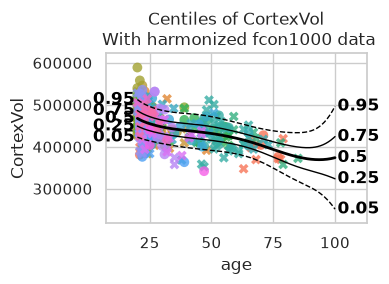
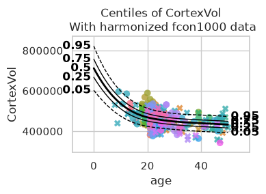
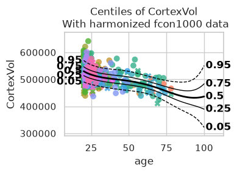
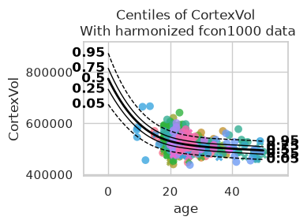
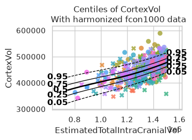
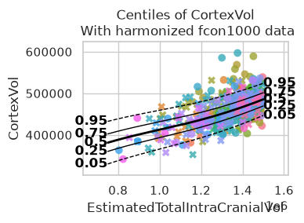
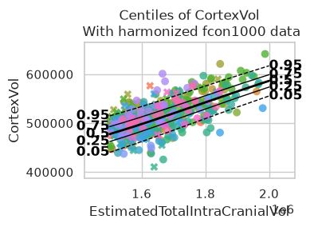
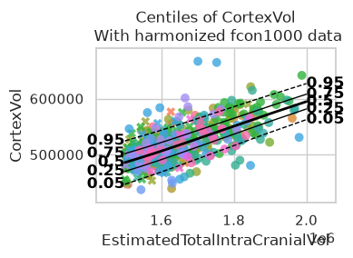

.. code:: ipython3

    import logging
    import os
    import warnings
    
    import pandas as pd
    import seaborn as sns
    
    import pcntoolkit.util.output
    from pcntoolkit import (
        HBR,
        BsplineBasisFunction,
        CompositeBasisFunction,
        NormalLikelihood,
        NormativeModel,
        NormData,
        make_prior,
        plot_centiles_advanced,
    )
    
    sns.set_style("darkgrid")
    
    # Suppress some annoying warnings and logs
    pymc_logger = logging.getLogger("pymc")
    
    pymc_logger.setLevel(logging.WARNING)
    
    pymc_logger.propagate = False
    
    warnings.simplefilter(action="ignore", category=FutureWarning)
    pd.options.mode.chained_assignment = None  # default='warn'
    pcntoolkit.util.output.Output.set_show_messages(False)

.. code:: ipython3

    save_path = os.path.join("pcntoolkit_resources", "data")
    os.makedirs(save_path, exist_ok=True)
    data_path = os.path.join(save_path, "fcon1000.csv")
    if not os.path.exists(data_path):
        data = pd.read_csv(
            "https://raw.githubusercontent.com/predictive-clinical-neuroscience/PCNtoolkit-demo/refs/heads/main/data/fcon1000.csv"
        )
        data.to_csv(data_path, index=False)
    else:
        data = pd.read_csv(data_path)
    
    # Define the variables
    sex_map = {0: "F", 1: "M"}
    data["sex"] = data["sex"].map(sex_map)
    subject_ids = "sub_id"
    covariates = ["age", "EstimatedTotalIntraCranialVol"]
    batch_effects = ["sex", "site"]
    response_vars = ["CortexVol"]
    
    data = NormData.from_dataframe("fcon1000", data, covariates, batch_effects, response_vars)
    train, test = data.train_test_split()

.. code:: ipython3

    CompositeBasisFunction(
            (BsplineBasisFunction(basis_column=0, degree=3, nknots=5), BsplineBasisFunction(basis_column=1, degree=3, nknots=5))
        ),

.. code:: text

    (<pcntoolkit.math_functions.basis_function.CompositeBasisFunction at 0x7f625cd7bcb0>,)

.. code:: ipython3

    mu = make_prior(
        # Mu is linear because we want to allow the mean to vary as a function of the covariates.
        linear=True,
        # The slope coefficients are assumed to be normally distributed, with a mean of 0 and a standard deviation of 10.
        slope=make_prior(dist_name="Normal", dist_params=(0.0, 5.0)),
        # The intercept is random, because we expect the intercept to vary between sites and sexes.
    
        intercept=make_prior(
            random=True,
            # Mu is the mean of the intercept, which is normally distributed with a mean of 0 and a standard deviation of 1.
            mu=make_prior(dist_name="Normal", dist_params=(0.0, 1.0)),
            # Sigma is the scale at which the intercepts vary. It is a positive parameter, so we have to map it to the positive domain.
            sigma=make_prior(dist_name="Gamma", dist_params=(1.0, 1.0))
        ),
            # We use a B-spline basis function to allow for non-linearity in the mean.
        basis_function=CompositeBasisFunction(
            (BsplineBasisFunction(basis_column=0, degree=3, nknots=5), BsplineBasisFunction(basis_column=1, degree=3, nknots=5))
        ),
    )
    sigma = make_prior(
        # Sigma is also linear, because we want to allow the standard deviation to vary as a function of the covariates: heteroskedasticity.
        linear=True,
        # The slope coefficients are assumed to be normally distributed, with a mean of 0 and a standard deviation of 2.
        slope=make_prior(dist_name="Normal", dist_params=(0.0, 1.0)),
        # The intercept is not random, because we assume the intercept of the variance to be the same for all sites and sexes.
        intercept=make_prior(dist_name="Normal", dist_params=(1.0, 1.0)),
        # We use a B-spline basis function to allow for non-linearity in the standard deviation.
        basis_function=BsplineBasisFunction(basis_column=0, nknots=5, degree=3),
        # We use a softplus mapping to ensure that sigma is strictly positive.
        mapping="softplus",
        # We scale the softplus mapping by a factor of 3, to avoid spikes in the resulting density.
        # The parameters (a, b, c) provided to a mapping f are used as: f_abc(x) = f((x - a) / b) * b + c
        # This basically provides an affine transformation of the softplus function.
        # a -> horizontal shift
        # b -> scaling
        # c -> vertical shift
        # You can leave c out, and it will default to 0.
        mapping_params=(0.0, 2.0),
    )
    
    
    # Set the likelihood with the priors we just created.
    likelihood = NormalLikelihood(mu, sigma)
    
    template_hbr = HBR(
        name="template",
        # The number of cores to use for sampling.
        cores=16,
        # Whether to show a progress bar during the model fitting.
        progressbar=False,
        # The number of draws to sample from the posterior per chain.
        draws=1500,
        # The number of tuning steps to run.
        tune=500,
        # The number of MCMC chains to run.
        chains=4,
        # The sampler to use for the model.
        nuts_sampler="nutpie",
        # The likelihood function to use for the model.
        likelihood=likelihood,
    )

.. code:: ipython3

    model = NormativeModel(
        # The regression model to use for the normative model.
        template_regression_model=template_hbr,
        # Whether to save the model after fitting.
        savemodel=True,
        # Whether to evaluate the model after fitting.
        evaluate_model=True,
        # Whether to save the results after evaluation.
        saveresults=True,
        # Whether to save the plots after fitting.
        saveplots=True,
        # The directory to save the model, results, and plots.
        save_dir="resources/composite_basis/save_dir",
        # The scaler to use for the input data. Can be either one of "standardize", "minmax", "robminmax", "none"
        inscaler="standardize",
        # The scaler to use for the output data. Can be either one of "standardize", "minmax", "robminmax", "none"
        outscaler="standardize",
    )

.. code:: ipython3

    model.fit_predict(train, test)

.. raw:: html

    
<svg style="position: absolute; width: 0; height: 0; overflow: hidden">
    <defs>
    <symbol id="icon-database" viewBox="0 0 32 32">
    <path d="M16 0c-8.837 0-16 2.239-16 5v4c0 2.761 7.163 5 16 5s16-2.239 16-5v-4c0-2.761-7.163-5-16-5z"></path>
    <path d="M16 17c-8.837 0-16-2.239-16-5v6c0 2.761 7.163 5 16 5s16-2.239 16-5v-6c0 2.761-7.163 5-16 5z"></path>
    <path d="M16 26c-8.837 0-16-2.239-16-5v6c0 2.761 7.163 5 16 5s16-2.239 16-5v-6c0 2.761-7.163 5-16 5z"></path>
    </symbol>
    <symbol id="icon-file-text2" viewBox="0 0 32 32">
    <path d="M28.681 7.159c-0.694-0.947-1.662-2.053-2.724-3.116s-2.169-2.030-3.116-2.724c-1.612-1.182-2.393-1.319-2.841-1.319h-15.5c-1.378 0-2.5 1.121-2.5 2.5v27c0 1.378 1.122 2.5 2.5 2.5h23c1.378 0 2.5-1.122 2.5-2.5v-19.5c0-0.448-0.137-1.23-1.319-2.841zM24.543 5.457c0.959 0.959 1.712 1.825 2.268 2.543h-4.811v-4.811c0.718 0.556 1.584 1.309 2.543 2.268zM28 29.5c0 0.271-0.229 0.5-0.5 0.5h-23c-0.271 0-0.5-0.229-0.5-0.5v-27c0-0.271 0.229-0.5 0.5-0.5 0 0 15.499-0 15.5 0v7c0 0.552 0.448 1 1 1h7v19.5z"></path>
    <path d="M23 26h-14c-0.552 0-1-0.448-1-1s0.448-1 1-1h14c0.552 0 1 0.448 1 1s-0.448 1-1 1z"></path>
    <path d="M23 22h-14c-0.552 0-1-0.448-1-1s0.448-1 1-1h14c0.552 0 1 0.448 1 1s-0.448 1-1 1z"></path>
    <path d="M23 18h-14c-0.552 0-1-0.448-1-1s0.448-1 1-1h14c0.552 0 1 0.448 1 1s-0.448 1-1 1z"></path>
    </symbol>
    </defs>
    </svg>
    <pre class='xr-text-repr-fallback'>&lt;xarray.NormData&gt; Size: 54kB
    Dimensions:            (observations: 216, response_vars: 1, covariates: 2,
                            batch_effect_dims: 2, centile: 5, statistic: 13)
    Coordinates:
      * observations       (observations) int64 2kB 756 769 692 616 ... 751 470 1043
      * response_vars      (response_vars) &lt;U9 36B &#x27;CortexVol&#x27;
      * covariates         (covariates) &lt;U29 232B &#x27;age&#x27; &#x27;EstimatedTotalIntraCrani...
      * batch_effect_dims  (batch_effect_dims) &lt;U4 32B &#x27;sex&#x27; &#x27;site&#x27;
      * centile            (centile) float64 40B 0.05 0.25 0.5 0.75 0.95
      * statistic          (statistic) &lt;U8 416B &#x27;EXPV&#x27; &#x27;Kurtosis&#x27; ... &#x27;Skewness&#x27;
    Data variables:
        subject_ids        (observations) int64 2kB 756 769 692 616 ... 751 470 1043
        Y                  (observations, response_vars) float64 2kB 4.579e+05 .....
        X                  (observations, covariates) float64 3kB 63.0 ... 1.603e+06
        batch_effects      (observations, batch_effect_dims) &lt;U17 29kB &#x27;F&#x27; ... &#x27;Q...
        Z                  (observations, response_vars) float64 2kB -0.1452 ... ...
        centiles           (centile, observations, response_vars) float64 9kB 4.2...
        baseline_logp      (observations, response_vars) float64 2kB -1.036 ... -...
        logp               (observations, response_vars) float64 2kB -0.0674 ... ...
        Yhat               (observations, response_vars) float64 2kB 4.609e+05 .....
        statistics         (response_vars, statistic) float64 104B 0.6692 ... 0.3127
    Attributes:
        real_ids:                       False
        is_scaled:                      False
        name:                           fcon1000_test
        unique_batch_effects:           {np.str_(&#x27;sex&#x27;): [&#x27;M&#x27;, &#x27;F&#x27;], np.str_(&#x27;sit...
        batch_effect_counts:            defaultdict(&lt;function NormData.register_b...
        covariate_ranges:               {np.str_(&#x27;age&#x27;): {&#x27;min&#x27;: 7.88, &#x27;max&#x27;: 85....
        batch_effect_covariate_ranges:  {np.str_(&#x27;sex&#x27;): {&#x27;M&#x27;: {np.str_(&#x27;age&#x27;): {...</pre>

xarray.NormData

<ul class='xr-sections'><li class='xr-section-item'><input id='section-c07f94d3-d7e5-459d-bd56-071b98852078' class='xr-section-summary-in' type='checkbox' disabled /><label for='section-c07f94d3-d7e5-459d-bd56-071b98852078' class='xr-section-summary'>Dimensions:</label>
<ul class='xr-dim-list'><li>observations: 216</li><li>response_vars: 1</li><li>covariates: 2</li><li>batch_effect_dims: 2</li><li>centile: 5</li><li>statistic: 13</li></ul>
</li><li class='xr-section-item'><input id='section-d329a58a-9060-483c-b7fa-c24648f704aa' class='xr-section-summary-in' type='checkbox' checked /><label for='section-d329a58a-9060-483c-b7fa-c24648f704aa' class='xr-section-summary' title='Expand/collapse section'>Coordinates: (6)</label>

<ul class='xr-var-list'><li class='xr-var-item'>
observations

(observations)

int64

756 769 692 616 ... 751 470 1043
<input id='attrs-4ea51682-1081-43d1-962c-a7b14bc08281' class='xr-var-attrs-in' type='checkbox' disabled><label for='attrs-4ea51682-1081-43d1-962c-a7b14bc08281' title='Show/Hide attributes'><svg class='icon xr-icon-file-text2'><use xlink:href='#icon-file-text2'></use></svg></label><input id='data-0a48c7c6-4609-4336-ba29-912e9c8faa94' class='xr-var-data-in' type='checkbox'><label for='data-0a48c7c6-4609-4336-ba29-912e9c8faa94' title='Show/Hide data repr'><svg class='icon xr-icon-database'><use xlink:href='#icon-database'></use></svg></label>
<dl class='xr-attrs'></dl>

<pre>array([ 756,  769,  692, ...,  751,  470, 1043], shape=(216,))</pre>
</li><li class='xr-var-item'>
response_vars

(response_vars)

&lt;U9

&#x27;CortexVol&#x27;
<input id='attrs-69088ed1-5e85-4a91-bf30-51d3f5b3b92e' class='xr-var-attrs-in' type='checkbox' disabled><label for='attrs-69088ed1-5e85-4a91-bf30-51d3f5b3b92e' title='Show/Hide attributes'><svg class='icon xr-icon-file-text2'><use xlink:href='#icon-file-text2'></use></svg></label><input id='data-5ee10c77-74a9-4b81-a0ca-9dcd6838dbd3' class='xr-var-data-in' type='checkbox'><label for='data-5ee10c77-74a9-4b81-a0ca-9dcd6838dbd3' title='Show/Hide data repr'><svg class='icon xr-icon-database'><use xlink:href='#icon-database'></use></svg></label>
<dl class='xr-attrs'></dl>

<pre>array([&#x27;CortexVol&#x27;], dtype=&#x27;&lt;U9&#x27;)</pre>
</li><li class='xr-var-item'>
covariates

(covariates)

&lt;U29

&#x27;age&#x27; &#x27;EstimatedTotalIntraCrania...
<input id='attrs-a14c003a-5834-43ae-9890-348adae8a7f8' class='xr-var-attrs-in' type='checkbox' disabled><label for='attrs-a14c003a-5834-43ae-9890-348adae8a7f8' title='Show/Hide attributes'><svg class='icon xr-icon-file-text2'><use xlink:href='#icon-file-text2'></use></svg></label><input id='data-b0997b46-1dfd-468d-bbb7-eee29f198211' class='xr-var-data-in' type='checkbox'><label for='data-b0997b46-1dfd-468d-bbb7-eee29f198211' title='Show/Hide data repr'><svg class='icon xr-icon-database'><use xlink:href='#icon-database'></use></svg></label>
<dl class='xr-attrs'></dl>

<pre>array([&#x27;age&#x27;, &#x27;EstimatedTotalIntraCranialVol&#x27;], dtype=&#x27;&lt;U29&#x27;)</pre>
</li><li class='xr-var-item'>
batch_effect_dims

(batch_effect_dims)

&lt;U4

&#x27;sex&#x27; &#x27;site&#x27;
<input id='attrs-d73a6409-61db-45a9-b4e8-ea6128de55da' class='xr-var-attrs-in' type='checkbox' disabled><label for='attrs-d73a6409-61db-45a9-b4e8-ea6128de55da' title='Show/Hide attributes'><svg class='icon xr-icon-file-text2'><use xlink:href='#icon-file-text2'></use></svg></label><input id='data-527326e6-50e2-4008-bd07-8b4aa7247ae8' class='xr-var-data-in' type='checkbox'><label for='data-527326e6-50e2-4008-bd07-8b4aa7247ae8' title='Show/Hide data repr'><svg class='icon xr-icon-database'><use xlink:href='#icon-database'></use></svg></label>
<dl class='xr-attrs'></dl>

<pre>array([&#x27;sex&#x27;, &#x27;site&#x27;], dtype=&#x27;&lt;U4&#x27;)</pre>
</li><li class='xr-var-item'>
centile

(centile)

float64

0.05 0.25 0.5 0.75 0.95
<input id='attrs-fb833d47-7456-4c65-adf8-b2fe1130a73b' class='xr-var-attrs-in' type='checkbox' disabled><label for='attrs-fb833d47-7456-4c65-adf8-b2fe1130a73b' title='Show/Hide attributes'><svg class='icon xr-icon-file-text2'><use xlink:href='#icon-file-text2'></use></svg></label><input id='data-bf877c13-80ee-4f96-8661-2a4f0df193a3' class='xr-var-data-in' type='checkbox'><label for='data-bf877c13-80ee-4f96-8661-2a4f0df193a3' title='Show/Hide data repr'><svg class='icon xr-icon-database'><use xlink:href='#icon-database'></use></svg></label>
<dl class='xr-attrs'></dl>

<pre>array([0.05, 0.25, 0.5 , 0.75, 0.95])</pre>
</li><li class='xr-var-item'>
statistic

(statistic)

&lt;U8

&#x27;EXPV&#x27; &#x27;Kurtosis&#x27; ... &#x27;Skewness&#x27;
<input id='attrs-7adfbeea-5a6c-44cc-8f97-dc2a43e32e97' class='xr-var-attrs-in' type='checkbox' disabled><label for='attrs-7adfbeea-5a6c-44cc-8f97-dc2a43e32e97' title='Show/Hide attributes'><svg class='icon xr-icon-file-text2'><use xlink:href='#icon-file-text2'></use></svg></label><input id='data-0fd07bc5-5c32-440a-8be1-5b810aab26fa' class='xr-var-data-in' type='checkbox'><label for='data-0fd07bc5-5c32-440a-8be1-5b810aab26fa' title='Show/Hide data repr'><svg class='icon xr-icon-database'><use xlink:href='#icon-database'></use></svg></label>
<dl class='xr-attrs'></dl>

<pre>array([&#x27;EXPV&#x27;, &#x27;Kurtosis&#x27;, &#x27;MACE&#x27;, &#x27;MAPE&#x27;, &#x27;MLL&#x27;, &#x27;MSLL&#x27;, &#x27;R2&#x27;, &#x27;RMSE&#x27;, &#x27;Rho&#x27;,
           &#x27;Rho_p&#x27;, &#x27;SMSE&#x27;, &#x27;ShapiroW&#x27;, &#x27;Skewness&#x27;], dtype=&#x27;&lt;U8&#x27;)</pre>
</li></ul>
</li><li class='xr-section-item'><input id='section-a8dace10-a56b-46f6-bf26-abb35e27f830' class='xr-section-summary-in' type='checkbox' checked /><label for='section-a8dace10-a56b-46f6-bf26-abb35e27f830' class='xr-section-summary' title='Expand/collapse section'>Data variables: (10)</label>

<ul class='xr-var-list'><li class='xr-var-item'>
subject_ids

(observations)

int64

756 769 692 616 ... 751 470 1043
<input id='attrs-fba17e5e-ab3f-430e-88a8-0837ea66e9ac' class='xr-var-attrs-in' type='checkbox' disabled><label for='attrs-fba17e5e-ab3f-430e-88a8-0837ea66e9ac' title='Show/Hide attributes'><svg class='icon xr-icon-file-text2'><use xlink:href='#icon-file-text2'></use></svg></label><input id='data-440dfc1e-23cd-4f42-ae6b-7a954088d318' class='xr-var-data-in' type='checkbox'><label for='data-440dfc1e-23cd-4f42-ae6b-7a954088d318' title='Show/Hide data repr'><svg class='icon xr-icon-database'><use xlink:href='#icon-database'></use></svg></label>
<dl class='xr-attrs'></dl>

<pre>array([ 756,  769,  692,  616,   35,  164,  680,  331,  299,  727,  136,
             80,  209,  394,  653,  626,  935,  302,   61,  449,  984, 1036,
            518,  574,  593,  870,  828,  354,  947,  275,  874,  604,  948,
            670,  228,  294,  708,   90, 1020,  884,  856, 1023,  428,  635,
            221,  298, 1027,  324,  654,  844, 1003,  390,  259,  384,  205,
            881,   63,  681,   34,   16,  219,  214,  738,  501,  242, 1051,
            465,  553,  269,  757,  339,  826,  640,  925,  120,  717,  548,
            248,  726,  334,  556,  186,  822,  761,  411,  783,  109,  960,
            982,  424,  405,  800,  361,  938,  714,  993,  413,  279,  392,
            517,  357,  129,  277,  198,  608, 1033,   19,  660, 1060,  600,
            113,  539,  900,  823,  824,  436,   78,  462,  446, 1021,  435,
            973,  241,  955,  192,  519,  940,   23,  332,  378,  549,  515,
            137,  937,  936,  111,   18,  855,  853,  628,  201,  814,  698,
            366, 1063,   93,  134,  225,  423,  476,   71,  807,  142,  801,
              2,  220,  656,   98,  722,  603,  989,  754,  474,  545,  487,
            538,  646, 1000, 1053,   54,  678,  280,  582,  502,  804,  967,
             95,  185,  985,  141,  295,  437,  138,   96,  155,   51, 1064,
           1046,  562,  527,   79,  861,  469,  710,  564,  907, 1054,  421,
            968,  875,  669,  618,  504,  343,  777,  133,   27,  959,   29,
            346,  304,  264,  798,  751,  470, 1043])</pre>
</li><li class='xr-var-item'>
Y

(observations, response_vars)

float64

4.579e+05 5.268e+05 ... 5.035e+05
<input id='attrs-340774c8-d9eb-477b-9a9e-ebb1e1bf7ac5' class='xr-var-attrs-in' type='checkbox' disabled><label for='attrs-340774c8-d9eb-477b-9a9e-ebb1e1bf7ac5' title='Show/Hide attributes'><svg class='icon xr-icon-file-text2'><use xlink:href='#icon-file-text2'></use></svg></label><input id='data-8f20a0e3-8f08-4444-96f4-a8afa3feecaf' class='xr-var-data-in' type='checkbox'><label for='data-8f20a0e3-8f08-4444-96f4-a8afa3feecaf' title='Show/Hide data repr'><svg class='icon xr-icon-database'><use xlink:href='#icon-database'></use></svg></label>
<dl class='xr-attrs'></dl>

<pre>array([[457858.327875],
           [526780.362454],
           [495744.470654],
           [585303.839185],
           [333111.551539],
           [510794.940093],
           [550533.324588],
           [467673.976819],
           [460129.533137],
           [444494.81748 ],
           [559424.623684],
           [421551.233862],
           [519842.763049],
           [506679.262498],
           [535569.986908],
           [467607.554967],
           [530904.612455],
           [509371.867477],
           [460068.379043],
           [487269.373272],
    ...
           [453982.166201],
           [558453.1234  ],
           [473575.183228],
           [382788.490644],
           [502713.911273],
           [512490.347519],
           [437300.068601],
           [567331.907771],
           [512273.764245],
           [491973.561824],
           [478907.15396 ],
           [474077.083308],
           [454163.909225],
           [468067.037499],
           [509199.707778],
           [526635.257997],
           [520499.662889],
           [486680.791077],
           [610402.005701],
           [503535.771203]])</pre>
</li><li class='xr-var-item'>
X

(observations, covariates)

float64

63.0 1.533e+06 ... 23.0 1.603e+06
<input id='attrs-882ad3a3-ce34-4cfd-a28d-a90b08d63fcf' class='xr-var-attrs-in' type='checkbox' disabled><label for='attrs-882ad3a3-ce34-4cfd-a28d-a90b08d63fcf' title='Show/Hide attributes'><svg class='icon xr-icon-file-text2'><use xlink:href='#icon-file-text2'></use></svg></label><input id='data-7f1d7bab-d095-4593-b861-800a95c9240e' class='xr-var-data-in' type='checkbox'><label for='data-7f1d7bab-d095-4593-b861-800a95c9240e' title='Show/Hide data repr'><svg class='icon xr-icon-database'><use xlink:href='#icon-database'></use></svg></label>
<dl class='xr-attrs'></dl>

<pre>array([[6.30000000e+01, 1.53274143e+06],
           [2.32700000e+01, 1.40047223e+06],
           [2.20000000e+01, 1.48954279e+06],
           [4.20000000e+01, 1.86413298e+06],
           [6.30000000e+01, 1.09596196e+06],
           [2.30000000e+01, 1.68477930e+06],
           [2.10000000e+01, 1.86815080e+06],
           [2.60000000e+01, 1.44257370e+06],
           [2.10000000e+01, 1.29684168e+06],
           [4.90000000e+01, 1.35607954e+06],
           [2.00000000e+01, 1.70498340e+06],
           [2.30000000e+01, 1.15830591e+06],
           [2.00000000e+01, 1.57575448e+06],
           [2.60000000e+01, 1.67796587e+06],
           [3.50000000e+01, 1.87317033e+06],
           [2.10000000e+01, 1.53007303e+06],
           [2.20000000e+01, 1.48131494e+06],
           [1.90000000e+01, 1.60557346e+06],
           [3.40000000e+01, 1.43249051e+06],
           [1.80000000e+01, 1.58241871e+06],
    ...
           [2.10000000e+01, 1.41064754e+06],
           [2.00000000e+01, 1.91714030e+06],
           [2.20000000e+01, 1.30791128e+06],
           [2.50000000e+01, 8.93525339e+05],
           [2.50000000e+01, 1.74430270e+06],
           [7.30000000e+01, 1.65369057e+06],
           [2.20000000e+01, 1.48584426e+06],
           [2.80000000e+01, 1.79437919e+06],
           [2.90600000e+01, 1.84599685e+06],
           [1.90000000e+01, 1.57800703e+06],
           [2.00000000e+01, 1.46577039e+06],
           [2.20000000e+01, 1.30793200e+06],
           [1.90000000e+01, 1.33464236e+06],
           [2.40000000e+01, 1.31818656e+06],
           [2.10000000e+01, 1.64204629e+06],
           [2.40000000e+01, 1.54616694e+06],
           [2.27900000e+01, 1.45689873e+06],
           [7.20000000e+01, 1.57223354e+06],
           [2.30000000e+01, 1.98747750e+06],
           [2.30000000e+01, 1.60306371e+06]])</pre>
</li><li class='xr-var-item'>
batch_effects

(observations, batch_effect_dims)

&lt;U17

&#x27;F&#x27; &#x27;Munchen&#x27; ... &#x27;M&#x27; &#x27;Queensland&#x27;
<input id='attrs-cee4c30a-0b3c-41c9-ba37-d8b6c418c17c' class='xr-var-attrs-in' type='checkbox' disabled><label for='attrs-cee4c30a-0b3c-41c9-ba37-d8b6c418c17c' title='Show/Hide attributes'><svg class='icon xr-icon-file-text2'><use xlink:href='#icon-file-text2'></use></svg></label><input id='data-0c83bc48-3596-475e-a2a9-567e5f1807af' class='xr-var-data-in' type='checkbox'><label for='data-0c83bc48-3596-475e-a2a9-567e5f1807af' title='Show/Hide data repr'><svg class='icon xr-icon-database'><use xlink:href='#icon-database'></use></svg></label>
<dl class='xr-attrs'></dl>

<pre>array([[&#x27;F&#x27;, &#x27;Munchen&#x27;],
           [&#x27;M&#x27;, &#x27;NewYork_a&#x27;],
           [&#x27;F&#x27;, &#x27;Leiden_2200&#x27;],
           [&#x27;M&#x27;, &#x27;ICBM&#x27;],
           [&#x27;F&#x27;, &#x27;AnnArbor_b&#x27;],
           [&#x27;M&#x27;, &#x27;Beijing_Zang&#x27;],
           [&#x27;M&#x27;, &#x27;Leiden_2200&#x27;],
           [&#x27;F&#x27;, &#x27;Berlin_Margulies&#x27;],
           [&#x27;F&#x27;, &#x27;Beijing_Zang&#x27;],
           [&#x27;F&#x27;, &#x27;Milwaukee_b&#x27;],
           [&#x27;M&#x27;, &#x27;Beijing_Zang&#x27;],
           [&#x27;F&#x27;, &#x27;Atlanta&#x27;],
           [&#x27;F&#x27;, &#x27;Beijing_Zang&#x27;],
           [&#x27;F&#x27;, &#x27;Cambridge_Buckner&#x27;],
           [&#x27;M&#x27;, &#x27;ICBM&#x27;],
           [&#x27;F&#x27;, &#x27;ICBM&#x27;],
           [&#x27;M&#x27;, &#x27;Oulu&#x27;],
           [&#x27;F&#x27;, &#x27;Beijing_Zang&#x27;],
           [&#x27;M&#x27;, &#x27;Atlanta&#x27;],
           [&#x27;F&#x27;, &#x27;Cambridge_Buckner&#x27;],
    ...
           [&#x27;F&#x27;, &#x27;SaintLouis&#x27;],
           [&#x27;M&#x27;, &#x27;Cambridge_Buckner&#x27;],
           [&#x27;F&#x27;, &#x27;Oulu&#x27;],
           [&#x27;F&#x27;, &#x27;Newark&#x27;],
           [&#x27;M&#x27;, &#x27;Leiden_2180&#x27;],
           [&#x27;M&#x27;, &#x27;ICBM&#x27;],
           [&#x27;F&#x27;, &#x27;Cambridge_Buckner&#x27;],
           [&#x27;M&#x27;, &#x27;Berlin_Margulies&#x27;],
           [&#x27;M&#x27;, &#x27;NewYork_a&#x27;],
           [&#x27;F&#x27;, &#x27;Beijing_Zang&#x27;],
           [&#x27;M&#x27;, &#x27;AnnArbor_b&#x27;],
           [&#x27;F&#x27;, &#x27;Oulu&#x27;],
           [&#x27;F&#x27;, &#x27;AnnArbor_b&#x27;],
           [&#x27;F&#x27;, &#x27;Berlin_Margulies&#x27;],
           [&#x27;M&#x27;, &#x27;Beijing_Zang&#x27;],
           [&#x27;F&#x27;, &#x27;Beijing_Zang&#x27;],
           [&#x27;M&#x27;, &#x27;NewYork_a&#x27;],
           [&#x27;M&#x27;, &#x27;Munchen&#x27;],
           [&#x27;M&#x27;, &#x27;Cambridge_Buckner&#x27;],
           [&#x27;M&#x27;, &#x27;Queensland&#x27;]], dtype=&#x27;&lt;U17&#x27;)</pre>
</li><li class='xr-var-item'>
Z

(observations, response_vars)

float64

-0.1452 1.026 ... 2.329 -0.8429
<input id='attrs-ba062335-8047-4fb0-acf9-a5d1d4d7c110' class='xr-var-attrs-in' type='checkbox' disabled><label for='attrs-ba062335-8047-4fb0-acf9-a5d1d4d7c110' title='Show/Hide attributes'><svg class='icon xr-icon-file-text2'><use xlink:href='#icon-file-text2'></use></svg></label><input id='data-f8843fc3-f30d-4535-a983-5f0d53d40931' class='xr-var-data-in' type='checkbox'><label for='data-f8843fc3-f30d-4535-a983-5f0d53d40931' title='Show/Hide data repr'><svg class='icon xr-icon-database'><use xlink:href='#icon-database'></use></svg></label>
<dl class='xr-attrs'></dl>

<pre>array([[-0.1452342 ],
           [ 1.02557814],
           [ 0.62657494],
           [ 1.51122484],
           [-1.46386279],
           [-1.32089945],
           [-1.266134  ],
           [-0.98459974],
           [ 0.04239691],
           [-0.11265924],
           [ 0.24885113],
           [-0.69253884],
           [ 0.28964749],
           [ 1.38967122],
           [-1.3265277 ],
           [-1.14246806],
           [-0.05558395],
           [-0.52835085],
           [-0.80463574],
           [ 0.34179643],
    ...
           [-1.15059447],
           [ 0.05224613],
           [-0.61551759],
           [-0.53313076],
           [-1.55142862],
           [ 1.99936409],
           [-0.3105774 ],
           [-0.37140766],
           [-3.6574103 ],
           [-0.97704145],
           [-0.3726907 ],
           [-0.59656068],
           [-0.09744914],
           [-0.22048462],
           [-1.14294196],
           [ 1.32593466],
           [ 0.32550667],
           [ 0.94806214],
           [ 2.32887786],
           [-0.8428516 ]])</pre>
</li><li class='xr-var-item'>
centiles

(centile, observations, response_vars)

float64

4.264e+05 4.604e+05 ... 5.612e+05
<input id='attrs-e6868394-3349-4ab3-8dca-dad8fddd99a9' class='xr-var-attrs-in' type='checkbox' disabled><label for='attrs-e6868394-3349-4ab3-8dca-dad8fddd99a9' title='Show/Hide attributes'><svg class='icon xr-icon-file-text2'><use xlink:href='#icon-file-text2'></use></svg></label><input id='data-aa4de47c-a726-440c-9cd7-0e188917d162' class='xr-var-data-in' type='checkbox'><label for='data-aa4de47c-a726-440c-9cd7-0e188917d162' title='Show/Hide data repr'><svg class='icon xr-icon-database'><use xlink:href='#icon-database'></use></svg></label>
<dl class='xr-attrs'></dl>

<pre>array([[[426414.66545903],
            [460356.11209154],
            [439852.13711768],
            ...,
            [427547.07448351],
            [530854.05583804],
            [484932.00163072]],
    
           [[446730.29912676],
            [484501.9300667 ],
            [463736.43756812],
            ...,
            [449781.49982632],
            [550328.32854015],
            [507417.68473341]],
    
           [[460851.48294849],
            [501285.43481627],
            [480338.16422997],
            ...,
            [465236.41561045],
            [563864.69118177],
            [523047.24715038]],
    
           [[474972.66677021],
            [518068.93956585],
            [496939.89089182],
            ...,
            [480691.33139458],
            [577401.0538234 ],
            [538676.80956735]],
    
           [[495288.30043794],
            [542214.757541  ],
            [520824.19134226],
            ...,
            [502925.75673739],
            [596875.32652551],
            [561162.49267003]]], shape=(5, 216, 1))</pre>
</li><li class='xr-var-item'>
baseline_logp

(observations, response_vars)

float64

-1.036 -1.182 ... -4.021 -0.9114
<input id='attrs-ef23cfc3-be20-4553-b36f-cd42cdb3166c' class='xr-var-attrs-in' type='checkbox' disabled><label for='attrs-ef23cfc3-be20-4553-b36f-cd42cdb3166c' title='Show/Hide attributes'><svg class='icon xr-icon-file-text2'><use xlink:href='#icon-file-text2'></use></svg></label><input id='data-5a70c705-f365-40db-a3eb-3e38f73c1d51' class='xr-var-data-in' type='checkbox'><label for='data-5a70c705-f365-40db-a3eb-3e38f73c1d51' title='Show/Hide data repr'><svg class='icon xr-icon-database'><use xlink:href='#icon-database'></use></svg></label>
<dl class='xr-attrs'></dl>

<pre>array([[-1.03593217],
           [-1.18228146],
           [-0.8710495 ],
           [-2.86273506],
           [-5.81179816],
           [-0.97178023],
           [-1.6920084 ],
           [-0.93572612],
           [-1.00917076],
           [-1.23698624],
           [-1.94337031],
           [-1.75597632],
           [-1.07782826],
           [-0.93484472],
           [-1.34346116],
           [-0.9362691 ],
           [-1.25389532],
           [-0.95820961],
           [-1.00986314],
           [-0.85592663],
    ...
           [-1.08657625],
           [-1.91430013],
           [-0.89483328],
           [-3.13185767],
           [-0.90594411],
           [-0.989051  ],
           [-1.37609215],
           [-2.19462803],
           [-0.98677789],
           [-0.86061958],
           [-0.87038174],
           [-0.89202585],
           [-1.08406159],
           [-0.93255066],
           [-0.95662517],
           [-1.17989111],
           [-1.08685779],
           [-0.85598943],
           [-4.02130046],
           [-0.91139503]])</pre>
</li><li class='xr-var-item'>
logp

(observations, response_vars)

float64

-0.0674 -0.7177 ... -2.746 -0.4943
<input id='attrs-120674b3-05d5-49c6-b863-47819a78bf46' class='xr-var-attrs-in' type='checkbox' disabled><label for='attrs-120674b3-05d5-49c6-b863-47819a78bf46' title='Show/Hide attributes'><svg class='icon xr-icon-file-text2'><use xlink:href='#icon-file-text2'></use></svg></label><input id='data-327313dd-95ac-4ff1-8034-315461738d69' class='xr-var-data-in' type='checkbox'><label for='data-327313dd-95ac-4ff1-8034-315461738d69' title='Show/Hide data repr'><svg class='icon xr-icon-database'><use xlink:href='#icon-database'></use></svg></label>
<dl class='xr-attrs'></dl>

<pre>array([[-0.06739766],
           [-0.71774241],
           [-0.39375198],
           [-1.14205819],
           [-1.29561254],
           [-0.95643277],
           [-0.89115855],
           [-0.63552506],
           [-0.26546052],
           [-0.17668714],
           [-0.16663574],
           [-0.53459753],
           [-0.22530745],
           [-1.01641127],
           [-0.84978715],
           [-0.83878184],
           [-0.18086933],
           [-0.33712012],
           [-0.46234971],
           [-0.29056045],
    ...
           [-0.89833334],
           [-0.06833494],
           [-0.43173388],
           [-0.68164652],
           [-1.28126074],
           [-2.17038144],
           [-0.2216316 ],
           [-0.0818406 ],
           [-6.69068996],
           [-0.6853034 ],
           [-0.31273584],
           [-0.42022392],
           [-0.31698828],
           [-0.24425089],
           [-0.79000254],
           [-0.99983502],
           [-0.23094237],
           [-0.59127051],
           [-2.745846  ],
           [-0.49428729]])</pre>
</li><li class='xr-var-item'>
Yhat

(observations, response_vars)

float64

4.609e+05 5.013e+05 ... 5.23e+05
<input id='attrs-0847feee-2d19-4565-8387-90ba947dcb24' class='xr-var-attrs-in' type='checkbox' disabled><label for='attrs-0847feee-2d19-4565-8387-90ba947dcb24' title='Show/Hide attributes'><svg class='icon xr-icon-file-text2'><use xlink:href='#icon-file-text2'></use></svg></label><input id='data-1f877f17-1efc-44ab-83c7-5448aca1750d' class='xr-var-data-in' type='checkbox'><label for='data-1f877f17-1efc-44ab-83c7-5448aca1750d' title='Show/Hide data repr'><svg class='icon xr-icon-database'><use xlink:href='#icon-database'></use></svg></label>
<dl class='xr-attrs'></dl>

<pre>array([[460851.48294849],
           [501285.43481627],
           [480338.16422997],
           [554816.52335155],
           [368861.78390248],
           [540442.23727543],
           [578083.67035311],
           [490915.92950866],
           [458980.8615633 ],
           [447235.97793447],
           [553534.56261321],
           [440433.3798298 ],
           [512645.639827  ],
           [476656.97410276],
           [561612.66165678],
           [495844.90220083],
           [532276.65464161],
           [522671.62391985],
           [478683.54418691],
           [478362.31677303],
    ...
           [483707.71585982],
           [557312.09904843],
           [489766.15053705],
           [398355.93717343],
           [535781.34069868],
           [467840.94011831],
           [444951.56176264],
           [574881.95283768],
           [584814.59222909],
           [516823.56908283],
           [488561.00998264],
           [489769.35548539],
           [456889.78897657],
           [473648.15586175],
           [536289.52742187],
           [495774.93114554],
           [512511.24829394],
           [465236.41561045],
           [563864.69118177],
           [523047.24715038]])</pre>
</li><li class='xr-var-item'>
statistics

(response_vars, statistic)

float64

0.6692 1.067 ... 0.9798 0.3127
<input id='attrs-c7dc1c31-16c5-4a93-be2e-34046fe5a118' class='xr-var-attrs-in' type='checkbox' disabled><label for='attrs-c7dc1c31-16c5-4a93-be2e-34046fe5a118' title='Show/Hide attributes'><svg class='icon xr-icon-file-text2'><use xlink:href='#icon-file-text2'></use></svg></label><input id='data-51a99900-5377-4c4e-b990-2a5d960a7697' class='xr-var-data-in' type='checkbox'><label for='data-51a99900-5377-4c4e-b990-2a5d960a7697' title='Show/Hide data repr'><svg class='icon xr-icon-database'><use xlink:href='#icon-database'></use></svg></label>
<dl class='xr-attrs'></dl>

<pre>array([[ 6.69205968e-01,  1.06713629e+00,  1.73853276e-01,
             4.45134462e-02,  8.63554327e-01, -4.92371993e-01,
             6.64625582e-01,  2.83495870e+04,  8.06076519e-01,
             1.19122177e-50,  3.35374418e-01,  9.79783265e-01,
             3.12689406e-01]])</pre>
</li></ul>
</li><li class='xr-section-item'><input id='section-751af24f-0b65-4a34-a1b1-897310f9010a' class='xr-section-summary-in' type='checkbox' checked /><label for='section-751af24f-0b65-4a34-a1b1-897310f9010a' class='xr-section-summary' title='Expand/collapse section'>Attributes: (7)</label>

<dl class='xr-attrs'><dt>real_ids :</dt><dd>False</dd><dt>is_scaled :</dt><dd>False</dd><dt>name :</dt><dd>fcon1000_test</dd><dt>unique_batch_effects :</dt><dd>{np.str_(&#x27;sex&#x27;): [&#x27;M&#x27;, &#x27;F&#x27;], np.str_(&#x27;site&#x27;): [&#x27;AnnArbor_a&#x27;, &#x27;AnnArbor_b&#x27;, &#x27;Atlanta&#x27;, &#x27;Baltimore&#x27;, &#x27;Bangor&#x27;, &#x27;Beijing_Zang&#x27;, &#x27;Berlin_Margulies&#x27;, &#x27;Cambridge_Buckner&#x27;, &#x27;Cleveland&#x27;, &#x27;ICBM&#x27;, &#x27;Leiden_2180&#x27;, &#x27;Leiden_2200&#x27;, &#x27;Milwaukee_b&#x27;, &#x27;Munchen&#x27;, &#x27;NewYork_a&#x27;, &#x27;NewYork_a_ADHD&#x27;, &#x27;Newark&#x27;, &#x27;Oulu&#x27;, &#x27;Oxford&#x27;, &#x27;PaloAlto&#x27;, &#x27;Pittsburgh&#x27;, &#x27;Queensland&#x27;, &#x27;SaintLouis&#x27;]}</dd><dt>batch_effect_counts :</dt><dd>defaultdict(&lt;function NormData.register_batch_effects.&lt;locals&gt;.&lt;lambda&gt; at 0x7f6211031e40&gt;, {np.str_(&#x27;sex&#x27;): {&#x27;M&#x27;: 489, &#x27;F&#x27;: 589}, np.str_(&#x27;site&#x27;): {&#x27;AnnArbor_a&#x27;: 24, &#x27;AnnArbor_b&#x27;: 32, &#x27;Atlanta&#x27;: 28, &#x27;Baltimore&#x27;: 23, &#x27;Bangor&#x27;: 20, &#x27;Beijing_Zang&#x27;: 198, &#x27;Berlin_Margulies&#x27;: 26, &#x27;Cambridge_Buckner&#x27;: 198, &#x27;Cleveland&#x27;: 31, &#x27;ICBM&#x27;: 85, &#x27;Leiden_2180&#x27;: 12, &#x27;Leiden_2200&#x27;: 19, &#x27;Milwaukee_b&#x27;: 46, &#x27;Munchen&#x27;: 15, &#x27;NewYork_a&#x27;: 83, &#x27;NewYork_a_ADHD&#x27;: 25, &#x27;Newark&#x27;: 19, &#x27;Oulu&#x27;: 102, &#x27;Oxford&#x27;: 22, &#x27;PaloAlto&#x27;: 17, &#x27;Pittsburgh&#x27;: 3, &#x27;Queensland&#x27;: 19, &#x27;SaintLouis&#x27;: 31}})</dd><dt>covariate_ranges :</dt><dd>{np.str_(&#x27;age&#x27;): {&#x27;min&#x27;: 7.88, &#x27;max&#x27;: 85.0}, np.str_(&#x27;EstimatedTotalIntraCranialVol&#x27;): {&#x27;min&#x27;: 803895.003258, &#x27;max&#x27;: 2213930.77819}}</dd><dt>batch_effect_covariate_ranges :</dt><dd>{np.str_(&#x27;sex&#x27;): {&#x27;M&#x27;: {np.str_(&#x27;age&#x27;): {&#x27;min&#x27;: 9.21, &#x27;max&#x27;: 78.0}, np.str_(&#x27;EstimatedTotalIntraCranialVol&#x27;): {&#x27;min&#x27;: 803895.003258, &#x27;max&#x27;: 2213930.77819}}, &#x27;F&#x27;: {np.str_(&#x27;age&#x27;): {&#x27;min&#x27;: 7.88, &#x27;max&#x27;: 85.0}, np.str_(&#x27;EstimatedTotalIntraCranialVol&#x27;): {&#x27;min&#x27;: 854269.795819, &#x27;max&#x27;: 1839480.7792}}}, np.str_(&#x27;site&#x27;): {&#x27;AnnArbor_a&#x27;: {np.str_(&#x27;age&#x27;): {&#x27;min&#x27;: 13.41, &#x27;max&#x27;: 40.98}, np.str_(&#x27;EstimatedTotalIntraCranialVol&#x27;): {&#x27;min&#x27;: 1239237.74772, &#x27;max&#x27;: 1797270.09178}}, &#x27;AnnArbor_b&#x27;: {np.str_(&#x27;age&#x27;): {&#x27;min&#x27;: 19.0, &#x27;max&#x27;: 79.0}, np.str_(&#x27;EstimatedTotalIntraCranialVol&#x27;): {&#x27;min&#x27;: 1095961.96155, &#x27;max&#x27;: 1785422.9362}}, &#x27;Atlanta&#x27;: {np.str_(&#x27;age&#x27;): {&#x27;min&#x27;: 22.0, &#x27;max&#x27;: 57.0}, np.str_(&#x27;EstimatedTotalIntraCranialVol&#x27;): {&#x27;min&#x27;: 991144.994738, &#x27;max&#x27;: 1961041.2011400005}}, &#x27;Baltimore&#x27;: {np.str_(&#x27;age&#x27;): {&#x27;min&#x27;: 20.0, &#x27;max&#x27;: 40.0}, np.str_(&#x27;EstimatedTotalIntraCranialVol&#x27;): {&#x27;min&#x27;: 1277794.4776, &#x27;max&#x27;: 1858687.83646}}, &#x27;Bangor&#x27;: {np.str_(&#x27;age&#x27;): {&#x27;min&#x27;: 19.0, &#x27;max&#x27;: 38.0}, np.str_(&#x27;EstimatedTotalIntraCranialVol&#x27;): {&#x27;min&#x27;: 1209177.6117399998, &#x27;max&#x27;: 1839143.13269}}, &#x27;Beijing_Zang&#x27;: {np.str_(&#x27;age&#x27;): {&#x27;min&#x27;: 18.0, &#x27;max&#x27;: 26.0}, np.str_(&#x27;EstimatedTotalIntraCranialVol&#x27;): {&#x27;min&#x27;: 1002619.98087, &#x27;max&#x27;: 1869137.32932}}, &#x27;Berlin_Margulies&#x27;: {np.str_(&#x27;age&#x27;): {&#x27;min&#x27;: 23.0, &#x27;max&#x27;: 44.0}, np.str_(&#x27;EstimatedTotalIntraCranialVol&#x27;): {&#x27;min&#x27;: 1283953.04581, &#x27;max&#x27;: 2034930.18739}}, &#x27;Cambridge_Buckner&#x27;: {np.str_(&#x27;age&#x27;): {&#x27;min&#x27;: 18.0, &#x27;max&#x27;: 30.0}, np.str_(&#x27;EstimatedTotalIntraCranialVol&#x27;): {&#x27;min&#x27;: 1226746.2365, &#x27;max&#x27;: 1987477.49695}}, &#x27;Cleveland&#x27;: {np.str_(&#x27;age&#x27;): {&#x27;min&#x27;: 24.0, &#x27;max&#x27;: 60.0}, np.str_(&#x27;EstimatedTotalIntraCranialVol&#x27;): {&#x27;min&#x27;: 1195065.98729, &#x27;max&#x27;: 1727397.1725}}, &#x27;ICBM&#x27;: {np.str_(&#x27;age&#x27;): {&#x27;min&#x27;: 19.0, &#x27;max&#x27;: 85.0}, np.str_(&#x27;EstimatedTotalIntraCranialVol&#x27;): {&#x27;min&#x27;: 1315469.72766, &#x27;max&#x27;: 2156696.50099}}, &#x27;Leiden_2180&#x27;: {np.str_(&#x27;age&#x27;): {&#x27;min&#x27;: 20.0, &#x27;max&#x27;: 27.0}, np.str_(&#x27;EstimatedTotalIntraCranialVol&#x27;): {&#x27;min&#x27;: 1508119.55881, &#x27;max&#x27;: 1968074.24155}}, &#x27;Leiden_2200&#x27;: {np.str_(&#x27;age&#x27;): {&#x27;min&#x27;: 18.0, &#x27;max&#x27;: 28.0}, np.str_(&#x27;EstimatedTotalIntraCranialVol&#x27;): {&#x27;min&#x27;: 1309818.45623, &#x27;max&#x27;: 1868150.79879}}, &#x27;Milwaukee_b&#x27;: {np.str_(&#x27;age&#x27;): {&#x27;min&#x27;: 44.0, &#x27;max&#x27;: 65.0}, np.str_(&#x27;EstimatedTotalIntraCranialVol&#x27;): {&#x27;min&#x27;: 961761.166078, &#x27;max&#x27;: 1749317.40938}}, &#x27;Munchen&#x27;: {np.str_(&#x27;age&#x27;): {&#x27;min&#x27;: 63.0, &#x27;max&#x27;: 74.0}, np.str_(&#x27;EstimatedTotalIntraCranialVol&#x27;): {&#x27;min&#x27;: 1205099.3215, &#x27;max&#x27;: 1807706.83688}}, &#x27;NewYork_a&#x27;: {np.str_(&#x27;age&#x27;): {&#x27;min&#x27;: 7.88, &#x27;max&#x27;: 49.16}, np.str_(&#x27;EstimatedTotalIntraCranialVol&#x27;): {&#x27;min&#x27;: 945590.839808, &#x27;max&#x27;: 1980091.79537}}, &#x27;NewYork_a_ADHD&#x27;: {np.str_(&#x27;age&#x27;): {&#x27;min&#x27;: 20.69, &#x27;max&#x27;: 50.9}, np.str_(&#x27;EstimatedTotalIntraCranialVol&#x27;): {&#x27;min&#x27;: 1182852.33915, &#x27;max&#x27;: 1836931.72887}}, &#x27;Newark&#x27;: {np.str_(&#x27;age&#x27;): {&#x27;min&#x27;: 21.0, &#x27;max&#x27;: 39.0}, np.str_(&#x27;EstimatedTotalIntraCranialVol&#x27;): {&#x27;min&#x27;: 803895.003258, &#x27;max&#x27;: 1483045.87846}}, &#x27;Oulu&#x27;: {np.str_(&#x27;age&#x27;): {&#x27;min&#x27;: 20.0, &#x27;max&#x27;: 23.0}, np.str_(&#x27;EstimatedTotalIntraCranialVol&#x27;): {&#x27;min&#x27;: 1038404.46752, &#x27;max&#x27;: 1807616.45732}}, &#x27;Oxford&#x27;: {np.str_(&#x27;age&#x27;): {&#x27;min&#x27;: 20.0, &#x27;max&#x27;: 35.0}, np.str_(&#x27;EstimatedTotalIntraCranialVol&#x27;): {&#x27;min&#x27;: 989444.241903, &#x27;max&#x27;: 1689557.92241}}, &#x27;PaloAlto&#x27;: {np.str_(&#x27;age&#x27;): {&#x27;min&#x27;: 22.0, &#x27;max&#x27;: 46.0}, np.str_(&#x27;EstimatedTotalIntraCranialVol&#x27;): {&#x27;min&#x27;: 854269.795819, &#x27;max&#x27;: 1673520.84453}}, &#x27;Pittsburgh&#x27;: {np.str_(&#x27;age&#x27;): {&#x27;min&#x27;: 25.0, &#x27;max&#x27;: 47.0}, np.str_(&#x27;EstimatedTotalIntraCranialVol&#x27;): {&#x27;min&#x27;: 823904.532171, &#x27;max&#x27;: 1026186.09328}}, &#x27;Queensland&#x27;: {np.str_(&#x27;age&#x27;): {&#x27;min&#x27;: 20.0, &#x27;max&#x27;: 34.0}, np.str_(&#x27;EstimatedTotalIntraCranialVol&#x27;): {&#x27;min&#x27;: 1335132.49541, &#x27;max&#x27;: 1845048.33956}}, &#x27;SaintLouis&#x27;: {np.str_(&#x27;age&#x27;): {&#x27;min&#x27;: 21.0, &#x27;max&#x27;: 29.0}, np.str_(&#x27;EstimatedTotalIntraCranialVol&#x27;): {&#x27;min&#x27;: 1374160.52253, &#x27;max&#x27;: 2213930.77819}}}}</dd></dl>
</li></ul>

.. code:: ipython3

    model.covariates

.. code:: text

    ['age', 'EstimatedTotalIntraCranialVol']

.. code:: ipython3

    plot_centiles_advanced(
        model,
        covariate="age",
        response_vars=["CortexVol"],
        scatter_data=data,
        covariate_ranges={"age": [20, 100], "EstimatedTotalIntraCranialVol": [0.75e6, 1.5e6]},
        batch_effects="all",
        show_legend=False,
        plt_kwargs={"figsize": (4, 3)},
    )
    plot_centiles_advanced(
        model,
        covariate="age",
        response_vars=["CortexVol"],
        scatter_data=data,
        covariate_ranges={"age": [0, 50], "EstimatedTotalIntraCranialVol": [0.75e6, 1.5e6]},
        batch_effects="all",
        show_legend=False,
        plt_kwargs={"figsize": (4, 3)},
    )
    plot_centiles_advanced(
        model,
        covariate="age",
        response_vars=["CortexVol"],
        scatter_data=data,
        covariate_ranges={"age": [20, 100], "EstimatedTotalIntraCranialVol": [1.5e6, 2.0e6]},
        batch_effects="all",
        show_legend=False,
        plt_kwargs={"figsize": (4, 3)},
    )
    plot_centiles_advanced(
        model,
        covariate="age",
        response_vars=["CortexVol"],
        scatter_data=data,
        covariate_ranges={"age": [0, 50], "EstimatedTotalIntraCranialVol": [1.5e6, 2.0e6]},
        batch_effects="all",
        show_legend=False,
        plt_kwargs={"figsize": (4, 3)},
    )

.. code:: text

    [<Figure size 400x300 with 1 Axes>]

.. code:: ipython3

    plot_centiles_advanced(
        model,
        covariate="EstimatedTotalIntraCranialVol",
        response_vars=["CortexVol"],
        scatter_data=data,
        covariate_ranges={"age": [20, 100], "EstimatedTotalIntraCranialVol": [0.75e6, 1.5e6]},
        batch_effects="all",
        show_legend=False,
        plt_kwargs={"figsize": (4, 3)},
    )
    plot_centiles_advanced(
        model,
        covariate="EstimatedTotalIntraCranialVol",
        response_vars=["CortexVol"],
        scatter_data=data,
        covariate_ranges={"age": [0, 50], "EstimatedTotalIntraCranialVol": [0.75e6, 1.5e6]},
        batch_effects="all",
        show_legend=False,
        plt_kwargs={"figsize": (4, 3)},
    )
    plot_centiles_advanced(
        model,
        covariate="EstimatedTotalIntraCranialVol",
        response_vars=["CortexVol"],
        scatter_data=data,
        covariate_ranges={"age": [20, 100], "EstimatedTotalIntraCranialVol": [1.5e6, 2.0e6]},
        batch_effects="all",
        show_legend=False,
        plt_kwargs={"figsize": (4, 3)},
    )
    plot_centiles_advanced(
        model,
        covariate="EstimatedTotalIntraCranialVol",
        response_vars=["CortexVol"],
        scatter_data=data,
        covariate_ranges={"age": [0, 50], "EstimatedTotalIntraCranialVol": [1.5e6, 2.0e6]},
        batch_effects="all",
        show_legend=False,
        plt_kwargs={"figsize": (4, 3)},
    )

.. code:: text

    [<Figure size 400x300 with 1 Axes>]

