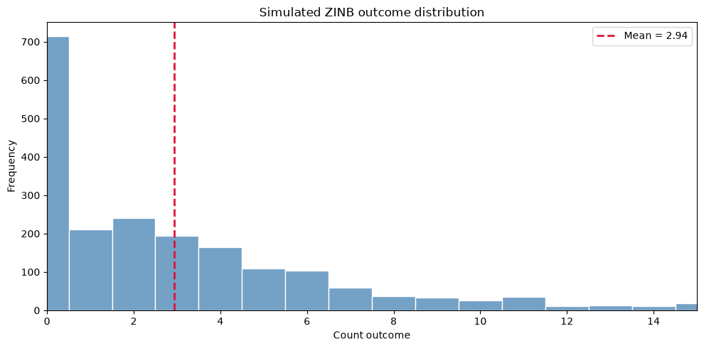
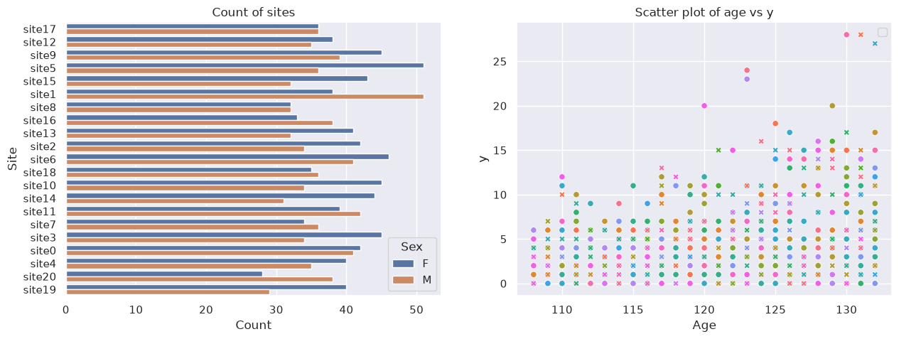
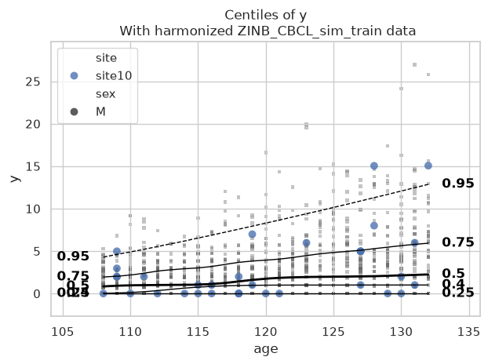

HBR with ZINB likelihood
========================

.. container:: notebook-download

   :download:`Download Jupyter notebook <notebooks/15_HBR_ZINB.ipynb>`

This tutorial shows you how you can use HBR to model zero inflated
negative binomial (ZINB) distributed data. ZINB data might come from
questionnaires, for example in measures of substance use, where many
participants report no use while others report varying levels of use.

Generate simulated data
-----------------------

.. code:: ipython3

    import numpy as np
    import pandas as pd
    import pymc as pm
    
    rng = np.random.default_rng(42)
    
    n = 2000 # Small sample size to run notebook fast
    
    # Age varies in months from 108 to 132 (roughly 9 to 11 years old)
    age_months = rng.integers(108, 133, size=n)
    sex = np.where(rng.binomial(1, 0.52, size=n) == 1, "F", "M")
    site = np.array([f"site{i}" for i in rng.integers(0, 21, size=n)])
    
    # Standardise age and site so the coefficients below are on a comparable scale
    age_z = (age_months - age_months.mean()) / age_months.std()
    site_id = np.array([int(s[4:]) for s in site])
    site_z = (site_id - site_id.mean()) / site_id.std()

A ZINB draw has two steps: first decide whether the subject can draw
from a negative binomial (probability ``psi``), then, if so, draw a
count from a negative binomial with mean ``mu`` and shape ``alpha``. The
subjects that can’t draw from a negative binomial (``1-psi1``) are the
ones that get only zeros (zero inflation)

Let’s simulate ``mu``, ``psi`` and ``alpha``:

.. code:: ipython3

    # NB mean (mu): linear in age, sex and site on the log scale.
    eta_mu = 1.2 + 0.35 * age_z + 0.25 * (sex == "F") + 0.08 * site_z
    mu = np.clip(np.exp(eta_mu), 0.1, 16.0) # exp() makes the mean positive
    
    # NB mixing weight (psi) on the logit scale.
    eta_psi = 1.0 - 0.2 * age_z - 0.1 * (sex == "F") - 0.10 * (site_id == 0)
    # inverse logit -> probability
    psi = np.clip(1 / (1 + np.exp(-eta_psi)), 0.70, 0.98) # structural zeros are (1 - psi), so here roughly 2-30% of the sample.
    
    # NB shape parameter (alpha)
    alpha = 2.5
    
    # Draw straight from PyMC so the data matches the fitted likelihood exactly.
    y = pm.draw(
        pm.ZeroInflatedNegativeBinomial.dist(psi=psi, mu=mu, alpha=alpha),
        random_seed=42,
    ).astype(int)
    
    # One row per subject. mu, psi and alpha are the ground truth we can compare the fit against.
    df = pd.DataFrame({
        "age": age_months,
        "sex": sex,
        "site": site,
        "age_z": age_z,
        "mu": mu,
        "psi": psi,          
        "alpha": alpha,     
        "y": y,
    })
    
    # Sanity checks on the simulated data
    summary = pd.Series({
        "n": n,
        "age_mean": age_months.mean(),
        "sex_male_prop": (sex == "M").mean(),
        "mean_mu": mu.mean(),
        "mean_psi": psi.mean(),
        # the fraction who were never in the running for a non-zero count (eg healthy subjects)
        "structural_zero_rate": (1 - psi).mean(),
        # the fraction of people who scored 0 (eg the healthy ones above, PLUS patients 
        # who happened to score 0 this time)
        "zero_rate": (y == 0).mean(),
        "mean_y": y.mean(),
        "expected_mean_psi_mu": (psi * mu).mean(), # theoretical ZINB mean, should be close to mean_y
        "var_y": y.var(), # much larger than mean_y: a Poisson would not fit these data
        "max_y": y.max(),
    })
    summary

.. code:: text

    n                       2000.000000
    age_mean                 120.004500
    sex_male_prop              0.475500
    mean_mu                    4.073324
    mean_psi                   0.728246
    structural_zero_rate       0.271754
    zero_rate                  0.357500
    mean_y                     2.938000
    expected_mean_psi_mu       2.927550
    var_y                     14.333156
    max_y                     41.000000
    dtype: float64

The table shows that 35.75% (``zero_rate = 0.3775``) of subjects scored
zero. Of those, ~ 27% (``structural_zeros = 0.27``) are structural zeros
coming from the zero inflated component. The remaining ~8.75% are
sampling zeros, subjects in the negative binomial component whose draw
happened to land on 0.

Plot simulated data
-------------------

.. code:: ipython3

    import matplotlib.pyplot as plt
    import seaborn as sns
    
    fig, ax = plt.subplots(figsize=(10, 5))
    sns.histplot(df["y"], discrete=True, ax=ax, color="steelblue", edgecolor="white")
    ax.set_title("Simulated ZINB outcome distribution")
    ax.set_xlabel("Count outcome")
    ax.set_ylabel("Frequency")
    ax.set_xlim(0, np.quantile(df["y"], 0.99))
    ax.axvline(df["y"].mean(), color="crimson", linestyle="--", linewidth=2, label=f"Mean = {df['y'].mean():.2f}")
    ax.legend()
    plt.tight_layout()
    plt.show()

Set up PCNtoolkit
-----------------

.. code:: ipython3

    import warnings
    import logging
    
    
    import pandas as pd
    import matplotlib.pyplot as plt
    from pcntoolkit import (
        HBR,
        BsplineBasisFunction,
        NormativeModel,
        NormData,
        load_fcon1000,
        NormalLikelihood,
        ZeroInflatedNegativeBinomialLikelihood,
        make_prior,
        plot_centiles_advanced,
        plot_qq,
        plot_ridge,
    )
    
    import numpy as np
    import pcntoolkit.util.output
    import seaborn as sns
    
    sns.set_style("darkgrid")
    
    # Suppress some annoying warnings and logs
    pymc_logger = logging.getLogger("pymc")
    
    pymc_logger.setLevel(logging.WARNING)
    pymc_logger.propagate = False
    
    warnings.simplefilter(action="ignore", category=FutureWarning)
    pd.options.mode.chained_assignment = None  # default='warn'
    pcntoolkit.util.output.Output.set_show_messages(False)

Build and visualise NormData
----------------------------

.. code:: ipython3

    from sklearn.model_selection import train_test_split
    from pcntoolkit import NormData
    
    covariate_cols = ["age"]
    batch_effects = ["sex", "site"]
    response_variables = ["y"]
    
    # Make sure categories / numeric types are sensible
    df = df.copy()
    df["age"] = df["age"].astype(int)
    df["sex"] = df["sex"].astype(str)
    df["site"] = df["site"].astype(str)
    df["y"] = df["y"].astype(int)
    
    print(df)
    
    # Build NormData
    norm_data = NormData.from_dataframe(
        name="ZINB_CBCL_sim",
        dataframe=df,
        covariates=covariate_cols,
        batch_effects=batch_effects,
        response_vars=response_variables,
        remove_outliers=True,
        z_threshold=10,
    )
    
    # Split into train and test
    train, test = norm_data.train_test_split()
    
    # Visualize the train data
    features_to_model = response_variables
    feature_to_plot = features_to_model[0]
    df = train.to_dataframe()
    fig, ax = plt.subplots(1, 2, figsize=(15, 5))
    
    sns.countplot(
        data=df,
        y=("batch_effects", "site"),
        hue=("batch_effects", "sex"),
        ax=ax[0],
        orient="h",
    )
    ax[0].legend(title="Sex")
    ax[0].set_title("Count of sites")
    ax[0].set_xlabel("Count")
    ax[0].set_ylabel("Site")
    
    
    sns.scatterplot(
        data=df,
        x=("X", "age"),
        y=("Y", feature_to_plot),
        hue=("batch_effects", "site"),
        style=("batch_effects", "sex"),
        ax=ax[1],
    )
    ax[1].legend([], [])
    ax[1].set_title(f"Scatter plot of age vs {feature_to_plot}")
    ax[1].set_xlabel("Age")
    ax[1].set_ylabel(feature_to_plot)
    
    print(norm_data.batch_effects)

.. code:: text

          age sex    site     age_z        mu       psi  alpha  y
    0     110   F  site13 -1.382274  2.747225  0.764310    2.5  0
    1     127   F  site17  0.966535  6.591107  0.700000    2.5  4
    2     124   F  site13  0.552039  5.406494  0.700000    2.5  0
    3     118   F  site12 -0.276952  3.991600  0.722198    2.5  2
    4     118   M   site9 -0.276952  2.987410  0.741809    2.5  4
    ...   ...  ..     ...       ...       ...       ...    ... ..
    1995  108   F   site9 -1.658604  2.365120  0.774120    2.5  1
    1996  121   M  site15  0.137543  3.739870  0.725616    2.5  0
    1997  132   F   site7  1.657361  7.351415  0.700000    2.5  0
    1998  115   M   site2 -0.691448  2.354906  0.757365    2.5  5
    1999  115   F   site3 -0.691448  3.064127  0.738520    2.5  0
    
    [2000 rows x 8 columns]

.. code:: text

    /home/runner/work/PCNtoolkit/PCNtoolkit/pcntoolkit/dataio/norm_data.py:427: UserWarning: No grouping was set for outlier removal, so thresholds are computed across all rows and site differences are ignored. Consider remove_outliers_group_by=['site'] (if available) or your site column.
      dataframe = cls.remove_outliers(

.. code:: text

    <xarray.DataArray 'batch_effects' (observations: 1999, batch_effect_dims: 2)> Size: 96kB
    array([['F', 'site13'],
           ['F', 'site17'],
           ['F', 'site13'],
           ...,
           ['F', 'site7'],
           ['M', 'site2'],
           ['F', 'site3']], shape=(1999, 2), dtype='<U6')
    Coordinates:
      * observations       (observations) int64 16kB 0 1 2 3 ... 1995 1996 1997 1998
      * batch_effect_dims  (batch_effect_dims) <U4 32B 'sex' 'site'

HBR with ZINB likelihood
------------------------

In our HBR configuration below we dont use B-splines. The reason for
that is that the simulated data we created earlier are monotonic with
age (``eta_mu = 1.2 + 0.35 * age_z + ...``), so just a linear predictor
plus the softplus mapping in the HBR modelled ``mu`` is flexible enough.

.. code:: ipython3

    mu = make_prior(
        linear=True,
        slope=make_prior(dist_name="Normal", dist_params=(0.0, 5.0)),
        intercept=make_prior(
            random=True, # random effects on the intercept for site and sex
            mu=make_prior(dist_name="Normal", dist_params=(0.0, 1.0)),
            sigma=make_prior(dist_name="Gamma", dist_params=(1.0, 1.0)),
        ),
        mapping="softplus",          # mu must be positive
    )
    
    alpha = make_prior(
        linear=True,
        slope=make_prior(dist_name="Normal", dist_params=(0.0, 1.0)),
        intercept=make_prior(dist_name="Normal", dist_params=(1.0, 1.0)),
        mapping="softplus",          # alpha must be positive
        mapping_params=(0.0, 2.0),
    )
    
    psi = make_prior(
        linear=True,
        slope=make_prior(dist_name="Normal", dist_params=(0, 1)),
        intercept=make_prior(dist_name="Normal", dist_params=(0, 1)),
        mapping="sigmoid",           # psi is a probability, must be in (0, 1)
    )
    
    likelihood = ZeroInflatedNegativeBinomialLikelihood(mu, alpha, psi)
    
    template_hbr = HBR(
        name="template", 
        cores=4, 
        progressbar=True,
        draws=1500, 
        tune=500, 
        chains=4,
        nuts_sampler="nutpie", 
        likelihood=likelihood,
    )

.. code:: ipython3

    model = NormativeModel(
        template_regression_model=template_hbr,
        savemodel=False,
        evaluate_model=False,
        saveresults=False,
        saveplots=False,
        # inscaler scales X (age), not Y. Age is a continuous covariate, so standardizing it is harmless 
        inscaler="standardize",
        # outscaler scales Y. We must not apply the scaling here as 
        # ZINB models counts, so Y must be non-negative and integer.
        outscaler="none",
    )
    
    model.fit_predict(train, test)

.. code:: text

    Output()

.. raw:: html

    <pre style="white-space:pre;overflow-x:auto;line-height:normal;font-family:Menlo,'DejaVu Sans Mono',consolas,'Courier New',monospace"></pre>

.. raw:: html

    
<svg style="position: absolute; width: 0; height: 0; overflow: hidden">
    <defs>
    <symbol id="icon-database" viewBox="0 0 32 32">
    <path d="M16 0c-8.837 0-16 2.239-16 5v4c0 2.761 7.163 5 16 5s16-2.239 16-5v-4c0-2.761-7.163-5-16-5z"></path>
    <path d="M16 17c-8.837 0-16-2.239-16-5v6c0 2.761 7.163 5 16 5s16-2.239 16-5v-6c0 2.761-7.163 5-16 5z"></path>
    <path d="M16 26c-8.837 0-16-2.239-16-5v6c0 2.761 7.163 5 16 5s16-2.239 16-5v-6c0 2.761-7.163 5-16 5z"></path>
    </symbol>
    <symbol id="icon-file-text2" viewBox="0 0 32 32">
    <path d="M28.681 7.159c-0.694-0.947-1.662-2.053-2.724-3.116s-2.169-2.030-3.116-2.724c-1.612-1.182-2.393-1.319-2.841-1.319h-15.5c-1.378 0-2.5 1.121-2.5 2.5v27c0 1.378 1.122 2.5 2.5 2.5h23c1.378 0 2.5-1.122 2.5-2.5v-19.5c0-0.448-0.137-1.23-1.319-2.841zM24.543 5.457c0.959 0.959 1.712 1.825 2.268 2.543h-4.811v-4.811c0.718 0.556 1.584 1.309 2.543 2.268zM28 29.5c0 0.271-0.229 0.5-0.5 0.5h-23c-0.271 0-0.5-0.229-0.5-0.5v-27c0-0.271 0.229-0.5 0.5-0.5 0 0 15.499-0 15.5 0v7c0 0.552 0.448 1 1 1h7v19.5z"></path>
    <path d="M23 26h-14c-0.552 0-1-0.448-1-1s0.448-1 1-1h14c0.552 0 1 0.448 1 1s-0.448 1-1 1z"></path>
    <path d="M23 22h-14c-0.552 0-1-0.448-1-1s0.448-1 1-1h14c0.552 0 1 0.448 1 1s-0.448 1-1 1z"></path>
    <path d="M23 18h-14c-0.552 0-1-0.448-1-1s0.448-1 1-1h14c0.552 0 1 0.448 1 1s-0.448 1-1 1z"></path>
    </symbol>
    </defs>
    </svg>
    <pre class='xr-text-repr-fallback'>&lt;xarray.NormData&gt; Size: 61kB
    Dimensions:            (observations: 400, response_vars: 1, covariates: 1,
                            batch_effect_dims: 2, centile: 5)
    Coordinates:
      * observations       (observations) int64 3kB 1176 1275 1689 ... 745 690 95
      * response_vars      (response_vars) &lt;U1 4B &#x27;y&#x27;
      * covariates         (covariates) &lt;U3 12B &#x27;age&#x27;
      * batch_effect_dims  (batch_effect_dims) &lt;U4 32B &#x27;sex&#x27; &#x27;site&#x27;
      * centile            (centile) float64 40B 0.05 0.25 0.5 0.75 0.95
    Data variables:
        subject_ids        (observations) int64 3kB 1176 1275 1689 ... 745 690 95
        Y                  (observations, response_vars) float64 3kB 1.0 5.0 ... 3.0
        X                  (observations, covariates) float64 3kB 115.0 ... 115.0
        batch_effects      (observations, batch_effect_dims) &lt;U6 19kB &#x27;F&#x27; ... &#x27;si...
        Z                  (observations, response_vars) float64 3kB -0.2274 ... ...
        centiles           (centile, observations, response_vars) float64 16kB 0....
        baseline_logp      (observations, response_vars) float64 3kB -2.404 ... -...
        logp               (observations, response_vars) float64 3kB -2.087 ... -...
        Yhat               (observations, response_vars) float64 3kB 2.536 ... 2.585
    Attributes:
        real_ids:                       False
        is_scaled:                      False
        name:                           ZINB_CBCL_sim_test
        unique_batch_effects:           {np.str_(&#x27;sex&#x27;): [&#x27;F&#x27;, &#x27;M&#x27;], np.str_(&#x27;sit...
        batch_effect_counts:            defaultdict(&lt;function NormData.register_b...
        covariate_ranges:               {np.str_(&#x27;age&#x27;): {&#x27;min&#x27;: 108.0, &#x27;max&#x27;: 13...
        batch_effect_covariate_ranges:  {np.str_(&#x27;sex&#x27;): {&#x27;F&#x27;: {np.str_(&#x27;age&#x27;): {...</pre>

xarray.NormData

<ul class='xr-sections'><li class='xr-section-item'><input id='section-92167075-97cb-43ad-acc6-48717416caa0' class='xr-section-summary-in' type='checkbox' disabled /><label for='section-92167075-97cb-43ad-acc6-48717416caa0' class='xr-section-summary'>Dimensions:</label>
<ul class='xr-dim-list'><li>observations: 400</li><li>response_vars: 1</li><li>covariates: 1</li><li>batch_effect_dims: 2</li><li>centile: 5</li></ul>
</li><li class='xr-section-item'><input id='section-6146368d-7e9b-496d-a20a-1424e05a0dc6' class='xr-section-summary-in' type='checkbox' checked /><label for='section-6146368d-7e9b-496d-a20a-1424e05a0dc6' class='xr-section-summary' title='Expand/collapse section'>Coordinates: (5)</label>

<ul class='xr-var-list'><li class='xr-var-item'>
observations

(observations)

int64

1176 1275 1689 159 ... 745 690 95
<input id='attrs-b191fd9d-ce56-45a2-a5a0-c7e1763c4712' class='xr-var-attrs-in' type='checkbox' disabled><label for='attrs-b191fd9d-ce56-45a2-a5a0-c7e1763c4712' title='Show/Hide attributes'><svg class='icon xr-icon-file-text2'><use xlink:href='#icon-file-text2'></use></svg></label><input id='data-8c666136-7a50-46e2-994a-c05a80265db8' class='xr-var-data-in' type='checkbox'><label for='data-8c666136-7a50-46e2-994a-c05a80265db8' title='Show/Hide data repr'><svg class='icon xr-icon-database'><use xlink:href='#icon-database'></use></svg></label>
<dl class='xr-attrs'></dl>

<pre>array([1176, 1275, 1689, ...,  745,  690,   95], shape=(400,))</pre>
</li><li class='xr-var-item'>
response_vars

(response_vars)

&lt;U1

&#x27;y&#x27;
<input id='attrs-d362476d-21d4-46d7-9eb1-4ddd3c2a87ce' class='xr-var-attrs-in' type='checkbox' disabled><label for='attrs-d362476d-21d4-46d7-9eb1-4ddd3c2a87ce' title='Show/Hide attributes'><svg class='icon xr-icon-file-text2'><use xlink:href='#icon-file-text2'></use></svg></label><input id='data-7adffe9b-21f1-4bcf-bf4a-0018d06e5f61' class='xr-var-data-in' type='checkbox'><label for='data-7adffe9b-21f1-4bcf-bf4a-0018d06e5f61' title='Show/Hide data repr'><svg class='icon xr-icon-database'><use xlink:href='#icon-database'></use></svg></label>
<dl class='xr-attrs'></dl>

<pre>array([&#x27;y&#x27;], dtype=&#x27;&lt;U1&#x27;)</pre>
</li><li class='xr-var-item'>
covariates

(covariates)

&lt;U3

&#x27;age&#x27;
<input id='attrs-09213d01-de29-4d55-b7d2-35b7b60903e1' class='xr-var-attrs-in' type='checkbox' disabled><label for='attrs-09213d01-de29-4d55-b7d2-35b7b60903e1' title='Show/Hide attributes'><svg class='icon xr-icon-file-text2'><use xlink:href='#icon-file-text2'></use></svg></label><input id='data-99b26e95-cfc1-422f-b9ec-367020d6e073' class='xr-var-data-in' type='checkbox'><label for='data-99b26e95-cfc1-422f-b9ec-367020d6e073' title='Show/Hide data repr'><svg class='icon xr-icon-database'><use xlink:href='#icon-database'></use></svg></label>
<dl class='xr-attrs'></dl>

<pre>array([&#x27;age&#x27;], dtype=&#x27;&lt;U3&#x27;)</pre>
</li><li class='xr-var-item'>
batch_effect_dims

(batch_effect_dims)

&lt;U4

&#x27;sex&#x27; &#x27;site&#x27;
<input id='attrs-bfd1a133-39e3-4c1c-ba3f-006b5d01294d' class='xr-var-attrs-in' type='checkbox' disabled><label for='attrs-bfd1a133-39e3-4c1c-ba3f-006b5d01294d' title='Show/Hide attributes'><svg class='icon xr-icon-file-text2'><use xlink:href='#icon-file-text2'></use></svg></label><input id='data-bf00e545-e5f4-4ad7-9fb6-db4b76fba92f' class='xr-var-data-in' type='checkbox'><label for='data-bf00e545-e5f4-4ad7-9fb6-db4b76fba92f' title='Show/Hide data repr'><svg class='icon xr-icon-database'><use xlink:href='#icon-database'></use></svg></label>
<dl class='xr-attrs'></dl>

<pre>array([&#x27;sex&#x27;, &#x27;site&#x27;], dtype=&#x27;&lt;U4&#x27;)</pre>
</li><li class='xr-var-item'>
centile

(centile)

float64

0.05 0.25 0.5 0.75 0.95
<input id='attrs-08d45e5b-6b77-447f-bd81-2f850f133b08' class='xr-var-attrs-in' type='checkbox' disabled><label for='attrs-08d45e5b-6b77-447f-bd81-2f850f133b08' title='Show/Hide attributes'><svg class='icon xr-icon-file-text2'><use xlink:href='#icon-file-text2'></use></svg></label><input id='data-e3cf16b5-b00b-4453-9dcf-f269e8298758' class='xr-var-data-in' type='checkbox'><label for='data-e3cf16b5-b00b-4453-9dcf-f269e8298758' title='Show/Hide data repr'><svg class='icon xr-icon-database'><use xlink:href='#icon-database'></use></svg></label>
<dl class='xr-attrs'></dl>

<pre>array([0.05, 0.25, 0.5 , 0.75, 0.95])</pre>
</li></ul>
</li><li class='xr-section-item'><input id='section-70499fb6-ced7-410f-be6e-f8cbe47a6ffa' class='xr-section-summary-in' type='checkbox' checked /><label for='section-70499fb6-ced7-410f-be6e-f8cbe47a6ffa' class='xr-section-summary' title='Expand/collapse section'>Data variables: (9)</label>

<ul class='xr-var-list'><li class='xr-var-item'>
subject_ids

(observations)

int64

1176 1275 1689 159 ... 745 690 95
<input id='attrs-fefb2143-1239-40bd-a237-283b58b7ce0c' class='xr-var-attrs-in' type='checkbox' disabled><label for='attrs-fefb2143-1239-40bd-a237-283b58b7ce0c' title='Show/Hide attributes'><svg class='icon xr-icon-file-text2'><use xlink:href='#icon-file-text2'></use></svg></label><input id='data-5b6bdd1c-f9f6-4e9e-bf0c-b245866d07ad' class='xr-var-data-in' type='checkbox'><label for='data-5b6bdd1c-f9f6-4e9e-bf0c-b245866d07ad' title='Show/Hide data repr'><svg class='icon xr-icon-database'><use xlink:href='#icon-database'></use></svg></label>
<dl class='xr-attrs'></dl>

<pre>array([1176, 1275, 1689,  159,  609, 1598,  826,  860, 1646, 1948, 1701,
            524,  440,  611, 1029, 1099,  331, 1597, 1679,  968, 1153, 1871,
            343,  938, 1332, 1220, 1470, 1271, 1772, 1453,  656,  820, 1599,
           1573, 1038, 1716, 1319, 1053,  999,  887, 1692,  956, 1821, 1287,
           1376,  547, 1294,  503, 1975, 1442, 1874, 1662, 1468, 1637,  894,
            567,  759, 1363,  799, 1487,  940, 1329,  770, 1648, 1493,   18,
             47,  677, 1900, 1473, 1669, 1400, 1203, 1915, 1228, 1739,  715,
            898, 1133,  311, 1240,   71,  508, 1450,  496, 1273,  396,  950,
           1604,  967, 1747,  699, 1388, 1585,  150,  403, 1274, 1164,  880,
           1588, 1693,  316, 1386,   33,  528, 1278, 1189,  174, 1550,  432,
           1066, 1179, 1349, 1611,  416, 1837,  680, 1034,   88,   50, 1795,
            472,  342,  970,  446,  151,  207, 1781,  652,  543,   68,  739,
           1091,  105,  175,  488, 1625, 1056,  426,  513,  570, 1564,  362,
            676, 1187,  140, 1556, 1740,  842, 1835, 1375,  772, 1784,  788,
            201,  473,  531, 1151,   92,  829,  993, 1723,  587,  490,    5,
            430, 1862, 1299, 1334,   78,  282, 1799, 1816, 1079, 1590, 1419,
            391, 1180,  838,  108,  225,   38, 1705,  945,  542, 1817, 1454,
           1397, 1930,   14,  106,  905, 1763,  845, 1536,  626,  405,  123,
            452,  816,  254, 1433,  933,  377,  424, 1430,  388,   83, 1347,
            195,  687,  110,  832,  299,  121, 1057,  442,  936, 1227, 1225,
           1264,  283, 1383,  710,  685, 1992,  131,  911, 1657,  815, 1774,
            439,  713, 1165, 1371, 1488, 1842, 1512, 1687, 1126, 1142, 1113,
           1144,  892, 1495,  557,  241,   55, 1535,  351,  787,  754,  667,
            431,  292, 1425,  748,  897,    0, 1858, 1777, 1630, 1755,  698,
            696,  862,  198, 1843, 1421,  458,  449,  232,   39, 1462, 1435,
            835,  951, 1895,  145,  453, 1382,  532, 1420, 1022, 1399, 1572,
            192, 1279,  463,  395,  738, 1221,  876,   82,  960,  536, 1013,
            775, 1920,  369, 1513, 1303, 1480, 1822,  907, 1031,  177, 1767,
            529, 1761,  413,  373,  612, 1810,  265, 1809, 1643, 1297,  964,
           1521, 1593,  918, 1484, 1323, 1324,  457,  574, 1283, 1802, 1603,
           1348,  812, 1311,  333,  769, 1213,  869,   99,  367, 1069,  294,
            846, 1614, 1017,   57, 1892,  213, 1891,  382, 1945, 1389,   13,
           1619, 1737,  825,   80,  153,  112, 1982, 1870, 1771, 1024, 1671,
            471, 1808, 1058, 1670,  422,  980,  885, 1083, 1594,  697, 1407,
           1672, 1559, 1944,  888,  857,  584, 1560, 1070,  837, 1238, 1015,
           1847,    2, 1111, 1352,  903, 1087,   34, 1875, 1232, 1681,  148,
            417,  745,  690,   95])</pre>
</li><li class='xr-var-item'>
Y

(observations, response_vars)

float64

1.0 5.0 8.0 3.0 ... 4.0 0.0 0.0 3.0
<input id='attrs-4909cfbc-3b5b-476b-ad86-a60e8eb0db8e' class='xr-var-attrs-in' type='checkbox' disabled><label for='attrs-4909cfbc-3b5b-476b-ad86-a60e8eb0db8e' title='Show/Hide attributes'><svg class='icon xr-icon-file-text2'><use xlink:href='#icon-file-text2'></use></svg></label><input id='data-ff29e019-de8b-4ddc-a018-27b43f64a9f2' class='xr-var-data-in' type='checkbox'><label for='data-ff29e019-de8b-4ddc-a018-27b43f64a9f2' title='Show/Hide data repr'><svg class='icon xr-icon-database'><use xlink:href='#icon-database'></use></svg></label>
<dl class='xr-attrs'></dl>

<pre>array([[ 1.],
           [ 5.],
           [ 8.],
           [ 3.],
           [14.],
           [ 3.],
           [ 6.],
           [ 0.],
           [ 0.],
           [ 4.],
           [ 2.],
           [ 0.],
           [11.],
           [ 4.],
           [ 4.],
           [ 2.],
           [ 1.],
           [ 9.],
           [ 0.],
           [ 7.],
    ...
           [ 1.],
           [ 3.],
           [ 1.],
           [ 0.],
           [ 6.],
           [ 0.],
           [ 0.],
           [ 0.],
           [ 7.],
           [ 2.],
           [ 2.],
           [ 0.],
           [ 9.],
           [ 1.],
           [ 3.],
           [10.],
           [ 4.],
           [ 0.],
           [ 0.],
           [ 3.]])</pre>
</li><li class='xr-var-item'>
X

(observations, covariates)

float64

115.0 125.0 110.0 ... 132.0 115.0
<input id='attrs-3c9bcce8-38af-47d4-95a7-4ddb3d2a2086' class='xr-var-attrs-in' type='checkbox' disabled><label for='attrs-3c9bcce8-38af-47d4-95a7-4ddb3d2a2086' title='Show/Hide attributes'><svg class='icon xr-icon-file-text2'><use xlink:href='#icon-file-text2'></use></svg></label><input id='data-fe73740e-f1ac-4b03-b048-3114df0c4ff3' class='xr-var-data-in' type='checkbox'><label for='data-fe73740e-f1ac-4b03-b048-3114df0c4ff3' title='Show/Hide data repr'><svg class='icon xr-icon-database'><use xlink:href='#icon-database'></use></svg></label>
<dl class='xr-attrs'></dl>

<pre>array([[115.],
           [125.],
           [110.],
           [127.],
           [129.],
           [129.],
           [125.],
           [132.],
           [116.],
           [116.],
           [112.],
           [115.],
           [132.],
           [119.],
           [116.],
           [118.],
           [117.],
           [126.],
           [120.],
           [131.],
    ...
           [115.],
           [124.],
           [112.],
           [115.],
           [128.],
           [121.],
           [124.],
           [113.],
           [120.],
           [130.],
           [132.],
           [130.],
           [113.],
           [132.],
           [108.],
           [128.],
           [111.],
           [117.],
           [132.],
           [115.]])</pre>
</li><li class='xr-var-item'>
batch_effects

(observations, batch_effect_dims)

&lt;U6

&#x27;F&#x27; &#x27;site15&#x27; &#x27;F&#x27; ... &#x27;F&#x27; &#x27;site13&#x27;
<input id='attrs-ac79d8dd-f916-4abf-8044-064416cdaed8' class='xr-var-attrs-in' type='checkbox' disabled><label for='attrs-ac79d8dd-f916-4abf-8044-064416cdaed8' title='Show/Hide attributes'><svg class='icon xr-icon-file-text2'><use xlink:href='#icon-file-text2'></use></svg></label><input id='data-a08efbed-666e-4b72-af11-b8a9ced12449' class='xr-var-data-in' type='checkbox'><label for='data-a08efbed-666e-4b72-af11-b8a9ced12449' title='Show/Hide data repr'><svg class='icon xr-icon-database'><use xlink:href='#icon-database'></use></svg></label>
<dl class='xr-attrs'></dl>

<pre>array([[&#x27;F&#x27;, &#x27;site15&#x27;],
           [&#x27;F&#x27;, &#x27;site4&#x27;],
           [&#x27;F&#x27;, &#x27;site20&#x27;],
           [&#x27;M&#x27;, &#x27;site5&#x27;],
           [&#x27;F&#x27;, &#x27;site15&#x27;],
           [&#x27;M&#x27;, &#x27;site0&#x27;],
           [&#x27;F&#x27;, &#x27;site11&#x27;],
           [&#x27;M&#x27;, &#x27;site15&#x27;],
           [&#x27;M&#x27;, &#x27;site11&#x27;],
           [&#x27;M&#x27;, &#x27;site1&#x27;],
           [&#x27;M&#x27;, &#x27;site8&#x27;],
           [&#x27;M&#x27;, &#x27;site6&#x27;],
           [&#x27;F&#x27;, &#x27;site17&#x27;],
           [&#x27;M&#x27;, &#x27;site0&#x27;],
           [&#x27;M&#x27;, &#x27;site19&#x27;],
           [&#x27;F&#x27;, &#x27;site17&#x27;],
           [&#x27;F&#x27;, &#x27;site14&#x27;],
           [&#x27;F&#x27;, &#x27;site8&#x27;],
           [&#x27;F&#x27;, &#x27;site5&#x27;],
           [&#x27;F&#x27;, &#x27;site11&#x27;],
    ...
           [&#x27;M&#x27;, &#x27;site13&#x27;],
           [&#x27;M&#x27;, &#x27;site6&#x27;],
           [&#x27;F&#x27;, &#x27;site1&#x27;],
           [&#x27;F&#x27;, &#x27;site5&#x27;],
           [&#x27;M&#x27;, &#x27;site17&#x27;],
           [&#x27;M&#x27;, &#x27;site1&#x27;],
           [&#x27;F&#x27;, &#x27;site13&#x27;],
           [&#x27;M&#x27;, &#x27;site16&#x27;],
           [&#x27;F&#x27;, &#x27;site7&#x27;],
           [&#x27;F&#x27;, &#x27;site11&#x27;],
           [&#x27;F&#x27;, &#x27;site4&#x27;],
           [&#x27;F&#x27;, &#x27;site5&#x27;],
           [&#x27;F&#x27;, &#x27;site8&#x27;],
           [&#x27;F&#x27;, &#x27;site9&#x27;],
           [&#x27;M&#x27;, &#x27;site14&#x27;],
           [&#x27;F&#x27;, &#x27;site2&#x27;],
           [&#x27;M&#x27;, &#x27;site2&#x27;],
           [&#x27;M&#x27;, &#x27;site17&#x27;],
           [&#x27;M&#x27;, &#x27;site9&#x27;],
           [&#x27;F&#x27;, &#x27;site13&#x27;]], dtype=&#x27;&lt;U6&#x27;)</pre>
</li><li class='xr-var-item'>
Z

(observations, response_vars)

float64

-0.2274 0.5307 ... -1.048 0.3723
<input id='attrs-f86910f5-5bbe-4544-85ab-6586ff317bd2' class='xr-var-attrs-in' type='checkbox' disabled><label for='attrs-f86910f5-5bbe-4544-85ab-6586ff317bd2' title='Show/Hide attributes'><svg class='icon xr-icon-file-text2'><use xlink:href='#icon-file-text2'></use></svg></label><input id='data-6660a2bf-de4d-4d93-9884-c6b36dd57d1e' class='xr-var-data-in' type='checkbox'><label for='data-6660a2bf-de4d-4d93-9884-c6b36dd57d1e' title='Show/Hide data repr'><svg class='icon xr-icon-database'><use xlink:href='#icon-database'></use></svg></label>
<dl class='xr-attrs'></dl>

<pre>array([[-0.22744741],
           [ 0.53070041],
           [ 2.00191415],
           [ 0.23535159],
           [ 1.70284255],
           [ 0.20305482],
           [ 0.73764682],
           [-1.02847187],
           [-1.0159802 ],
           [ 0.86628926],
           [ 0.38603499],
           [-1.0097844 ],
           [ 1.18341043],
           [ 0.77409243],
           [ 0.7863769 ],
           [-0.02086315],
           [-0.26799117],
           [ 1.19120781],
           [-1.05812947],
           [ 0.73125032],
    ...
           [-0.13568881],
           [ 0.27429858],
           [-0.14659829],
           [-1.05193428],
           [ 0.7147825 ],
           [-1.03759302],
           [-1.07158795],
           [-0.97862361],
           [ 1.13010862],
           [-0.11423166],
           [-0.12691942],
           [-1.04884453],
           [ 1.97312292],
           [-0.29975733],
           [ 0.97655747],
           [ 1.25579665],
           [ 1.17669911],
           [-1.04947269],
           [-1.0479629 ],
           [ 0.37227426]])</pre>
</li><li class='xr-var-item'>
centiles

(centile, observations, response_vars)

float64

0.0 0.0 0.0 ... 8.101 13.37 8.382
<input id='attrs-e6c385f0-bbbc-4a1c-9d8c-ce8e0996d251' class='xr-var-attrs-in' type='checkbox' disabled><label for='attrs-e6c385f0-bbbc-4a1c-9d8c-ce8e0996d251' title='Show/Hide attributes'><svg class='icon xr-icon-file-text2'><use xlink:href='#icon-file-text2'></use></svg></label><input id='data-3a29c1c4-a1fd-4d19-a690-357124a38164' class='xr-var-data-in' type='checkbox'><label for='data-3a29c1c4-a1fd-4d19-a690-357124a38164' title='Show/Hide data repr'><svg class='icon xr-icon-database'><use xlink:href='#icon-database'></use></svg></label>
<dl class='xr-attrs'></dl>

<pre>array([[[ 0.        ],
            [ 0.        ],
            [ 0.        ],
            ...,
            [ 0.        ],
            [ 0.        ],
            [ 0.        ]],
    
           [[ 0.        ],
            [ 0.        ],
            [ 0.        ],
            ...,
            [ 0.        ],
            [ 0.        ],
            [ 0.        ]],
    
           [[ 1.8885    ],
            [ 2.33883333],
            [ 1.13666667],
            ...,
            [ 1.71933333],
            [ 2.37833333],
            [ 1.92583333]],
    
           [[ 4.023     ],
            [ 5.8195    ],
            [ 3.087     ],
            ...,
            [ 3.95483333],
            [ 6.16816667],
            [ 4.07533333]],
    
           [[ 8.23166667],
            [11.99833333],
            [ 6.49283333],
            ...,
            [ 8.10066667],
            [13.369     ],
            [ 8.38183333]]], shape=(5, 400, 1))</pre>
</li><li class='xr-var-item'>
baseline_logp

(observations, response_vars)

float64

-2.404 -2.363 ... -2.592 -2.242
<input id='attrs-62747081-fb8c-4280-9998-411973e6eefd' class='xr-var-attrs-in' type='checkbox' disabled><label for='attrs-62747081-fb8c-4280-9998-411973e6eefd' title='Show/Hide attributes'><svg class='icon xr-icon-file-text2'><use xlink:href='#icon-file-text2'></use></svg></label><input id='data-7ce906f7-8921-42d5-882e-e0eec87c3f8b' class='xr-var-data-in' type='checkbox'><label for='data-7ce906f7-8921-42d5-882e-e0eec87c3f8b' title='Show/Hide data repr'><svg class='icon xr-icon-database'><use xlink:href='#icon-database'></use></svg></label>
<dl class='xr-attrs'></dl>

<pre>array([[ -2.40444125],
           [ -2.36321579],
           [ -3.07861972],
           [ -2.24167175],
           [ -6.42854393],
           [ -2.24167175],
           [ -2.53060538],
           [ -2.59244358],
           [ -2.59244358],
           [ -2.26690458],
           [ -2.28751731],
           [ -2.59244358],
           [ -4.4337291 ],
           [ -2.26690458],
           [ -2.26690458],
           [ -2.28751731],
           [ -2.40444125],
           [ -3.45924446],
           [ -2.59244358],
           [ -2.76907336],
    ...
           [ -2.40444125],
           [ -2.24167175],
           [ -2.40444125],
           [ -2.59244358],
           [ -2.53060538],
           [ -2.59244358],
           [ -2.59244358],
           [ -2.59244358],
           [ -2.76907336],
           [ -2.28751731],
           [ -2.28751731],
           [ -2.59244358],
           [ -3.45924446],
           [ -2.40444125],
           [ -2.24167175],
           [ -3.91094759],
           [ -2.26690458],
           [ -2.59244358],
           [ -2.59244358],
           [ -2.24167175]])</pre>
</li><li class='xr-var-item'>
logp

(observations, response_vars)

float64

-2.087 -2.715 ... -1.028 -2.238
<input id='attrs-5cd87d3b-f767-4cec-baaf-4b5994488b82' class='xr-var-attrs-in' type='checkbox' disabled><label for='attrs-5cd87d3b-f767-4cec-baaf-4b5994488b82' title='Show/Hide attributes'><svg class='icon xr-icon-file-text2'><use xlink:href='#icon-file-text2'></use></svg></label><input id='data-f8ac7ff5-1025-480f-86d3-08de40df9aee' class='xr-var-data-in' type='checkbox'><label for='data-f8ac7ff5-1025-480f-86d3-08de40df9aee' title='Show/Hide data repr'><svg class='icon xr-icon-database'><use xlink:href='#icon-database'></use></svg></label>
<dl class='xr-attrs'></dl>

<pre>array([[ -2.08710609],
           [ -2.71508374],
           [ -4.42625474],
           [ -2.4156848 ],
           [ -4.53749682],
           [ -2.46517054],
           [ -2.8965342 ],
           [ -1.02656154],
           [ -0.98540577],
           [ -2.54638211],
           [ -1.92231182],
           [ -0.9630699 ],
           [ -3.74767622],
           [ -2.52810166],
           [ -2.51189715],
           [ -2.22970834],
           [ -2.21778249],
           [ -3.52313874],
           [ -1.05989479],
           [ -3.08676583],
    ...
           [ -1.92315341],
           [ -2.35682584],
           [ -1.89973956],
           [ -1.02417113],
           [ -2.91949693],
           [ -1.02585508],
           [ -1.08411441],
           [ -0.9474179 ],
           [ -3.21032375],
           [ -2.58732741],
           [ -2.66534627],
           [ -1.04854213],
           [ -4.4855402 ],
           [ -2.77593556],
           [ -2.35344707],
           [ -3.69005203],
           [ -2.7386891 ],
           [ -1.02984231],
           [ -1.02763477],
           [ -2.23778336]])</pre>
</li><li class='xr-var-item'>
Yhat

(observations, response_vars)

float64

2.536 3.648 1.97 ... 3.917 2.585
<input id='attrs-8221e0bb-68c5-4065-9091-f68d7d56dc80' class='xr-var-attrs-in' type='checkbox' disabled><label for='attrs-8221e0bb-68c5-4065-9091-f68d7d56dc80' title='Show/Hide attributes'><svg class='icon xr-icon-file-text2'><use xlink:href='#icon-file-text2'></use></svg></label><input id='data-5b5d77e3-6d45-4b42-b293-b683017762e0' class='xr-var-data-in' type='checkbox'><label for='data-5b5d77e3-6d45-4b42-b293-b683017762e0' title='Show/Hide data repr'><svg class='icon xr-icon-database'><use xlink:href='#icon-database'></use></svg></label>
<dl class='xr-attrs'></dl>

<pre>array([[2.53597029],
           [3.64776062],
           [1.97015101],
           [3.18146622],
           [4.04552894],
           [3.36843563],
           [3.5794481 ],
           [3.89734757],
           [2.13814915],
           [2.10282801],
           [1.71736857],
           [1.99040157],
           [4.49727536],
           [2.29551377],
           [2.26424252],
           [3.03155335],
           [2.84646195],
           [3.70268807],
           [2.88402296],
           [4.19396083],
    ...
           [2.12708192],
           [2.97733976],
           [2.1092199 ],
           [2.32781574],
           [3.64599905],
           [2.65403759],
           [3.5748048 ],
           [1.86408322],
           [3.02830909],
           [4.0943003 ],
           [4.35915674],
           [3.94219461],
           [2.27570863],
           [4.36351514],
           [1.40407769],
           [3.91073777],
           [1.61083898],
           [2.45764695],
           [3.91693314],
           [2.58496912]])</pre>
</li></ul>
</li><li class='xr-section-item'><input id='section-0b7e93df-cf22-4213-ba54-b011fa84a816' class='xr-section-summary-in' type='checkbox' checked /><label for='section-0b7e93df-cf22-4213-ba54-b011fa84a816' class='xr-section-summary' title='Expand/collapse section'>Attributes: (7)</label>

<dl class='xr-attrs'><dt>real_ids :</dt><dd>False</dd><dt>is_scaled :</dt><dd>False</dd><dt>name :</dt><dd>ZINB_CBCL_sim_test</dd><dt>unique_batch_effects :</dt><dd>{np.str_(&#x27;sex&#x27;): [&#x27;F&#x27;, &#x27;M&#x27;], np.str_(&#x27;site&#x27;): [&#x27;site13&#x27;, &#x27;site17&#x27;, &#x27;site12&#x27;, &#x27;site9&#x27;, &#x27;site5&#x27;, &#x27;site15&#x27;, &#x27;site1&#x27;, &#x27;site8&#x27;, &#x27;site16&#x27;, &#x27;site11&#x27;, &#x27;site2&#x27;, &#x27;site6&#x27;, &#x27;site18&#x27;, &#x27;site10&#x27;, &#x27;site14&#x27;, &#x27;site19&#x27;, &#x27;site4&#x27;, &#x27;site7&#x27;, &#x27;site3&#x27;, &#x27;site0&#x27;, &#x27;site20&#x27;]}</dd><dt>batch_effect_counts :</dt><dd>defaultdict(&lt;function NormData.register_batch_effects.&lt;locals&gt;.&lt;lambda&gt; at 0x7fa99c66ac00&gt;, {np.str_(&#x27;sex&#x27;): {&#x27;F&#x27;: 1048, &#x27;M&#x27;: 951}, np.str_(&#x27;site&#x27;): {&#x27;site13&#x27;: 91, &#x27;site17&#x27;: 90, &#x27;site12&#x27;: 91, &#x27;site9&#x27;: 106, &#x27;site5&#x27;: 109, &#x27;site15&#x27;: 94, &#x27;site1&#x27;: 111, &#x27;site8&#x27;: 80, &#x27;site16&#x27;: 88, &#x27;site11&#x27;: 101, &#x27;site2&#x27;: 95, &#x27;site6&#x27;: 109, &#x27;site18&#x27;: 89, &#x27;site10&#x27;: 98, &#x27;site14&#x27;: 94, &#x27;site19&#x27;: 86, &#x27;site4&#x27;: 94, &#x27;site7&#x27;: 88, &#x27;site3&#x27;: 99, &#x27;site0&#x27;: 104, &#x27;site20&#x27;: 82}})</dd><dt>covariate_ranges :</dt><dd>{np.str_(&#x27;age&#x27;): {&#x27;min&#x27;: 108.0, &#x27;max&#x27;: 132.0}}</dd><dt>batch_effect_covariate_ranges :</dt><dd>{np.str_(&#x27;sex&#x27;): {&#x27;F&#x27;: {np.str_(&#x27;age&#x27;): {&#x27;min&#x27;: 108.0, &#x27;max&#x27;: 132.0}}, &#x27;M&#x27;: {np.str_(&#x27;age&#x27;): {&#x27;min&#x27;: 108.0, &#x27;max&#x27;: 132.0}}}, np.str_(&#x27;site&#x27;): {&#x27;site13&#x27;: {np.str_(&#x27;age&#x27;): {&#x27;min&#x27;: 108.0, &#x27;max&#x27;: 132.0}}, &#x27;site17&#x27;: {np.str_(&#x27;age&#x27;): {&#x27;min&#x27;: 108.0, &#x27;max&#x27;: 132.0}}, &#x27;site12&#x27;: {np.str_(&#x27;age&#x27;): {&#x27;min&#x27;: 108.0, &#x27;max&#x27;: 132.0}}, &#x27;site9&#x27;: {np.str_(&#x27;age&#x27;): {&#x27;min&#x27;: 108.0, &#x27;max&#x27;: 132.0}}, &#x27;site5&#x27;: {np.str_(&#x27;age&#x27;): {&#x27;min&#x27;: 108.0, &#x27;max&#x27;: 132.0}}, &#x27;site15&#x27;: {np.str_(&#x27;age&#x27;): {&#x27;min&#x27;: 108.0, &#x27;max&#x27;: 132.0}}, &#x27;site1&#x27;: {np.str_(&#x27;age&#x27;): {&#x27;min&#x27;: 108.0, &#x27;max&#x27;: 132.0}}, &#x27;site8&#x27;: {np.str_(&#x27;age&#x27;): {&#x27;min&#x27;: 108.0, &#x27;max&#x27;: 132.0}}, &#x27;site16&#x27;: {np.str_(&#x27;age&#x27;): {&#x27;min&#x27;: 108.0, &#x27;max&#x27;: 132.0}}, &#x27;site11&#x27;: {np.str_(&#x27;age&#x27;): {&#x27;min&#x27;: 108.0, &#x27;max&#x27;: 132.0}}, &#x27;site2&#x27;: {np.str_(&#x27;age&#x27;): {&#x27;min&#x27;: 108.0, &#x27;max&#x27;: 132.0}}, &#x27;site6&#x27;: {np.str_(&#x27;age&#x27;): {&#x27;min&#x27;: 108.0, &#x27;max&#x27;: 132.0}}, &#x27;site18&#x27;: {np.str_(&#x27;age&#x27;): {&#x27;min&#x27;: 108.0, &#x27;max&#x27;: 132.0}}, &#x27;site10&#x27;: {np.str_(&#x27;age&#x27;): {&#x27;min&#x27;: 108.0, &#x27;max&#x27;: 132.0}}, &#x27;site14&#x27;: {np.str_(&#x27;age&#x27;): {&#x27;min&#x27;: 108.0, &#x27;max&#x27;: 132.0}}, &#x27;site19&#x27;: {np.str_(&#x27;age&#x27;): {&#x27;min&#x27;: 108.0, &#x27;max&#x27;: 132.0}}, &#x27;site4&#x27;: {np.str_(&#x27;age&#x27;): {&#x27;min&#x27;: 108.0, &#x27;max&#x27;: 132.0}}, &#x27;site7&#x27;: {np.str_(&#x27;age&#x27;): {&#x27;min&#x27;: 108.0, &#x27;max&#x27;: 132.0}}, &#x27;site3&#x27;: {np.str_(&#x27;age&#x27;): {&#x27;min&#x27;: 108.0, &#x27;max&#x27;: 132.0}}, &#x27;site0&#x27;: {np.str_(&#x27;age&#x27;): {&#x27;min&#x27;: 108.0, &#x27;max&#x27;: 132.0}}, &#x27;site20&#x27;: {np.str_(&#x27;age&#x27;): {&#x27;min&#x27;: 108.0, &#x27;max&#x27;: 131.0}}}}</dd></dl>
</li></ul>

To model a discrete likelihood like ZINB we use a method called
randomized quantile residuals. This is what makes discrete y map to a
continuous, normally distributed z. This has the cost of making the
z-scores **stochastic**. So evaluation metrics computed from z-scores
give a different number every time you run the code. These are
``ShapiroW``, ``Skew`` and ``Kurtosis``.

``MSLL`` is also not meaningful for ZINB, as it compares ZINB (distrete)
to a baseline Gaussian which is continuous.

Importantly, the centiles curves and everything else on the y-space
remain **deterministic**.

Plot centiles
-------------

.. code:: ipython3

    plot_centiles_advanced(
        model,
        centiles=[0.25, 0.4, 0.5, 0.75, 0.95],  # the default centiles are[0.05, 0.25, 0.5, 0.75, 0.95]
        scatter_data=train,  
        batch_effects={"site": ["site10"], "sex": ["M"]},
        show_other_data=True,
        harmonize_data=True, 
    )

.. code:: text

    [<Figure size 640x480 with 1 Axes>]

As we saw earlier 35.75% (``zero_rate = 0.3575``) of the outcomes are
zero, so every centile below 0.3575 is expected to mostly be flat on the
zero line. That is why the 0.25 centile is a straight line at 0, while
the 0.4 centile starts to lift off 0.
