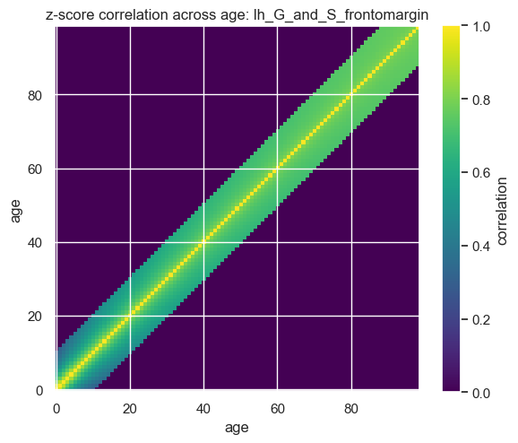
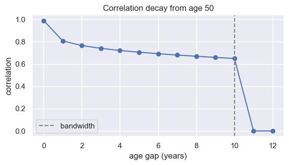
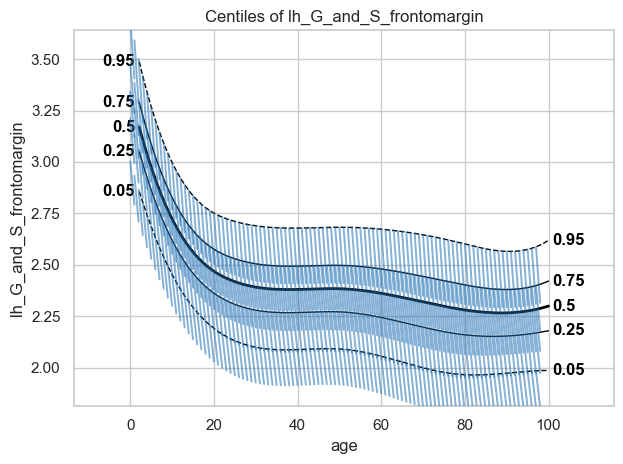

Thrivelines from a saved correlation matrix
===========================================

.. container:: notebook-download

   :download:`Download Jupyter notebook <notebooks/15_longitudinal_modelling_loading_precomputed_matrix.ipynb>`

Thrivelines show how a z-score is expected to evolve over one covariate
step (by default, one year). To estimate them we need to know the
correlation matrix (= how strongly z-scores correlate across ages).

In pcntoolkit the correlation matrix lives in the ``CorrelationMatrix``
class, and everything downstream, scoring subjects and drawing
thrivelines, needs only that matrix plus a fitted normative model.

In this notebook we plot thrivelines using a precomputed correlation
matrix. The matrix already carries everything learned from a
longitudinal cohort, so no longitudinal data is needed to plot them.

   **Note:** the normative model is downloaded automatically from
   SURFdrive, but the correlation matrix exists in a private directory.

.. code:: ipython3

    import matplotlib.pyplot as plt
    import numpy as np
    from scipy import stats
    
    from pcntoolkit import CorrelationMatrix, NormativeModel, ZGainScore
    from pcntoolkit.util.plotter import plot_thrivelines

1. Load precomputed correlation matrix
--------------------------------------

``load()`` loads only one specific file layout: the velocity models from
Johanna Bayer’s pipeline, saved in
``batch_<n>_<region>/Velocity/<file>.pkl``. The region name is not
stored inside the file, so it is read from the directory name.

.. code:: ipython3

    MATRIX_PATH = (
        "R:/3022017.06/projects/lifespan_hbr/johbay/Velocity/Velocity_models"
        "/DES_retrain/batch_1_lh_G_and_S_frontomargin/Velocity"
        "/velocity_objects_new_Oct25.pkl"
    )
    
    # The region is read from the batch_1_lh_G_and_S_frontomargin directory.
    corr = CorrelationMatrix.load(MATRIX_PATH)
    REGION = str(corr.matrix.coords["response_vars"].values[0])
    
    print("region:    ", REGION)
    print("shape:     ", corr.matrix.shape)
    print("bandwidth: ", corr.bandwidth)
    print("n_subjects:", corr.n_subjects)
    print("range:     ", corr.estimated_range)

.. code:: text

    region:     lh_G_and_S_frontomargin
    shape:      (1, 99, 99)
    bandwidth:  10
    n_subjects: None
    range:      None

``bandwidth`` is recovered from the matrix itself: correlations were
only estimated for age gaps up to that many years, and wider gaps were
filled in by regression.

``n_subjects`` and ``estimated_range`` are ``None``. The saved file does
not record how many subjects the correlations came from, or which ages
were actually observed. A matrix built here with
``CorrelationMatrix.compute()`` would carry both.

2. Look at the correlations
---------------------------

Two things are worth checking before trusting a matrix you did not
estimate.

The diagonal is 1.0, since a z-score correlates perfectly with itself,
and the values fall away from it as the age gap widens. Beyond the
bandwidth the cells are interpolated rather than measured, so the band
edge is where the estimates stop and the model takes over.

.. code:: ipython3

    R = corr.matrix.sel(response_vars=REGION)
    
    plt.figure(figsize=(6, 5))
    plt.imshow(R.values, origin="lower", cmap="viridis", vmin=0, vmax=1)
    plt.colorbar(label="correlation")
    plt.xlabel("age")
    plt.ylabel("age")
    plt.title(f"z-score correlation across age: {REGION}")
    plt.tight_layout()
    plt.show()

.. code:: ipython3

    # The correlation at each age gap, read along one row.
    age = 50
    gaps = np.arange(0, (corr.bandwidth or 10) + 3)
    values = [corr.get(REGION, age, age - g) for g in gaps]
    
    plt.figure(figsize=(6, 3.5))
    plt.plot(gaps, values, marker="o")
    plt.axvline(corr.bandwidth, color="grey", ls="--", label="bandwidth")
    plt.xlabel("age gap (years)")
    plt.ylabel("correlation")
    plt.title(f"Correlation decay from age {age}")
    plt.legend()
    plt.tight_layout()
    plt.show()

3. Load a normative model
-------------------------

The model supplies the mapping from z-scores back to real units
(cortical thickness in mm), which is what turns thrivelines in z-space
into lines you can draw on a centile plot.

We use a lifespan HBR model fitted on 79k subjects across 100 sites, for
the same region as the correlation matrix. It is downloaded from
`SURFdrive <https://surfdrive.surf.nl/s/Mb6mZyFmJeCaPcZ>`__, which hosts
one folder per region; only ``lh_G_and_S_frontomargin`` is needed here.

.. code:: ipython3

    import base64
    from pathlib import Path
    from urllib.request import Request, urlopen
    
    MODEL_NAME = "HBR_Sb_ct_DES_lifespan_79K_100sites"
    MODEL_PATH = Path("resources") / MODEL_NAME
    SHARE_ID = "Mb6mZyFmJeCaPcZ"  # from the SURFdrive share link
    WEBDAV = "https://surfdrive.surf.nl/public.php/webdav"
    
    # The share id is the WebDAV username; the password is empty.
    auth = base64.b64encode(f"{SHARE_ID}:".encode()).decode()
    
    # Download once: the shared model metadata, plus this one region (~15 MB).
    for relative in (
        "model/normative_model.json",
        f"model/{REGION}/regression_model.json",
        f"model/{REGION}/idata.nc",
    ):
        target = MODEL_PATH / relative
        if not target.exists():
            target.parent.mkdir(parents=True, exist_ok=True)
            request = Request(
                f"{WEBDAV}/{MODEL_NAME}/{relative}",
                headers={"Authorization": f"Basic {auth}"},
            )
            with urlopen(request) as response, open(target, "wb") as f:
                f.write(response.read())
            print("downloaded", relative)
    
    model = NormativeModel.load(str(MODEL_PATH))
    print("covariates:   ", model.covariates)
    print("response vars:", list(model.response_vars))

.. code:: text

    covariates:    ['age']
    response vars: ['lh_G_and_S_frontomargin']
    C:\Users\kontsi\Documents\GitHub\PCNtoolkit-local\pcntoolkit\util\output.py:295: UserWarning: Process: 9864 - 2026-08-13 16:41:00 - This model was saved with PCNtoolkit v1.1.1, but you are running v1.3.0. Loading this model in v1.3.0...
      warnings.warn(message, category)
    C:\Users\kontsi\Documents\GitHub\PCNtoolkit-local\pcntoolkit\util\output.py:295: UserWarning: Process: 9864 - 2026-08-13 16:41:00 - This model was saved with PCNtoolkit v1.1.1, but you are running v1.3.0. Loading this model in v1.3.0...
      warnings.warn(message, category)

4. Compute thrivelines
----------------------

``ZGainScore`` takes the model and the matrix as inputs.

If the model has covariates besides age (sex, ICV, …), those must be
held at some value to invert a z-score. Each is fixed to the midpoint of
its range in the model.

.. code:: ipython3

    centiles = [0.05, 0.25, 0.5, 0.75, 0.95]
    
    thrivelines = ZGainScore(model, corr).get_thrivelines(
        z_anchors=stats.norm.ppf(centiles),
    )
    thrivelines.head()

.. code:: text

    Sampling: []
    Sampling: []

.. raw:: html

    

    
    <table border="1" class="dataframe">
      <thead>
        <tr style="text-align: right;">
          <th></th>
          <th>segment</th>
          <th>start_age</th>
          <th>start_z</th>
          <th>response_var</th>
          <th>offset</th>
          <th>X</th>
          <th>Z</th>
          <th>Y</th>
        </tr>
      </thead>
      <tbody>
        <tr>
          <th>0</th>
          <td>0</td>
          <td>0.0</td>
          <td>-1.644854</td>
          <td>lh_G_and_S_frontomargin</td>
          <td>0</td>
          <td>0.0</td>
          <td>-1.644854</td>
          <td>3.003392</td>
        </tr>
        <tr>
          <th>1</th>
          <td>0</td>
          <td>0.0</td>
          <td>-1.644854</td>
          <td>lh_G_and_S_frontomargin</td>
          <td>1</td>
          <td>1.0</td>
          <td>-2.265750</td>
          <td>2.792222</td>
        </tr>
        <tr>
          <th>2</th>
          <td>1</td>
          <td>0.0</td>
          <td>-0.674490</td>
          <td>lh_G_and_S_frontomargin</td>
          <td>0</td>
          <td>0.0</td>
          <td>-0.674490</td>
          <td>3.212478</td>
        </tr>
        <tr>
          <th>3</th>
          <td>1</td>
          <td>0.0</td>
          <td>-0.674490</td>
          <td>lh_G_and_S_frontomargin</td>
          <td>1</td>
          <td>1.0</td>
          <td>-1.368015</td>
          <td>2.993245</td>
        </tr>
        <tr>
          <th>4</th>
          <td>2</td>
          <td>0.0</td>
          <td>0.000000</td>
          <td>lh_G_and_S_frontomargin</td>
          <td>0</td>
          <td>0.0</td>
          <td>0.000000</td>
          <td>3.342607</td>
        </tr>
      </tbody>
    </table>
    

Each row is one point on one thriveline segment. A segment is a starting
point (``start_age``, ``start_z``) and where it is expected to land one
year later, so every segment has two rows: ``offset`` 0 and ``offset``
1.

5. Plot them over the centiles
------------------------------

Each short line shows where someone at that age and z-score is expected
to move over one year. A subject who tracks along a thriveline is
changing as expected; one that crosses them steeply is not.

.. code:: ipython3

    plot_thrivelines(
        model,
        thrivelines=thrivelines,
        centiles=centiles,
        covariate="age",
        response_vars=[REGION],
    )

.. code:: text

    Process: 9864 - 2026-08-13 16:49:39 - Dataset "centile" created.
        - 150 observations
        - 150 unique subjects
        - 1 covariates
        - 1 response variables
        - 2 batch effects:
        	sex (1)
    	site_id2 (1)
        
    Process: 9864 - 2026-08-13 16:49:39 - Computing centiles for 1 response variables.
    Process: 9864 - 2026-08-13 16:49:39 - Computing centiles for lh_G_and_S_frontomargin.
    Sampling: []
    Sampling: []
    Sampling: []
    Sampling: []
    Sampling: []

.. code:: text

    [<Figure size 640x480 with 1 Axes>]

